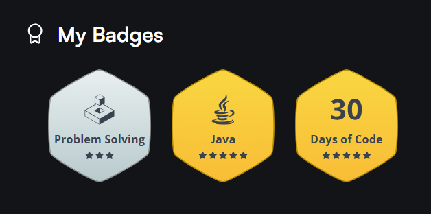

    

- [30 Days of Code](#30-days-of-code)
- [Java](#java)
- [Data Structures](#data-structures)
- [Algorithms](#algorithms)

All problems resolved by Java 8

# 30 Days of Code

|  Day  |                                                Challenge                                                |                                                 Difficulty                                                  | Score |                                                               Problem Statement                                                               |                                                         Solutions                                                         |
| :---: | :-----------------------------------------------------------------------------------------------------: | :---------------------------------------------------------------------------------------------------------: | :---: | :-------------------------------------------------------------------------------------------------------------------------------------------: | :-----------------------------------------------------------------------------------------------------------------------: |
|   0   |                  [Hello, World](https://www.hackerrank.com/challenges/30-hello-world)                   |   [Easy](https://www.hackerrank.com/domains/tutorials/30-days-of-code?filters%5Bdifficulty%5D%5B%5D=easy)   |  30   |                     [Problem Statement](30%20Days%20of%20Code/Day%200%20-%20Hello%2C%20World/30-hello-world-English.pdf)                      |                    [Solution.java](30%20Days%20of%20Code/Day%200%20-%20Hello%2C%20World/Solution.java)                    |
|   1   |                    [Data Types](https://www.hackerrank.com/challenges/30-data-types)                    |   [Easy](https://www.hackerrank.com/domains/tutorials/30-days-of-code?filters%5Bdifficulty%5D%5B%5D=easy)   |  30   |                       [Problem Statement](30%20Days%20of%20Code/Day%2001%20-%20Data%20Types/30-data-types-English.pdf)                        |                     [Solution.java](30%20Days%20of%20Code/Day%2001%20-%20Data%20Types/Solution.java)                      |
|   2   |                     [Operators](https://www.hackerrank.com/challenges/30-operators)                     |   [Easy](https://www.hackerrank.com/domains/tutorials/30-days-of-code?filters%5Bdifficulty%5D%5B%5D=easy)   |  30   |                         [Problem Statement](30%20Days%20of%20Code/Day%2002%20-%20Operators/30-operators-English.pdf)                          |                       [Solution.java](30%20Days%20of%20Code/Day%2002%20-%20Operators/Solution.java)                       |
|   3   |   [Intro to Conditional Statements](https://www.hackerrank.com/challenges/30-conditional-statements)    |   [Easy](https://www.hackerrank.com/domains/tutorials/30-days-of-code?filters%5Bdifficulty%5D%5B%5D=easy)   |  30   |     [Problem Statement](30%20Days%20of%20Code/Day%2003%20-%20Intro%20to%20Conditional%20Statements/30-conditional-statements-English.pdf)     |         [Solution.java](30%20Days%20of%20Code/Day%2003%20-%20Intro%20to%20Conditional%20Statements/Solution.java)         |
|   4   |            [Class vs. Instance](https://www.hackerrank.com/challenges/30-class-vs-instance)             |   [Easy](https://www.hackerrank.com/domains/tutorials/30-days-of-code?filters%5Bdifficulty%5D%5B%5D=easy)   |  30   |               [Problem Statement](30%20Days%20of%20Code/Day%2004%20-%20Class%20vs%20Instance/30-class-vs-instance-English.pdf)                |                   [Person.java](30%20Days%20of%20Code/Day%2004%20-%20Class%20vs%20Instance/Person.java)                   |
|   5   |                         [Loops](https://www.hackerrank.com/challenges/30-loops)                         |   [Easy](https://www.hackerrank.com/domains/tutorials/30-days-of-code?filters%5Bdifficulty%5D%5B%5D=easy)   |  30   |                             [Problem Statement](30%20Days%20of%20Code/Day%2005%20-%20Loops/30-loops-English.pdf)                              |                         [Solution.java](30%20Days%20of%20Code/Day%2005%20-%20Loops/Solution.java)                         |
|   6   |                  [Let's Review](https://www.hackerrank.com/challenges/30-review-loop)                   |   [Easy](https://www.hackerrank.com/domains/tutorials/30-days-of-code?filters%5Bdifficulty%5D%5B%5D=easy)   |  30   |                      [Problem Statement](30%20Days%20of%20Code/Day%2006%20-%20Let's%20Review/30-review-loop-English.pdf)                      |                    [Solution.java](30%20Days%20of%20Code/Day%2006%20-%20Let's%20Review/Solution.java)                     |
|   7   |                        [Arrays](https://www.hackerrank.com/challenges/30-arrays)                        |   [Easy](https://www.hackerrank.com/domains/tutorials/30-days-of-code?filters%5Bdifficulty%5D%5B%5D=easy)   |  30   |                            [Problem Statement](30%20Days%20of%20Code/Day%2007%20-%20Arrays/30-arrays-English.pdf)                             |                        [Solution.java](30%20Days%20of%20Code/Day%2007%20-%20Arrays/Solution.java)                         |
|   8   |         [Dictionaries and Maps](https://www.hackerrank.com/challenges/30-dictionaries-and-maps)         |   [Easy](https://www.hackerrank.com/domains/tutorials/30-days-of-code?filters%5Bdifficulty%5D%5B%5D=easy)   |  30   |           [Problem Statement](30%20Days%20of%20Code/Day%2008%20-%20Dictionaries%20and%20Maps/30-dictionaries-and-maps-English.pdf)            |               [Solution.java](30%20Days%20of%20Code/Day%2008%20-%20Dictionaries%20and%20Maps/Solution.java)               |
|   9   |                    [Recursion 3](https://www.hackerrank.com/challenges/30-recursion)                    |   [Easy](https://www.hackerrank.com/domains/tutorials/30-days-of-code?filters%5Bdifficulty%5D%5B%5D=easy)   |  30   |                       [Problem Statement](30%20Days%20of%20Code/Day%2009%20-%20Recursion%203/30-recursion-English.pdf)                        |                     [Solution.java](30%20Days%20of%20Code/Day%2009%20-%20Recursion%203/Solution.java)                     |
|  10   |                [Binary Numbers](https://www.hackerrank.com/challenges/30-binary-numbers)                |   [Easy](https://www.hackerrank.com/domains/tutorials/30-days-of-code?filters%5Bdifficulty%5D%5B%5D=easy)   |  30   |                   [Problem Statement](30%20Days%20of%20Code/Day%2010%20-%20Binary%20Numbers/30-binary-numbers-English.pdf)                    |                   [Solution.java](30%20Days%20of%20Code/Day%2010%20-%20Binary%20Numbers/Solution.java)                    |
|  11   |                     [2D Arrays](https://www.hackerrank.com/challenges/30-2d-arrays)                     |   [Easy](https://www.hackerrank.com/domains/tutorials/30-days-of-code?filters%5Bdifficulty%5D%5B%5D=easy)   |  30   |                        [Problem Statement](30%20Days%20of%20Code/Day%2011%20-%202D%20Arrays/30-2d-arrays-English.pdf)                         |                      [Solution.java](30%20Days%20of%20Code/Day%2011%20-%202D%20Arrays/Solution.java)                      |
|  12   |                   [Inheritance](https://www.hackerrank.com/challenges/30-inheritance)                   |   [Easy](https://www.hackerrank.com/domains/tutorials/30-days-of-code?filters%5Bdifficulty%5D%5B%5D=easy)   |  30   |                       [Problem Statement](30%20Days%20of%20Code/Day%2012%20-%20Inheritance/30-inheritance-English.pdf)                        |                      [Solution.java](30%20Days%20of%20Code/Day%2012%20-%20Inheritance/Solution.java)                      |
|  13   |              [Abstract Classes](https://www.hackerrank.com/challenges/30-abstract-classes)              |   [Easy](https://www.hackerrank.com/domains/tutorials/30-days-of-code?filters%5Bdifficulty%5D%5B%5D=easy)   |  30   |                 [Problem Statement](30%20Days%20of%20Code/Day%2013%20-%20Abstract%20Classes/30-abstract-classes-English.pdf)                  |                  [Solution.java](30%20Days%20of%20Code/Day%2013%20-%20Abstract%20Classes/Solution.java)                   |
|  14   |                         [Scope](https://www.hackerrank.com/challenges/30-scope)                         |   [Easy](https://www.hackerrank.com/domains/tutorials/30-days-of-code?filters%5Bdifficulty%5D%5B%5D=easy)   |  30   |                             [Problem Statement](30%20Days%20of%20Code/Day%2014%20-%20Scope/30-scope-English.pdf)                              |                         [Solution.java](30%20Days%20of%20Code/Day%2014%20-%20Scope/Solution.java)                         |
|  15   |                   [Linked List](https://www.hackerrank.com/challenges/30-linked-list)                   |   [Easy](https://www.hackerrank.com/domains/tutorials/30-days-of-code?filters%5Bdifficulty%5D%5B%5D=easy)   |  30   |                      [Problem Statement](30%20Days%20of%20Code/Day%2015%20-%20Linked%20List/30-linked-list-English.pdf)                       |                     [Solution.java](30%20Days%20of%20Code/Day%2015%20-%20Linked%20List/Solution.java)                     |
|  16   | [Exceptions - String to Integer](https://www.hackerrank.com/challenges/30-exceptions-string-to-integer) |   [Easy](https://www.hackerrank.com/domains/tutorials/30-days-of-code?filters%5Bdifficulty%5D%5B%5D=easy)   |  30   | [Problem Statement](30%20Days%20of%20Code/Day%2016%20-%20Exceptions%20-%20String%20to%20Integer/30-exceptions-string-to-integer-English.pdf)  |        [Solution.java](30%20Days%20of%20Code/Day%2016%20-%20Exceptions%20-%20String%20to%20Integer/Solution.java)         |
|  17   |               [More Exceptions](https://www.hackerrank.com/challenges/30-more-exceptions)               |   [Easy](https://www.hackerrank.com/domains/tutorials/30-days-of-code?filters%5Bdifficulty%5D%5B%5D=easy)   |  30   |                  [Problem Statement](30%20Days%20of%20Code/Day%2017%20-%20More%20Exceptions/30-more-exceptions-English.pdf)                   |                   [Solution.java](30%20Days%20of%20Code/Day%2017%20-%20More%20Exceptions/Solution.java)                   |
|  18   |               [Queues and Stacks](https://www.hackerrank.com/challenges/30-queues-stacks)               |   [Easy](https://www.hackerrank.com/domains/tutorials/30-days-of-code?filters%5Bdifficulty%5D%5B%5D=easy)   |  30   |                 [Problem Statement](30%20Days%20of%20Code/Day%2018%20-%20Queues%20and%20Stacks/30-queues-stacks-English.pdf)                  |                 [Solution.java](30%20Days%20of%20Code/Day%2018%20-%20Queues%20and%20Stacks/Solution.java)                 |
|  19   |                    [Interfaces](https://www.hackerrank.com/challenges/30-interfaces)                    |   [Easy](https://www.hackerrank.com/domains/tutorials/30-days-of-code?filters%5Bdifficulty%5D%5B%5D=easy)   |  30   |                        [Problem Statement](30%20Days%20of%20Code/Day%2019%20-%20Interfaces/30-interfaces-English.pdf)                         |                      [Solution.java](30%20Days%20of%20Code/Day%2019%20-%20Interfaces/Solution.java)                       |
|  20   |                       [Sorting](https://www.hackerrank.com/challenges/30-sorting)                       |   [Easy](https://www.hackerrank.com/domains/tutorials/30-days-of-code?filters%5Bdifficulty%5D%5B%5D=easy)   |  30   |                           [Problem Statement](30%20Days%20of%20Code/Day%2020%20-%20Sorting/30-sorting-English.pdf)                            |                        [Solution.java](30%20Days%20of%20Code/Day%2020%20-%20Sorting/Solution.java)                        |
|  21   |                      [Generics](https://www.hackerrank.com/challenges/30-generics)                      |   [Easy](https://www.hackerrank.com/domains/tutorials/30-days-of-code?filters%5Bdifficulty%5D%5B%5D=easy)   |  30   |                          [Problem Statement](30%20Days%20of%20Code/Day%2021%20-%20Generics/30-generics-English.pdf)                           |                       [Generics.java](30%20Days%20of%20Code/Day%2021%20-%20Generics/Generics.java)                        |
|  22   |           [Binary Search Trees](https://www.hackerrank.com/challenges/30-binary-search-trees)           |   [Easy](https://www.hackerrank.com/domains/tutorials/30-days-of-code?filters%5Bdifficulty%5D%5B%5D=easy)   |  30   |             [Problem Statement](30%20Days%20of%20Code/Day%2022%20-%20Binary%20Search%20Trees/30-binary-search-trees-English.pdf)              |                [Solution.java](30%20Days%20of%20Code/Day%2022%20-%20Binary%20Search%20Trees/Solution.java)                |
|  23   |           [BST Level-Order Traversal](https://www.hackerrank.com/challenges/30-binary-trees)            |   [Easy](https://www.hackerrank.com/domains/tutorials/30-days-of-code?filters%5Bdifficulty%5D%5B%5D=easy)   |  30   |              [Problem Statement](30%20Days%20of%20Code/Day%2023%20-%20BST%20Level-Order%20Traversal/30-binary-trees-English.pdf)              |             [Solution.java](30%20Days%20of%20Code/Day%2023%20-%20BST%20Level-Order%20Traversal/Solution.java)             |
|  24   |           [More Linked Lists](https://www.hackerrank.com/challenges/30-linked-list-deletion)            |   [Easy](https://www.hackerrank.com/domains/tutorials/30-days-of-code?filters%5Bdifficulty%5D%5B%5D=easy)   |  30   |              [Problem Statement](30%20Days%20of%20Code/Day%2024%20-%20More%20Linked%20Lists/30-linked-list-deletion-English.pdf)              |                 [Solution.java](30%20Days%20of%20Code/Day%2024%20-%20More%20Linked%20Lists/Solution.java)                 |
|  25   |   [Running Time and Complexity](https://www.hackerrank.com/challenges/30-running-time-and-complexity)   | [Medium](https://www.hackerrank.com/domains/tutorials/30-days-of-code?filters%5Bdifficulty%5D%5B%5D=medium) |  30   |    [Problem Statement](30%20Days%20of%20Code/Day%2025%20-%20Running%20Time%20and%20Complexity/30-running-time-and-complexity-English.pdf)     |           [Solution.java](30%20Days%20of%20Code/Day%2025%20-%20Running%20Time%20and%20Complexity/Solution.java)           |
|  26   |                  [Nested Logic](https://www.hackerrank.com/challenges/30-nested-logic)                  |   [Easy](https://www.hackerrank.com/domains/tutorials/30-days-of-code?filters%5Bdifficulty%5D%5B%5D=easy)   |  30   |                     [Problem Statement](30%20Days%20of%20Code/Day%2026%20-%20Nested%20Logic/30-nested-logic-English.pdf)                      |                    [Solution.java](30%20Days%20of%20Code/Day%2026%20-%20Nested%20Logic/Solution.java)                     |
|  27   |                       [Testing](https://www.hackerrank.com/challenges/30-testing)                       |   [Easy](https://www.hackerrank.com/domains/tutorials/30-days-of-code?filters%5Bdifficulty%5D%5B%5D=easy)   |  30   |                           [Problem Statement](30%20Days%20of%20Code/Day%2027%20-%20Testing/30-testing-English.pdf)                            |                        [Solution.java](30%20Days%20of%20Code/Day%2027%20-%20Testing/Solution.java)                        |
|  28   |   [RegEx, Patterns, and Intro to Databases](https://www.hackerrank.com/challenges/30-regex-patterns)    | [Medium](https://www.hackerrank.com/domains/tutorials/30-days-of-code?filters%5Bdifficulty%5D%5B%5D=medium) |  30   | [Problem Statement](30%20Days%20of%20Code/Day%2028%20-%20RegEx%2C%20Patterns%2C%20and%20Intro%20to%20Databases/30-regex-patterns-English.pdf) | [Solution.java](30%20Days%20of%20Code/Day%2028%20-%20RegEx%2C%20Patterns%2C%20and%20Intro%20to%20Databases/Solution.java) |
|  29   |                   [Bitwise AND](https://www.hackerrank.com/challenges/30-bitwise-and)                   | [Medium](https://www.hackerrank.com/domains/tutorials/30-days-of-code?filters%5Bdifficulty%5D%5B%5D=medium) |  30   |                      [Problem Statement](30%20Days%20of%20Code/Day%2029%20-%20Bitwise%20AND/30-bitwise-and-English.pdf)                       |                     [Solution.java](30%20Days%20of%20Code/Day%2029%20-%20Bitwise%20AND/Solution.java)                     |

# Java

|                                                            Subdomain                                                            |                                                        Challenge                                                         |                                       Difficulty                                       | Score |                                                                             Problem Statement                                                                              |                                                             Solution                                                              |
| :-----------------------------------------------------------------------------------------------------------------------------: | :----------------------------------------------------------------------------------------------------------------------: | :------------------------------------------------------------------------------------: | :---: | :------------------------------------------------------------------------------------------------------------------------------------------------------------------------: | :-------------------------------------------------------------------------------------------------------------------------------: |
|     [Introduction](https://www.hackerrank.com/domains/java?filters%5Bsubdomains%5D%5B%5D=java-introduction&badge_type=java)     |                        [Welcome to Java!](https://www.hackerrank.com/challenges/welcome-to-java)                         |   [Easy](https://www.hackerrank.com/domains/java?filters%5Bdifficulty%5D%5B%5D=easy)   |   3   |                                     [Problem Statement](Java/1.%20Introduction/01.%20Welcome%20to%20Java/welcome-to-java-English.pdf)                                      |                          [Solution.java](Java/1.%20Introduction/01.%20Welcome%20to%20Java/Solution.java)                          |
|     [Introduction](https://www.hackerrank.com/domains/java?filters%5Bsubdomains%5D%5B%5D=java-introduction&badge_type=java)     |                 [Java Stdin and Stdout I](https://www.hackerrank.com/challenges/java-stdin-and-stdout-1)                 |   [Easy](https://www.hackerrank.com/domains/java?filters%5Bdifficulty%5D%5B%5D=easy)   |   5   |                           [Problem Statement](Java/1.%20Introduction/02.%20Java%20Stdin%20and%20Stdout%20I/java-stdin-and-stdout-1-English.pdf)                            |                    [Solution.java](Java/1.%20Introduction/02.%20Java%20Stdin%20and%20Stdout%20I/Solution.java)                    |
|     [Introduction](https://www.hackerrank.com/domains/java?filters%5Bsubdomains%5D%5B%5D=java-introduction&badge_type=java)     |                            [Java If-Else](https://www.hackerrank.com/challenges/java-if-else)                            |   [Easy](https://www.hackerrank.com/domains/java?filters%5Bdifficulty%5D%5B%5D=easy)   |  10   |                                         [Problem Statement](Java/1.%20Introduction/03.%20Java%20If-Else/java-if-else-English.pdf)                                          |                            [Solution.java](Java/1.%20Introduction/03.%20Java%20If-Else/Solution.java)                             |
|     [Introduction](https://www.hackerrank.com/domains/java?filters%5Bsubdomains%5D%5B%5D=java-introduction&badge_type=java)     |                   [Java Stdin and Stdout II](https://www.hackerrank.com/challenges/java-stdin-stdout)                    |   [Easy](https://www.hackerrank.com/domains/java?filters%5Bdifficulty%5D%5B%5D=easy)   |  10   |                              [Problem Statement](Java/1.%20Introduction/04.%20Java%20Stdin%20and%20Stdout%20II/java-stdin-stdout-English.pdf)                              |                   [Solution.java](Java/1.%20Introduction/04.%20Java%20Stdin%20and%20Stdout%20II/Solution.java)                    |
|     [Introduction](https://www.hackerrank.com/domains/java?filters%5Bsubdomains%5D%5B%5D=java-introduction&badge_type=java)     |                  [Java Output Formatting](https://www.hackerrank.com/challenges/java-output-formatting)                  |   [Easy](https://www.hackerrank.com/domains/java?filters%5Bdifficulty%5D%5B%5D=easy)   |  10   |                              [Problem Statement](Java/1.%20Introduction/05.%20Java%20Output%20Formatting/java-output-formatting-English.pdf)                               |                      [Solution.java](Java/1.%20Introduction/05.%20Java%20Output%20Formatting/Solution.java)                       |
|     [Introduction](https://www.hackerrank.com/domains/java?filters%5Bsubdomains%5D%5B%5D=java-introduction&badge_type=java)     |                            [Java Loops I](https://www.hackerrank.com/challenges/java-loops-i)                            |   [Easy](https://www.hackerrank.com/domains/java?filters%5Bdifficulty%5D%5B%5D=easy)   |  10   |                                        [Problem Statement](Java/1.%20Introduction/06.%20Java%20Loops%20I/java-loops-i-English.pdf)                                         |                           [Solution.java](Java/1.%20Introduction/06.%20Java%20Loops%20I/Solution.java)                            |
|     [Introduction](https://www.hackerrank.com/domains/java?filters%5Bsubdomains%5D%5B%5D=java-introduction&badge_type=java)     |                            [Java Loops II](https://www.hackerrank.com/challenges/java-loops)                             |   [Easy](https://www.hackerrank.com/domains/java?filters%5Bdifficulty%5D%5B%5D=easy)   |  10   |                                         [Problem Statement](Java/1.%20Introduction/07.%20Java%20Loops%20II/java-loops-English.pdf)                                         |                           [Solution.java](Java/1.%20Introduction/07.%20Java%20Loops%20II/Solution.java)                           |
|     [Introduction](https://www.hackerrank.com/domains/java?filters%5Bsubdomains%5D%5B%5D=java-introduction&badge_type=java)     |                         [Java Data Types](https://www.hackerrank.com/challenges/java-datatypes)                          |   [Easy](https://www.hackerrank.com/domains/java?filters%5Bdifficulty%5D%5B%5D=easy)   |  10   |                                       [Problem Statement](Java/1.%20Introduction/08.%20Java%20Datatypes/java-datatypes-English.pdf)                                        |                           [Solution.java](Java/1.%20Introduction/08.%20Java%20Datatypes/Solution.java)                            |
|     [Introduction](https://www.hackerrank.com/domains/java?filters%5Bsubdomains%5D%5B%5D=java-introduction&badge_type=java)     |                        [Java End-of-file](https://www.hackerrank.com/challenges/java-end-of-file)                        |   [Easy](https://www.hackerrank.com/domains/java?filters%5Bdifficulty%5D%5B%5D=easy)   |  10   |                                     [Problem Statement](Java/1.%20Introduction/09.%20Java%20End-of-file/java-end-of-file-English.pdf)                                      |                          [Solution.java](Java/1.%20Introduction/09.%20Java%20End-of-file/Solution.java)                           |
|     [Introduction](https://www.hackerrank.com/domains/java?filters%5Bsubdomains%5D%5B%5D=java-introduction&badge_type=java)     |           [Java Static Initializer Block](https://www.hackerrank.com/challenges/java-static-initializer-block)           |   [Easy](https://www.hackerrank.com/domains/java?filters%5Bdifficulty%5D%5B%5D=easy)   |  10   |                      [Problem Statement](Java/1.%20Introduction/10.%20Java%20Static%20Initializer%20Block/java-static-initializer-block-English.pdf)                       |                  [Solution.java](Java/1.%20Introduction/10.%20Java%20Static%20Initializer%20Block/Solution.java)                  |
|     [Introduction](https://www.hackerrank.com/domains/java?filters%5Bsubdomains%5D%5B%5D=java-introduction&badge_type=java)     |                      [Java Int to String](https://www.hackerrank.com/challenges/java-int-to-string)                      |   [Easy](https://www.hackerrank.com/domains/java?filters%5Bdifficulty%5D%5B%5D=easy)   |  10   |                                 [Problem Statement](Java/1.%20Introduction/11.%20Java%20Int%20to%20String/java-int-to-string-English.pdf)                                  |                       [Solution.java](Java/1.%20Introduction/11.%20Java%20Int%20to%20String/Solution.java)                        |
|     [Introduction](https://www.hackerrank.com/domains/java?filters%5Bsubdomains%5D%5B%5D=java-introduction&badge_type=java)     |                      [Java Date and Time](https://www.hackerrank.com/challenges/java-date-and-time)                      |   [Easy](https://www.hackerrank.com/domains/java?filters%5Bdifficulty%5D%5B%5D=easy)   |  15   |                                 [Problem Statement](Java/1.%20Introduction/12.%20Java%20Date%20and%20Time/java-date-and-time-English.pdf)                                  |                       [Solution.java](Java/1.%20Introduction/12.%20Java%20Date%20and%20Time/Solution.java)                        |
|     [Introduction](https://www.hackerrank.com/domains/java?filters%5Bsubdomains%5D%5B%5D=java-introduction&badge_type=java)     |                 [Java Currency Formatter](https://www.hackerrank.com/challenges/java-currency-formatter)                 |   [Easy](https://www.hackerrank.com/domains/java?filters%5Bdifficulty%5D%5B%5D=easy)   |  15   |                             [Problem Statement](Java/1.%20Introduction/13.%20Java%20Currency%20Formatter/java-currency-formatter-English.pdf)                              |                      [Solution.java](Java/1.%20Introduction/13.%20Java%20Currency%20Formatter/Solution.java)                      |
|          [Strings](https://www.hackerrank.com/domains/java?filters%5Bsubdomains%5D%5B%5D=java-strings&badge_type=java)          |               [Java Strings Introduction](https://www.hackerrank.com/challenges/java-strings-introduction)               |   [Easy](https://www.hackerrank.com/domains/java?filters%5Bdifficulty%5D%5B%5D=easy)   |   5   |                              [Problem Statement](Java/2.%20Strings/01.%20Java%20Strings%20Introduction/java-strings-introduction-English.pdf)                              |                       [Solution.java](Java/2.%20Strings/01.%20Java%20Strings%20Introduction/Solution.java)                        |
|          [Strings](https://www.hackerrank.com/domains/java?filters%5Bsubdomains%5D%5B%5D=java-strings&badge_type=java)          |                          [Java Substring](https://www.hackerrank.com/challenges/java-substring)                          |   [Easy](https://www.hackerrank.com/domains/java?filters%5Bdifficulty%5D%5B%5D=easy)   |   5   |                                          [Problem Statement](Java/2.%20Strings/02.%20Java%20Substring/java-substring-English.pdf)                                          |                              [Solution.java](Java/2.%20Strings/02.%20Java%20Substring/Solution.java)                              |
|          [Strings](https://www.hackerrank.com/domains/java?filters%5Bsubdomains%5D%5B%5D=java-strings&badge_type=java)          |                 [Java Substring Comparisons](https://www.hackerrank.com/challenges/java-string-compare)                  |   [Easy](https://www.hackerrank.com/domains/java?filters%5Bdifficulty%5D%5B%5D=easy)   |  10   |                                [Problem Statement](Java/2.%20Strings/03.%20Java%20Substring%20Comparisons/java-string-compare-English.pdf)                                 |                       [Solution.java](Java/2.%20Strings/03.%20Java%20Substring%20Comparisons/Solution.java)                       |
|          [Strings](https://www.hackerrank.com/domains/java?filters%5Bsubdomains%5D%5B%5D=java-strings&badge_type=java)          |                     [Java String Reverse](https://www.hackerrank.com/challenges/java-string-reverse)                     |   [Easy](https://www.hackerrank.com/domains/java?filters%5Bdifficulty%5D%5B%5D=easy)   |  10   |                                    [Problem Statement](Java/2.%20Strings/04.%20Java%20String%20Reverse/java-string-reverse-English.pdf)                                    |                          [Solution.java](Java/2.%20Strings/04.%20Java%20String%20Reverse/Solution.java)                           |
|          [Strings](https://www.hackerrank.com/domains/java?filters%5Bsubdomains%5D%5B%5D=java-strings&badge_type=java)          |                           [Java Anagrams](https://www.hackerrank.com/challenges/java-anagrams)                           |   [Easy](https://www.hackerrank.com/domains/java?filters%5Bdifficulty%5D%5B%5D=easy)   |  10   |                                           [Problem Statement](Java/2.%20Strings/05.%20Java%20Anagrams/java-anagrams-English.pdf)                                           |                              [Solution.java](Java/2.%20Strings/05.%20Java%20Anagrams/Solution.java)                               |
|          [Strings](https://www.hackerrank.com/domains/java?filters%5Bsubdomains%5D%5B%5D=java-strings&badge_type=java)          |                  [Java String Tokens](https://www.hackerrank.com/challenges/java-strings-introduction)                   |   [Easy](https://www.hackerrank.com/domains/java?filters%5Bdifficulty%5D%5B%5D=easy)   |  15   |                                 [Problem Statement](Java/2.%20Strings/06.%20Java%20String%20Tokens/java-strings-introduction-English.pdf)                                  |                           [Solution.java](Java/2.%20Strings/06.%20Java%20String%20Tokens/Solution.java)                           |
|          [Strings](https://www.hackerrank.com/domains/java?filters%5Bsubdomains%5D%5B%5D=java-strings&badge_type=java)          |                  [Pattern Syntax Checker](https://www.hackerrank.com/challenges/pattern-syntax-checker)                  |   [Easy](https://www.hackerrank.com/domains/java?filters%5Bdifficulty%5D%5B%5D=easy)   |  20   |                                 [Problem Statement](Java/2.%20Strings/07.%20Pattern%20Syntax%20Checker/pattern-syntax-checker-English.pdf)                                 |                         [Solution.java](Java/2.%20Strings/07.%20Pattern%20Syntax%20Checker/Solution.java)                         |
|          [Strings](https://www.hackerrank.com/domains/java?filters%5Bsubdomains%5D%5B%5D=java-strings&badge_type=java)          |                              [Java Regex](https://www.hackerrank.com/challenges/java-regex)                              | [Medium](https://www.hackerrank.com/domains/java?filters%5Bdifficulty%5D%5B%5D=medium) |  30   |                                              [Problem Statement](Java/2.%20Strings/08.%20Java%20Regex/java-regex-English.pdf)                                              |                                [Solution.java](Java/2.%20Strings/08.%20Java%20Regex/Solution.java)                                |
|          [Strings](https://www.hackerrank.com/domains/java?filters%5Bsubdomains%5D%5B%5D=java-strings&badge_type=java)          |                  [Java Regex 2 - Duplicate Words](https://www.hackerrank.com/challenges/duplicate-word)                  | [Medium](https://www.hackerrank.com/domains/java?filters%5Bdifficulty%5D%5B%5D=medium) |  30   |                              [Problem Statement](Java/2.%20Strings/09.%20Java%20Regex%202%20-%20Duplicate%20Words/duplicate-word-English.pdf)                              |            [DuplicateWords.java](Java/2.%20Strings/09.%20Java%20Regex%202%20-%20Duplicate%20Words/DuplicateWords.java)            |
|          [Strings](https://www.hackerrank.com/domains/java?filters%5Bsubdomains%5D%5B%5D=java-strings&badge_type=java)          |            [Valid Username Regular Expression](https://www.hackerrank.com/challenges/valid-username-checker)             |   [Easy](https://www.hackerrank.com/domains/java?filters%5Bdifficulty%5D%5B%5D=easy)   |  20   |                          [Problem Statement](Java/2.%20Strings/10.%20Valid%20Username%20Regular%20Expression/valid-username-checker-English.pdf)                           |                  [Solution.java](Java/2.%20Strings/10.%20Valid%20Username%20Regular%20Expression/Solution.java)                   |
|          [Strings](https://www.hackerrank.com/domains/java?filters%5Bsubdomains%5D%5B%5D=java-strings&badge_type=java)          |                   [Tag Content Extractor](https://www.hackerrank.com/challenges/tag-content-extractor)                   | [Medium](https://www.hackerrank.com/domains/java?filters%5Bdifficulty%5D%5B%5D=medium) |  30   |                                  [Problem Statement](Java/2.%20Strings/11.%20Tag%20Content%20Extractor/tag-content-extractor-English.pdf)                                  |                         [Solution.java](Java/2.%20Strings/11.%20Tag%20Content%20Extractor/Solution.java)                          |
|          [BigNumber](https://www.hackerrank.com/domains/java?badge_type=java&filters%5Bsubdomains%5D%5B%5D=bignumber)           |                         [Java BigDecimal](https://www.hackerrank.com/challenges/java-bigdecimal)                         | [Medium](https://www.hackerrank.com/domains/java?filters%5Bdifficulty%5D%5B%5D=medium) |  30   |                                        [Problem Statement](Java/3.%20BigNumber/01.%20Java%20BigDecimal/java-bigdecimal-English.pdf)                                        |                            [Solution.java](Java/3.%20BigNumber/01.%20Java%20BigDecimal/Solution.java)                             |
|          [BigNumber](https://www.hackerrank.com/domains/java?badge_type=java&filters%5Bsubdomains%5D%5B%5D=bignumber)           |                     [Java Primality Test](https://www.hackerrank.com/challenges/java-primality-test)                     |   [Easy](https://www.hackerrank.com/domains/java?filters%5Bdifficulty%5D%5B%5D=easy)   |  20   |                                   [Problem Statement](Java/3.%20BigNumber/02.%20Java%20Primality%20Test/java-primality-test-English.pdf)                                   |                         [Solution.java](Java/3.%20BigNumber/02.%20Java%20Primality%20Test/Solution.java)                          |
|          [BigNumber](https://www.hackerrank.com/domains/java?badge_type=java&filters%5Bsubdomains%5D%5B%5D=bignumber)           |                         [Java BigInteger](https://www.hackerrank.com/challenges/java-biginteger)                         |   [Easy](https://www.hackerrank.com/domains/java?filters%5Bdifficulty%5D%5B%5D=easy)   |  10   |                                        [Problem Statement](Java/3.%20BigNumber/03.%20Java%20BigInteger/java-biginteger-English.pdf)                                        |                            [Solution.java](Java/3.%20BigNumber/03.%20Java%20BigInteger/Solution.java)                             |
|  [Data Structures](https://www.hackerrank.com/domains/java?badge_type=java&filters%5Bsubdomains%5D%5B%5D=java-data-structure)   |                    [Java 1D Array](https://www.hackerrank.com/challenges/java-1d-array-introduction)                     |   [Easy](https://www.hackerrank.com/domains/java?filters%5Bdifficulty%5D%5B%5D=easy)   |   5   |                              [Problem Statement](Java/4.%20Data%20Structures/01.%20Java%201D%20Array/java-1d-array-introduction-English.pdf)                               |                        [Solution.java](Java/4.%20Data%20Structures/01.%20Java%201D%20Array/Solution.java)                         |
|  [Data Structures](https://www.hackerrank.com/domains/java?badge_type=java&filters%5Bsubdomains%5D%5B%5D=java-data-structure)   |                           [Java 2D Array](https://www.hackerrank.com/challenges/java-2d-array)                           |   [Easy](https://www.hackerrank.com/domains/java?filters%5Bdifficulty%5D%5B%5D=easy)   |  10   |                                     [Problem Statement](Java/4.%20Data%20Structures/02.%20Java%202D%20Array/java-2d-array-English.pdf)                                     |                        [Solution.java](Java/4.%20Data%20Structures/02.%20Java%202D%20Array/Solution.java)                         |
|  [Data Structures](https://www.hackerrank.com/domains/java?badge_type=java&filters%5Bsubdomains%5D%5B%5D=java-data-structure)   |                      [Java SubArray](https://www.hackerrank.com/challenges/java-negative-subarray)                       |   [Easy](https://www.hackerrank.com/domains/java?filters%5Bdifficulty%5D%5B%5D=easy)   |  10   |                                 [Problem Statement](Java/4.%20Data%20Structures/03.%20Java%20Subarray/java-negative-subarray-English.pdf)                                  |                         [Solution.java](Java/4.%20Data%20Structures/03.%20Java%20Subarray/Solution.java)                          |
|  [Data Structures](https://www.hackerrank.com/domains/java?badge_type=java&filters%5Bsubdomains%5D%5B%5D=java-data-structure)   |                          [Java Arraylist](https://www.hackerrank.com/challenges/java-arraylist)                          |   [Easy](https://www.hackerrank.com/domains/java?filters%5Bdifficulty%5D%5B%5D=easy)   |  10   |                                     [Problem Statement](Java/4.%20Data%20Structures/04.%20Java%20Arraylist/java-arraylist-English.pdf)                                     |                         [Solution.java](Java/4.%20Data%20Structures/04.%20Java%20Arraylist/Solution.java)                         |
|  [Data Structures](https://www.hackerrank.com/domains/java?badge_type=java&filters%5Bsubdomains%5D%5B%5D=java-data-structure)   |                      [Java 1D Array (Part 2)](https://www.hackerrank.com/challenges/java-1d-array)                       | [Medium](https://www.hackerrank.com/domains/java?filters%5Bdifficulty%5D%5B%5D=medium) |  30   |                              [Problem Statement](Java/4.%20Data%20Structures/05.%20Java%201D%20Array%20(Part%202)/java-1d-array-English.pdf)                               |                  [Solution.java](Java/4.%20Data%20Structures/05.%20Java%201D%20Array%20(Part%202)/Solution.java)                  |
|  [Data Structures](https://www.hackerrank.com/domains/java?badge_type=java&filters%5Bsubdomains%5D%5B%5D=java-data-structure)   |                               [Java List](https://www.hackerrank.com/challenges/java-list)                               |   [Easy](https://www.hackerrank.com/domains/java?filters%5Bdifficulty%5D%5B%5D=easy)   |  15   |                                          [Problem Statement](Java/4.%20Data%20Structures/06.%20Java%20List/java-list-English.pdf)                                          |                           [Solution.java](Java/4.%20Data%20Structures/06.%20Java%20List/Solution.java)                            |
|  [Data Structures](https://www.hackerrank.com/domains/java?badge_type=java&filters%5Bsubdomains%5D%5B%5D=java-data-structure)   |                               [Java Map](https://www.hackerrank.com/challenges/phone-book)                               |   [Easy](https://www.hackerrank.com/domains/java?filters%5Bdifficulty%5D%5B%5D=easy)   |  10   |                                          [Problem Statement](Java/4.%20Data%20Structures/07.%20Java%20Map/phone-book-English.pdf)                                          |                            [Solution.java](Java/4.%20Data%20Structures/07.%20Java%20Map/Solution.java)                            |
|  [Data Structures](https://www.hackerrank.com/domains/java?badge_type=java&filters%5Bsubdomains%5D%5B%5D=java-data-structure)   |                              [Java Stack](https://www.hackerrank.com/challenges/java-stack)                              | [Medium](https://www.hackerrank.com/domains/java?filters%5Bdifficulty%5D%5B%5D=medium) |  30   |                                         [Problem Statement](Java/4.%20Data%20Structures/08.%20Java%20Stack/java-stack-English.pdf)                                         |                           [Solution.java](Java/4.%20Data%20Structures/08.%20Java%20Stack/Solution.java)                           |
|  [Data Structures](https://www.hackerrank.com/domains/java?badge_type=java&filters%5Bsubdomains%5D%5B%5D=java-data-structure)   |                            [Java Hashset](https://www.hackerrank.com/challenges/java-hashset)                            |   [Easy](https://www.hackerrank.com/domains/java?filters%5Bdifficulty%5D%5B%5D=easy)   |  10   |                                       [Problem Statement](Java/4.%20Data%20Structures/09.%20Java%20Hashet/java-hashset-English.pdf)                                        |                          [Solution.java](Java/4.%20Data%20Structures/09.%20Java%20Hashet/Solution.java)                           |
|  [Data Structures](https://www.hackerrank.com/domains/java?badge_type=java&filters%5Bsubdomains%5D%5B%5D=java-data-structure)   |                           [Java Generics](https://www.hackerrank.com/challenges/java-generics)                           |   [Easy](https://www.hackerrank.com/domains/java?filters%5Bdifficulty%5D%5B%5D=easy)   |  15   |                                      [Problem Statement](Java/4.%20Data%20Structures/10.%20Java%20Generics/java-generics-English.pdf)                                      |                         [Solution.java](Java/4.%20Data%20Structures/10.%20Java%20Generics/Solution.java)                          |
|  [Data Structures](https://www.hackerrank.com/domains/java?badge_type=java&filters%5Bsubdomains%5D%5B%5D=java-data-structure)   |                         [Java Comparator](https://www.hackerrank.com/challenges/java-comparator)                         | [Medium](https://www.hackerrank.com/domains/java?filters%5Bdifficulty%5D%5B%5D=medium) |  10   |                                    [Problem Statement](Java/4.%20Data%20Structures/11.%20Java%20Comparator/java-comparator-English.pdf)                                    |                        [Solution.java](Java/4.%20Data%20Structures/11.%20Java%20Comparator/Solution.java)                         |
|  [Data Structures](https://www.hackerrank.com/domains/java?badge_type=java&filters%5Bsubdomains%5D%5B%5D=java-data-structure)   |                               [Java Sort](https://www.hackerrank.com/challenges/java-sort)                               |   [Easy](https://www.hackerrank.com/domains/java?filters%5Bdifficulty%5D%5B%5D=easy)   |  10   |                                          [Problem Statement](Java/4.%20Data%20Structures/12.%20Java%20Sort/java-sort-English.pdf)                                          |                           [Solution.java](Java/4.%20Data%20Structures/12.%20Java%20Sort/Solution.java)                            |
|  [Data Structures](https://www.hackerrank.com/domains/java?badge_type=java&filters%5Bsubdomains%5D%5B%5D=java-data-structure)   |                            [Java Dequeue](https://www.hackerrank.com/challenges/java-dequeue)                            | [Medium](https://www.hackerrank.com/domains/java?filters%5Bdifficulty%5D%5B%5D=medium) |  30   |                                       [Problem Statement](Java/4.%20Data%20Structures/13.%20Java%20Dequeue/java-dequeue-English.pdf)                                       |                          [Solution.java](Java/4.%20Data%20Structures/13.%20Java%20Dequeue/Solution.java)                          |
|  [Data Structures](https://www.hackerrank.com/domains/java?badge_type=java&filters%5Bsubdomains%5D%5B%5D=java-data-structure)   |                             [Java BitSet](https://www.hackerrank.com/challenges/java-bitset)                             |   [Easy](https://www.hackerrank.com/domains/java?filters%5Bdifficulty%5D%5B%5D=easy)   |  20   |                                        [Problem Statement](Java/4.%20Data%20Structures/14.%20Java%20BitSet/java-bitset-English.pdf)                                        |                          [Solution.java](Java/4.%20Data%20Structures/14.%20Java%20BitSet/Solution.java)                           |
|  [Data Structures](https://www.hackerrank.com/domains/java?badge_type=java&filters%5Bsubdomains%5D%5B%5D=java-data-structure)   |                     [Java Priority Queue](https://www.hackerrank.com/challenges/java-priority-queue)                     | [Medium](https://www.hackerrank.com/domains/java?filters%5Bdifficulty%5D%5B%5D=medium) |  30   |                               [Problem Statement](Java/4.%20Data%20Structures/15.%20Java%20Priority%20Queue/java-priority-queue-English.pdf)                               |                     [Solution.java](Java/4.%20Data%20Structures/15.%20Java%20Priority%20Queue/Solution.java)                      |
|    [Object Oriented Programming](https://www.hackerrank.com/domains/java?badge_type=java&filters%5Bsubdomains%5D%5B%5D=oop)     |                      [Java Inheritance I](https://www.hackerrank.com/challenges/java-inheritance-1)                      |   [Easy](https://www.hackerrank.com/domains/java?filters%5Bdifficulty%5D%5B%5D=easy)   |   5   |                         [Problem Statement](Java/5.%20Object%20Oriented%20Programming/01.%20Java%20Inheritance%20I/java-inheritance-1-English.pdf)                         |               [Solution.java](Java/5.%20Object%20Oriented%20Programming/01.%20Java%20Inheritance%20I/Solution.java)               |
|    [Object Oriented Programming](https://www.hackerrank.com/domains/java?badge_type=java&filters%5Bsubdomains%5D%5B%5D=oop)     |                     [Java Inheritance II](https://www.hackerrank.com/challenges/java-inheritance-2)                      |   [Easy](https://www.hackerrank.com/domains/java?filters%5Bdifficulty%5D%5B%5D=easy)   |  10   |                        [Problem Statement](Java/5.%20Object%20Oriented%20Programming/02.%20Java%20Inheritance%20II/java-inheritance-2-English.pdf)                         |              [Solution.java](Java/5.%20Object%20Oriented%20Programming/02.%20Java%20Inheritance%20II/Solution.java)               |
|    [Object Oriented Programming](https://www.hackerrank.com/domains/java?badge_type=java&filters%5Bsubdomains%5D%5B%5D=oop)     |                     [Java Abstract Class](https://www.hackerrank.com/challenges/java-abstract-class)                     |   [Easy](https://www.hackerrank.com/domains/java?filters%5Bdifficulty%5D%5B%5D=easy)   |  10   |                        [Problem Statement](Java/5.%20Object%20Oriented%20Programming/03.%20Java%20Abstract%20Class/java-abstract-class-English.pdf)                        |                  [Main.java](Java/5.%20Object%20Oriented%20Programming/03.%20Java%20Abstract%20Class/Main.java)                   |
|    [Object Oriented Programming](https://www.hackerrank.com/domains/java?badge_type=java&filters%5Bsubdomains%5D%5B%5D=oop)     |                          [Java Interface](https://www.hackerrank.com/challenges/java-interface)                          |   [Easy](https://www.hackerrank.com/domains/java?filters%5Bdifficulty%5D%5B%5D=easy)   |  10   |                              [Problem Statement](Java/5.%20Object%20Oriented%20Programming/04.%20Java%20Interface/java-interface-English.pdf)                              |                  [Solution.java](Java/5.%20Object%20Oriented%20Programming/04.%20Java%20Interface/Solution.java)                  |
|    [Object Oriented Programming](https://www.hackerrank.com/domains/java?badge_type=java&filters%5Bsubdomains%5D%5B%5D=oop)     |                  [Java Method Overriding](https://www.hackerrank.com/challenges/java-method-overriding)                  |   [Easy](https://www.hackerrank.com/domains/java?filters%5Bdifficulty%5D%5B%5D=easy)   |  10   |                     [Problem Statement](Java/5.%20Object%20Oriented%20Programming/05.%20Java%20Method%20Overriding/java-method-overriding-English.pdf)                     |             [Solution.java](Java/5.%20Object%20Oriented%20Programming/05.%20Java%20Method%20Overriding/Solution.java)             |
|    [Object Oriented Programming](https://www.hackerrank.com/domains/java?badge_type=java&filters%5Bsubdomains%5D%5B%5D=oop)     | [Java Method Overriding 2 (Super Keyword)](https://www.hackerrank.com/challenges/java-method-overriding-2-super-keyword) |   [Easy](https://www.hackerrank.com/domains/java?filters%5Bdifficulty%5D%5B%5D=easy)   |  10   | [Problem Statement](Java/5.%20Object%20Oriented%20Programming/06.%20Java%20Method%20Overriding%202%20(Super%20Keyword)/java-method-overriding-2-super-keyword-English.pdf) | [Solution.java](Java/5.%20Object%20Oriented%20Programming/06.%20Java%20Method%20Overriding%202%20(Super%20Keyword)/Solution.java) |
|    [Object Oriented Programming](https://www.hackerrank.com/domains/java?badge_type=java&filters%5Bsubdomains%5D%5B%5D=oop)     |                 [Java Instanceof keyword](https://www.hackerrank.com/challenges/java-instanceof-keyword)                 |   [Easy](https://www.hackerrank.com/domains/java?filters%5Bdifficulty%5D%5B%5D=easy)   |  10   |                    [Problem Statement](Java/5.%20Object%20Oriented%20Programming/07.%20Java%20Instanceof%20keyword/java-instanceof-keyword-English.pdf)                    |            [Solution.java](Java/5.%20Object%20Oriented%20Programming/07.%20Java%20Instanceof%20keyword/Solution.java)             |
|    [Object Oriented Programming](https://www.hackerrank.com/domains/java?badge_type=java&filters%5Bsubdomains%5D%5B%5D=oop)     |                           [Java Iterator](https://www.hackerrank.com/challenges/java-iterator)                           |   [Easy](https://www.hackerrank.com/domains/java?filters%5Bdifficulty%5D%5B%5D=easy)   |  15   |                               [Problem Statement](Java/5.%20Object%20Oriented%20Programming/08.%20Java%20Iterator/java-iterator-English.pdf)                               |                  [Solution.java](Java/5.%20Object%20Oriented%20Programming/08.%20Java%20Iterator/Solution.java)                   |
| [Exception Handling](https://www.hackerrank.com/domains/java?badge_type=java&filters%5Bsubdomains%5D%5B%5D=handling-exceptions) |      [Java Exception Handling (Try-catch)](https://www.hackerrank.com/challenges/java-exception-handling-try-catch)      |   [Easy](https://www.hackerrank.com/domains/java?filters%5Bdifficulty%5D%5B%5D=easy)   |  10   |             [Problem Statement](Java/6.%20Exception%20Handling/01.%20Java%20Exception%20Handling%20(Try-catch)/java-exception-handling-try-catch-English.pdf)              |           [Solution.java](Java/6.%20Exception%20Handling/01.%20Java%20Exception%20Handling%20(Try-catch)/Solution.java)           |
| [Exception Handling](https://www.hackerrank.com/domains/java?badge_type=java&filters%5Bsubdomains%5D%5B%5D=handling-exceptions) |                 [Java Exception Handling](https://www.hackerrank.com/challenges/java-exception-handling)                 |   [Easy](https://www.hackerrank.com/domains/java?filters%5Bdifficulty%5D%5B%5D=easy)   |  15   |                         [Problem Statement](Java/6.%20Exception%20Handling/02.%20Java%20Exception%20Handling/java-exception-handling-English.pdf)                          |                  [Solution.java](Java/6.%20Exception%20Handling/02.%20Java%20Exception%20Handling/Solution.java)                  |
|         [Advanced](https://www.hackerrank.com/domains/java?badge_type=java&filters%5Bsubdomains%5D%5B%5D=java-advanced)         |             [Java Varargs - Simple Addition](https://www.hackerrank.com/challenges/simple-addition-varargs)              |   [Easy](https://www.hackerrank.com/domains/java?filters%5Bdifficulty%5D%5B%5D=easy)   |  15   |                          [Problem Statement](Java/7.%20Advanced/01.%20Java%20Varargs%20-%20Simple%20Addition/simple-addition-varargs-English.pdf)                          |                  [Solution.java](Java/7.%20Advanced/01.%20Java%20Varargs%20-%20Simple%20Addition/Solution.java)                   |
|         [Advanced](https://www.hackerrank.com/domains/java?badge_type=java&filters%5Bsubdomains%5D%5B%5D=java-advanced)         |             [Java Reflection - Attributes](https://www.hackerrank.com/challenges/java-reflection-attributes)             |   [Easy](https://www.hackerrank.com/domains/java?filters%5Bdifficulty%5D%5B%5D=easy)   |  15   |                          [Problem Statement](Java/7.%20Advanced/02.%20Java%20Reflection%20-%20Attributes/java-reflection-attributes-English.pdf)                           |                    [Solution.java](Java/7.%20Advanced/02.%20Java%20Reflection%20-%20Attributes/Solution.java)                     |
|         [Advanced](https://www.hackerrank.com/domains/java?badge_type=java&filters%5Bsubdomains%5D%5B%5D=java-advanced)         |                         [Can You Access?](https://www.hackerrank.com/challenges/can-you-access)                          | [Medium](https://www.hackerrank.com/domains/java?filters%5Bdifficulty%5D%5B%5D=medium) |  15   |                                        [Problem Statement](Java/7.%20Advanced/03.%20Can%20You%20Access/can-you-access-English.pdf)                                         |                            [Solution.java](Java/7.%20Advanced/03.%20Can%20You%20Access/Solution.java)                             |
|         [Advanced](https://www.hackerrank.com/domains/java?badge_type=java&filters%5Bsubdomains%5D%5B%5D=java-advanced)         |                           [Prime Checker](https://www.hackerrank.com/challenges/prime-checker)                           | [Medium](https://www.hackerrank.com/domains/java?filters%5Bdifficulty%5D%5B%5D=medium) |  30   |                                          [Problem Statement](Java/7.%20Advanced/04.%20Prime%20Checker/prime-checker-English.pdf)                                           |                              [Solution.java](Java/7.%20Advanced/04.%20Prime%20Checker/Solution.java)                              |
|         [Advanced](https://www.hackerrank.com/domains/java?badge_type=java&filters%5Bsubdomains%5D%5B%5D=java-advanced)         |                        [Java Factory Pattern](https://www.hackerrank.com/challenges/java-factory)                        |   [Easy](https://www.hackerrank.com/domains/java?filters%5Bdifficulty%5D%5B%5D=easy)   |  15   |                                      [Problem Statement](Java/7.%20Advanced/05.%20Java%20Factory%20Pattern/java-factory-English.pdf)                                       |                         [Solution.java](Java/7.%20Advanced/05.%20Java%20Factory%20Pattern/Solution.java)                          |
|         [Advanced](https://www.hackerrank.com/domains/java?badge_type=java&filters%5Bsubdomains%5D%5B%5D=java-advanced)         |                      [Java Singleton Pattern](https://www.hackerrank.com/challenges/java-singleton)                      |   [Easy](https://www.hackerrank.com/domains/java?filters%5Bdifficulty%5D%5B%5D=easy)   |  15   |                                    [Problem Statement](Java/7.%20Advanced/06.%20Java%20Singleton%20Pattern/java-singleton-English.pdf)                                     |                        [Solution.java](Java/7.%20Advanced/06.%20Java%20Singleton%20Pattern/Solution.java)                         |
|         [Advanced](https://www.hackerrank.com/domains/java?badge_type=java&filters%5Bsubdomains%5D%5B%5D=java-advanced)         |                    [Java Visitor Pattern](https://www.hackerrank.com/challenges/java-vistor-pattern)                     | [Medium](https://www.hackerrank.com/domains/java?filters%5Bdifficulty%5D%5B%5D=medium) |  30   |                                   [Problem Statement](Java/7.%20Advanced/07.%20Java%20Visitor%20Pattern/java-vistor-pattern-English.pdf)                                   |                         [Solution.java](Java/7.%20Advanced/07.%20Java%20Visitor%20Pattern/Solution.java)                          |
|         [Advanced](https://www.hackerrank.com/domains/java?badge_type=java&filters%5Bsubdomains%5D%5B%5D=java-advanced)         |                        [Java Annotations](https://www.hackerrank.com/challenges/java-annotations)                        | [Medium](https://www.hackerrank.com/domains/java?filters%5Bdifficulty%5D%5B%5D=medium) |  30   |                                       [Problem Statement](Java/7.%20Advanced/08.%20Java%20Annotations/java-annotations-English.pdf)                                        |                            [Solution.java](Java/7.%20Advanced/08.%20Java%20Annotations/Solution.java)                             |
|         [Advanced](https://www.hackerrank.com/domains/java?badge_type=java&filters%5Bsubdomains%5D%5B%5D=java-advanced)         |                     [Covariant Return Types](https://www.hackerrank.com/challenges/java-covariance)                      |   [Easy](https://www.hackerrank.com/domains/java?filters%5Bdifficulty%5D%5B%5D=easy)   |  20   |                                    [Problem Statement](Java/7.%20Advanced/09.%20Covariant%20Return%20Types/java-covariance-English.pdf)                                    |                        [Solution.java](Java/7.%20Advanced/09.%20Covariant%20Return%20Types/Solution.java)                         |
|         [Advanced](https://www.hackerrank.com/domains/java?badge_type=java&filters%5Bsubdomains%5D%5B%5D=java-advanced)         |                 [Java Lambda Expressions](https://www.hackerrank.com/challenges/java-lambda-expressions)                 | [Medium](https://www.hackerrank.com/domains/java?filters%5Bdifficulty%5D%5B%5D=medium) |  30   |                               [Problem Statement](Java/7.%20Advanced/10.%20Java%20Lambda%20Expressions/java-lambda-expressions-English.pdf)                                |                        [Solution.java](Java/7.%20Advanced/10.%20Java%20Lambda%20Expressions/Solution.java)                        |
|         [Advanced](https://www.hackerrank.com/domains/java?badge_type=java&filters%5Bsubdomains%5D%5B%5D=java-advanced)         |                                [Java MD5](https://www.hackerrank.com/challenges/java-md5)                                | [Medium](https://www.hackerrank.com/domains/java?filters%5Bdifficulty%5D%5B%5D=medium) |  30   |                                               [Problem Statement](Java/7.%20Advanced/11.%20Java%20MD5/java-md5-English.pdf)                                                |                                [Solution.java](Java/7.%20Advanced/11.%20Java%20MD5/Solution.java)                                 |
|         [Advanced](https://www.hackerrank.com/domains/java?badge_type=java&filters%5Bsubdomains%5D%5B%5D=java-advanced)         |                              [Java SHA-256](https://www.hackerrank.com/challenges/sha-256)                               | [Medium](https://www.hackerrank.com/domains/java?filters%5Bdifficulty%5D%5B%5D=medium) |  30   |                                              [Problem Statement](Java/7.%20Advanced/12.%20Java%20SHA-256/sha-256-English.pdf)                                              |                              [Solution.java](Java/7.%20Advanced/12.%20Java%20SHA-256/Solution.java)                               |

# Data Structures

|                                                      Subdomain                                                      |                                                                       Challenge                                                                        |                                            Difficulty                                             | Score |                                                                                               Problem Statement                                                                                               |                                                                       Solution                                                                        |
| :-----------------------------------------------------------------------------------------------------------------: | :----------------------------------------------------------------------------------------------------------------------------------------------------: | :-----------------------------------------------------------------------------------------------: | :---: | :-----------------------------------------------------------------------------------------------------------------------------------------------------------------------------------------------------------: | :---------------------------------------------------------------------------------------------------------------------------------------------------: |
|          [Arrays](https://www.hackerrank.com/domains/data-structures?filters%5Bsubdomains%5D%5B%5D=arrays)          |                                             [Arrays- DS](https://www.hackerrank.com/challenges/arrays-ds)                                              |   [Easy](https://www.hackerrank.com/domains/data-structures?filters%5Bdifficulty%5D%5B%5D=easy)   |  10   |                                                        [Problem Statement](Data%20Structures/01.%20Arrays/01.%20Arrays%20-%20DS/arrays-ds-English.pdf)                                                        |                                  [Solution.java](Data%20Structures/01.%20Arrays/01.%20Arrays%20-%20DS/Solution.java)                                  |
|          [Arrays](https://www.hackerrank.com/domains/data-structures?filters%5Bsubdomains%5D%5B%5D=arrays)          |                                            [2D Array - DS](https://www.hackerrank.com/challenges/2d-array)                                             |   [Easy](https://www.hackerrank.com/domains/data-structures?filters%5Bdifficulty%5D%5B%5D=easy)   |  15   |                                                      [Problem Statement](Data%20Structures/01.%20Arrays/02.%202D%20Array%20-%20DS/2d-array-English.pdf)                                                       |                                [Solution.java](Data%20Structures/01.%20Arrays/02.%202D%20Array%20-%20DS/Solution.java)                                |
|          [Arrays](https://www.hackerrank.com/domains/data-structures?filters%5Bsubdomains%5D%5B%5D=arrays)          |                                          [Dynamic Array](https://www.hackerrank.com/challenges/dynamic-array)                                          |   [Easy](https://www.hackerrank.com/domains/data-structures?filters%5Bdifficulty%5D%5B%5D=easy)   |  15   |                                                      [Problem Statement](Data%20Structures/01.%20Arrays/03.%20Dynamic%20Array/dynamic-array-English.pdf)                                                      |                                  [Solution.java](Data%20Structures/01.%20Arrays/03.%20Dynamic%20Array/Solution.java)                                  |
|          [Arrays](https://www.hackerrank.com/domains/data-structures?filters%5Bsubdomains%5D%5B%5D=arrays)          |                                       [Left Rotation](https://www.hackerrank.com/challenges/array-left-rotation)                                       |   [Easy](https://www.hackerrank.com/domains/data-structures?filters%5Bdifficulty%5D%5B%5D=easy)   |  20   |                                                   [Problem Statement](Data%20Structures/01.%20Arrays/04.%20Left%20Rotation/array-left-rotation-English.pdf)                                                   |                                  [Solution.java](Data%20Structures/01.%20Arrays/04.%20Left%20Rotation/Solution.java)                                  |
|          [Arrays](https://www.hackerrank.com/domains/data-structures?filters%5Bsubdomains%5D%5B%5D=arrays)          |                                          [Sparse Arrays](https://www.hackerrank.com/challenges/sparse-arrays)                                          | [Medium](https://www.hackerrank.com/domains/data-structures?filters%5Bdifficulty%5D%5B%5D=medium) |  25   |                                                      [Problem Statement](Data%20Structures/01.%20Arrays/05.%20Sparse%20Arrays/sparse-arrays-English.pdf)                                                      |                                  [Solution.java](Data%20Structures/01.%20Arrays/05.%20Sparse%20Arrays/Solution.java)                                  |
|          [Arrays](https://www.hackerrank.com/domains/data-structures?filters%5Bsubdomains%5D%5B%5D=arrays)          |                                           [Array Manipulation](https://www.hackerrank.com/challenges/crush)                                            |   [Hard](https://www.hackerrank.com/domains/data-structures?filters%5Bdifficulty%5D%5B%5D=hard)   |  60   |                                                       [Problem Statement](Data%20Structures/01.%20Arrays/06.%20Array%20Manipulation/crush-English.pdf)                                                        |                               [Solution.java](Data%20Structures/01.%20Arrays/06.%20Array%20Manipulation/Solution.java)                                |
|    [Linked Lists](https://www.hackerrank.com/domains/data-structures?filters%5Bsubdomains%5D%5B%5D=linked-lists)    |                    [Print the Elements of a Linked List](https://www.hackerrank.com/challenges/print-the-elements-of-a-linked-list)                    |   [Easy](https://www.hackerrank.com/domains/data-structures?filters%5Bdifficulty%5D%5B%5D=easy)   |   5   |                       [Problem Statement](Data%20Structures/02.%20Linked%20Lists/01.%20Print%20the%20Elements%20of%20a%20Linked%20List/print-the-elements-of-a-linked-list-English.pdf)                       |              [Solution.java](Data%20Structures/02.%20Linked%20Lists/01.%20Print%20the%20Elements%20of%20a%20Linked%20List/Solution.java)              |
|    [Linked Lists](https://www.hackerrank.com/domains/data-structures?filters%5Bsubdomains%5D%5B%5D=linked-lists)    |             [Insert a Node at the Tail of a Linked List](https://www.hackerrank.com/challenges/insert-a-node-at-the-tail-of-a-linked-list)             |   [Easy](https://www.hackerrank.com/domains/data-structures?filters%5Bdifficulty%5D%5B%5D=easy)   |   5   |             [Problem Statement](Data%20Structures/02.%20Linked%20Lists/02.%20Insert%20a%20Node%20at%20the%20Tail%20of%20a%20Linked%20List/insert-a-node-at-the-tail-of-a-linked-list-English.pdf)             |       [Solution.java](Data%20Structures/02.%20Linked%20Lists/02.%20Insert%20a%20Node%20at%20the%20Tail%20of%20a%20Linked%20List/Solution.java)        |
|    [Linked Lists](https://www.hackerrank.com/domains/data-structures?filters%5Bsubdomains%5D%5B%5D=linked-lists)    |             [Insert a node at the head of a linked list](https://www.hackerrank.com/challenges/insert-a-node-at-the-head-of-a-linked-list)             |   [Easy](https://www.hackerrank.com/domains/data-structures?filters%5Bdifficulty%5D%5B%5D=easy)   |   5   |             [Problem Statement](Data%20Structures/02.%20Linked%20Lists/03.%20Insert%20a%20node%20at%20the%20head%20of%20a%20linked%20list/insert-a-node-at-the-head-of-a-linked-list-English.pdf)             |       [Solution.java](Data%20Structures/02.%20Linked%20Lists/03.%20Insert%20a%20node%20at%20the%20head%20of%20a%20linked%20list/Solution.java)        |
|    [Linked Lists](https://www.hackerrank.com/domains/data-structures?filters%5Bsubdomains%5D%5B%5D=linked-lists)    |  [Insert a node at a specific position in a linked list](https://www.hackerrank.com/challenges/insert-a-node-at-a-specific-position-in-a-linked-list)  |   [Easy](https://www.hackerrank.com/domains/data-structures?filters%5Bdifficulty%5D%5B%5D=easy)   |   5   | [Problem Statement](Data%20Structures/02.%20Linked%20Lists/04.%20Insert%20a%20node%20at%20a%20specific%20position%20in%20a%20linked%20list/insert-a-node-at-a-specific-position-in-a-linked-list-English.pdf) | [Solution.java](Data%20Structures/02.%20Linked%20Lists/04.%20Insert%20a%20node%20at%20a%20specific%20position%20in%20a%20linked%20list/Solution.java) |
|    [Linked Lists](https://www.hackerrank.com/domains/data-structures?filters%5Bsubdomains%5D%5B%5D=linked-lists)    |                                [Delete a Node](https://www.hackerrank.com/challenges/delete-a-node-from-a-linked-list)                                 |   [Easy](https://www.hackerrank.com/domains/data-structures?filters%5Bdifficulty%5D%5B%5D=easy)   |   5   |                                       [Problem Statement](Data%20Structures/02.%20Linked%20Lists/05.%20Delete%20a%20Node/delete-a-node-from-a-linked-list-English.pdf)                                        |                             [Solution.java](Data%20Structures/02.%20Linked%20Lists/05.%20Delete%20a%20Node/Solution.java)                             |
|    [Linked Lists](https://www.hackerrank.com/domains/data-structures?filters%5Bsubdomains%5D%5B%5D=linked-lists)    |                        [Print in Reverse](https://www.hackerrank.com/challenges/print-the-elements-of-a-linked-list-in-reverse)                        |   [Easy](https://www.hackerrank.com/domains/data-structures?filters%5Bdifficulty%5D%5B%5D=easy)   |   5   |                               [Problem Statement](Data%20Structures/02.%20Linked%20Lists/06.%20Print%20in%20Reverse/print-the-elements-of-a-linked-list-in-reverse-English.pdf)                               |                           [Solution.java](Data%20Structures/02.%20Linked%20Lists/06.%20Print%20in%20Reverse/Solution.java)                            |
|    [Linked Lists](https://www.hackerrank.com/domains/data-structures?filters%5Bsubdomains%5D%5B%5D=linked-lists)    |                                  [Reverse a linked list](https://www.hackerrank.com/challenges/reverse-a-linked-list)                                  |   [Easy](https://www.hackerrank.com/domains/data-structures?filters%5Bdifficulty%5D%5B%5D=easy)   |   5   |                                        [Problem Statement](Data%20Structures/02.%20Linked%20Lists/07.%20Reverse%20a%20linked%20list/reverse-a-linked-list-English.pdf)                                        |                        [Solution.java](Data%20Structures/02.%20Linked%20Lists/07.%20Reverse%20a%20linked%20list/Solution.java)                        |
|    [Linked Lists](https://www.hackerrank.com/domains/data-structures?filters%5Bsubdomains%5D%5B%5D=linked-lists)    |                               [Compare two linked lists](https://www.hackerrank.com/challenges/compare-two-linked-lists)                               |   [Easy](https://www.hackerrank.com/domains/data-structures?filters%5Bdifficulty%5D%5B%5D=easy)   |   5   |                                     [Problem Statement](Data%20Structures/02.%20Linked%20Lists/08.%20Compare%20two%20linked%20lists/compare-two-linked-lists-English.pdf)                                     |                      [Solution.java](Data%20Structures/02.%20Linked%20Lists/08.%20Compare%20two%20linked%20lists/Solution.java)                       |
|    [Linked Lists](https://www.hackerrank.com/domains/data-structures?filters%5Bsubdomains%5D%5B%5D=linked-lists)    |                          [Merge two sorted linked lists](https://www.hackerrank.com/challenges/merge-two-sorted-linked-lists)                          |   [Easy](https://www.hackerrank.com/domains/data-structures?filters%5Bdifficulty%5D%5B%5D=easy)   |   5   |                               [Problem Statement](Data%20Structures/02.%20Linked%20Lists/09.%20Merge%20two%20sorted%20linked%20lists/merge-two-sorted-linked-lists-English.pdf)                               |                   [Solution.java](Data%20Structures/02.%20Linked%20Lists/09.%20Merge%20two%20sorted%20linked%20lists/Solution.java)                   |
|    [Linked Lists](https://www.hackerrank.com/domains/data-structures?filters%5Bsubdomains%5D%5B%5D=linked-lists)    |                 [Get Node Value](https://www.hackerrank.com/challenges/get-the-value-of-the-node-at-a-specific-position-from-the-tail)                 |   [Easy](https://www.hackerrank.com/domains/data-structures?filters%5Bdifficulty%5D%5B%5D=easy)   |   5   |                        [Problem Statement](Data%20Structures/02.%20Linked%20Lists/10.%20Get%20Node%20Value/get-the-value-of-the-node-at-a-specific-position-from-the-tail-English.pdf)                        |                            [Solution.java](Data%20Structures/02.%20Linked%20Lists/10.%20Get%20Node%20Value/Solution.java)                             |
|    [Linked Lists](https://www.hackerrank.com/domains/data-structures?filters%5Bsubdomains%5D%5B%5D=linked-lists)    | [Delete duplicate-value nodes from a sorted linked list](https://www.hackerrank.com/challenges/delete-duplicate-value-nodes-from-a-sorted-linked-list) |   [Easy](https://www.hackerrank.com/domains/data-structures?filters%5Bdifficulty%5D%5B%5D=easy)   |   5   |   [Problem Statement](Data%20Structures/02.%20Linked%20Lists/11.%20Delete%20duplicate-value%20nodes%20from%20a%20sorted%20linked%20list/delete-duplicate-value-nodes-from-a-sorted-linked-list-English.pdf)   |   [Solution.java](Data%20Structures/02.%20Linked%20Lists/11.%20Delete%20duplicate-value%20nodes%20from%20a%20sorted%20linked%20list/Solution.java)    |
|    [Linked Lists](https://www.hackerrank.com/domains/data-structures?filters%5Bsubdomains%5D%5B%5D=linked-lists)    |                         [Cycle Detection](https://www.hackerrank.com/challenges/detect-whether-a-linked-list-contains-a-cycle)                         | [Medium](https://www.hackerrank.com/domains/data-structures?filters%5Bdifficulty%5D%5B%5D=medium) |   5   |                                 [Problem Statement](Data%20Structures/02.%20Linked%20Lists/12.%20Cycle%20Detection/detect-whether-a-linked-list-contains-a-cycle-English.pdf)                                 |                             [Solution.java](Data%20Structures/02.%20Linked%20Lists/12.%20Cycle%20Detection/Solution.java)                             |
|    [Linked Lists](https://www.hackerrank.com/domains/data-structures?filters%5Bsubdomains%5D%5B%5D=linked-lists)    |                 [Find Merge Point of Two Lists](https://www.hackerrank.com/challenges/find-the-merge-point-of-two-joined-linked-lists)                 |   [Easy](https://www.hackerrank.com/domains/data-structures?filters%5Bdifficulty%5D%5B%5D=easy)   |   5   |                     [Problem Statement](Data%20Structures/02.%20Linked%20Lists/13.%20Find%20Merge%20Point%20of%20Two%20Lists/find-the-merge-point-of-two-joined-linked-lists-English.pdf)                     |                  [Solution.java](Data%20Structures/02.%20Linked%20Lists/13.%20Find%20Merge%20Point%20of%20Two%20Lists/Solution.java)                  |
|    [Linked Lists](https://www.hackerrank.com/domains/data-structures?filters%5Bsubdomains%5D%5B%5D=linked-lists)    |       [Inserting a Node Into a Sorted Doubly Linked List](https://www.hackerrank.com/challenges/insert-a-node-into-a-sorted-doubly-linked-list)        |   [Easy](https://www.hackerrank.com/domains/data-structures?filters%5Bdifficulty%5D%5B%5D=easy)   |   5   |        [Problem Statement](Data%20Structures/02.%20Linked%20Lists/14.%20Inserting%20a%20Node%20Into%20a%20Sorted%20Doubly%20Linked%20List/insert-a-node-into-a-sorted-doubly-linked-list-English.pdf)         |     [Solution.java](Data%20Structures/02.%20Linked%20Lists/14.%20Inserting%20a%20Node%20Into%20a%20Sorted%20Doubly%20Linked%20List/Solution.java)     |
|    [Linked Lists](https://www.hackerrank.com/domains/data-structures?filters%5Bsubdomains%5D%5B%5D=linked-lists)    |                           [Reverse a doubly linked list](https://www.hackerrank.com/challenges/reverse-a-doubly-linked-list)                           |   [Easy](https://www.hackerrank.com/domains/data-structures?filters%5Bdifficulty%5D%5B%5D=easy)   |   5   |                                [Problem Statement](Data%20Structures/02.%20Linked%20Lists/15.%20Reverse%20a%20doubly%20linked%20list/reverse-a-doubly-linked-list-English.pdf)                                |                   [Solution.java](Data%20Structures/02.%20Linked%20Lists/15.%20Reverse%20a%20doubly%20linked%20list/Solution.java)                    |
|           [Trees](https://www.hackerrank.com/domains/data-structures?filters%5Bsubdomains%5D%5B%5D=trees)           |                                [Tree Preorder Traversal](https://www.hackerrank.com/challenges/tree-preorder-traversal)                                |   [Easy](https://www.hackerrank.com/domains/data-structures?filters%5Bdifficulty%5D%5B%5D=easy)   |  10   |                                           [Problem Statement](Data%20Structures/03.%20Trees/01.%20Tree%20Preorder%20Traversal/tree-preorder-traversal-English.pdf)                                            |                            [Solution.java](Data%20Structures/03.%20Trees/01.%20Tree%20Preorder%20Traversal/Solution.java)                             |
|           [Trees](https://www.hackerrank.com/domains/data-structures?filters%5Bsubdomains%5D%5B%5D=trees)           |                               [Tree Postorder Traversal](https://www.hackerrank.com/challenges/tree-postorder-traversal)                               |   [Easy](https://www.hackerrank.com/domains/data-structures?filters%5Bdifficulty%5D%5B%5D=easy)   |  10   |                                          [Problem Statement](Data%20Structures/03.%20Trees/02.%20Tree%20Postorder%20Traversal/tree-postorder-traversal-English.pdf)                                           |                            [Solution.java](Data%20Structures/03.%20Trees/02.%20Tree%20Postorder%20Traversal/Solution.java)                            |
|           [Trees](https://www.hackerrank.com/domains/data-structures?filters%5Bsubdomains%5D%5B%5D=trees)           |                                 [Tree Inorder Traversal](https://www.hackerrank.com/challenges/tree-inorder-traversal)                                 |   [Easy](https://www.hackerrank.com/domains/data-structures?filters%5Bdifficulty%5D%5B%5D=easy)   |  10   |                                            [Problem Statement](Data%20Structures/03.%20Trees/03.%20Tree%20Inorder%20Traversal/tree-inorder-traversal-English.pdf)                                             |                             [Solution.java](Data%20Structures/03.%20Trees/03.%20Tree%20Inorder%20Traversal/Solution.java)                             |
|           [Trees](https://www.hackerrank.com/domains/data-structures?filters%5Bsubdomains%5D%5B%5D=trees)           |                           [Tree Height of a Binary Tree](https://www.hackerrank.com/challenges/tree-height-of-a-binary-tree)                           |   [Easy](https://www.hackerrank.com/domains/data-structures?filters%5Bdifficulty%5D%5B%5D=easy)   |  10   |                                   [Problem Statement](Data%20Structures/03.%20Trees/04.%20Tree%20Height%20of%20a%20Binary%20Tree/tree-height-of-a-binary-tree-English.pdf)                                    |                       [Solution.java](Data%20Structures/03.%20Trees/04.%20Tree%20Height%20of%20a%20Binary%20Tree/Solution.java)                       |
|           [Trees](https://www.hackerrank.com/domains/data-structures?filters%5Bsubdomains%5D%5B%5D=trees)           |                                         [Tree  Top View](https://www.hackerrank.com/challenges/tree-top-view)                                          |   [Easy](https://www.hackerrank.com/domains/data-structures?filters%5Bdifficulty%5D%5B%5D=easy)   |  20   |                                                     [Problem Statement](Data%20Structures/03.%20Trees/05.%20Tree%20Top%20View/tree-top-view-English.pdf)                                                      |                                 [Solution.java](Data%20Structures/03.%20Trees/05.%20Tree%20Top%20View/Solution.java)                                  |
|           [Trees](https://www.hackerrank.com/domains/data-structures?filters%5Bsubdomains%5D%5B%5D=trees)           |                             [Tree Level Order Traversal](https://www.hackerrank.com/challenges/tree-level-order-traversal)                             |   [Easy](https://www.hackerrank.com/domains/data-structures?filters%5Bdifficulty%5D%5B%5D=easy)   |  20   |                                       [Problem Statement](Data%20Structures/03.%20Trees/06.%20Tree%20Level%20Order%20Traversal/tree-level-order-traversal-English.pdf)                                        |                          [Solution.java](Data%20Structures/03.%20Trees/06.%20Tree%20Level%20Order%20Traversal/Solution.java)                          |
|           [Trees](https://www.hackerrank.com/domains/data-structures?filters%5Bsubdomains%5D%5B%5D=trees)           |                          [Binary Search Tree  Insertion](https://www.hackerrank.com/challenges/binary-search-tree-insertion)                           |   [Easy](https://www.hackerrank.com/domains/data-structures?filters%5Bdifficulty%5D%5B%5D=easy)   |  20   |                                     [Problem Statement](Data%20Structures/03.%20Trees/07.%20Binary%20Search%20Tree%20Insertion/binary-search-tree-insertion-English.pdf)                                      |                         [Solution.java](Data%20Structures/03.%20Trees/07.%20Binary%20Search%20Tree%20Insertion/Solution.java)                         |
|           [Trees](https://www.hackerrank.com/domains/data-structures?filters%5Bsubdomains%5D%5B%5D=trees)           |                                  [Tree Huffman Decoding](https://www.hackerrank.com/challenges/tree-huffman-decoding)                                  | [Medium](https://www.hackerrank.com/domains/data-structures?filters%5Bdifficulty%5D%5B%5D=medium) |  20   |                                             [Problem Statement](Data%20Structures/03.%20Trees/08.%20Tree%20Huffman%20Decoding/tree-huffman-decoding-English.pdf)                                              |                             [Solution.java](Data%20Structures/03.%20Trees/08.%20Tree%20Huffman%20Decoding/Solution.java)                              |
|           [Trees](https://www.hackerrank.com/domains/data-structures?filters%5Bsubdomains%5D%5B%5D=trees)           |             [Binary Search Tree  Lowest Common Ancestor](https://www.hackerrank.com/challenges/binary-search-tree-lowest-common-ancestor)              |   [Easy](https://www.hackerrank.com/domains/data-structures?filters%5Bdifficulty%5D%5B%5D=easy)   |  30   |                      [Problem Statement](Data%20Structures/03.%20Trees/09.%20Binary%20Search%20Tree%20Lowest%20Common%20Ancestor/binary-search-tree-lowest-common-ancestor-English.pdf)                       |                [Solution.java](Data%20Structures/03.%20Trees/09.%20Binary%20Search%20Tree%20Lowest%20Common%20Ancestor/Solution.java)                 |
|           [Trees](https://www.hackerrank.com/domains/data-structures?filters%5Bsubdomains%5D%5B%5D=trees)           |                                      [Swap Nodes \[Algo\]](https://www.hackerrank.com/challenges/swap-nodes-algo)                                      | [Medium](https://www.hackerrank.com/domains/data-structures?filters%5Bdifficulty%5D%5B%5D=medium) |  40   |                                                       [Problem Statement](Data%20Structures/03.%20Trees/10.%20Swap%20Nodes/swap-nodes-algo-English.pdf)                                                       |                                    [Solution.java](Data%20Structures/03.%20Trees/10.%20Swap%20Nodes/Solution.java)                                    |
|           [Trees](https://www.hackerrank.com/domains/data-structures?filters%5Bsubdomains%5D%5B%5D=trees)           |                         [Kitty's Calculations on a Tree](https://www.hackerrank.com/challenges/kittys-calculations-on-a-tree)                          | [Advanced](https://www.hackerrank.com/domains/data-structures?filters%5Bdifficulty%5D%5B%5D=hard) |  80   |                                   [Problem Statement](Data%20Structures/03.%20Trees/11.%20Kitty's%20Calculations%20on%20a%20Tree/kittys-calculations-on-a-tree-English.pdf)                                   |                       [Solution.java](Data%20Structures/03.%20Trees/11.%20Kitty's%20Calculations%20on%20a%20Tree/Solution.java)                       |
|           [Trees](https://www.hackerrank.com/domains/data-structures?filters%5Bsubdomains%5D%5B%5D=trees)           |                              [Is This a Binary Search Tree](https://www.hackerrank.com/challenges/is-binary-search-tree)                               | [Medium](https://www.hackerrank.com/domains/data-structures?filters%5Bdifficulty%5D%5B%5D=medium) |  30   |                                       [Problem Statement](Data%20Structures/03.%20Trees/12.%20Is%20This%20a%20Binary%20Search%20Tree/is-binary-search-tree-English.pdf)                                       |                       [Solution.java](Data%20Structures/03.%20Trees/12.%20Is%20This%20a%20Binary%20Search%20Tree/Solution.java)                       |
|           [Trees](https://www.hackerrank.com/domains/data-structures?filters%5Bsubdomains%5D%5B%5D=trees)           |                                        [Square-Ten Tree](https://www.hackerrank.com/challenges/square-ten-tree)                                        |   [Hard](https://www.hackerrank.com/domains/data-structures?filters%5Bdifficulty%5D%5B%5D=hard)   |  60   |                                                    [Problem Statement](Data%20Structures/03.%20Trees/13.%20Square-Ten%20Tree/square-ten-tree-English.pdf)                                                     |                                 [Solution.java](Data%20Structures/03.%20Trees/13.%20Square-Ten%20Tree/Solution.java)                                  |
|           [Trees](https://www.hackerrank.com/domains/data-structures?filters%5Bsubdomains%5D%5B%5D=trees)           |                                        [Balanced Forest](https://www.hackerrank.com/challenges/balanced-forest)                                        |   [Hard](https://www.hackerrank.com/domains/data-structures?filters%5Bdifficulty%5D%5B%5D=hard)   |  60   |                                                    [Problem Statement](Data%20Structures/03.%20Trees/14.%20Balanced%20Forest/balanced-forest-English.pdf)                                                     |                                 [Solution.java](Data%20Structures/03.%20Trees/14.%20Balanced%20Forest/Solution.java)                                  |
|           [Trees](https://www.hackerrank.com/domains/data-structures?filters%5Bsubdomains%5D%5B%5D=trees)           |                                        [Jenny's Subtrees](https://www.hackerrank.com/challenges/jenny-subtrees)                                        |   [Hard](https://www.hackerrank.com/domains/data-structures?filters%5Bdifficulty%5D%5B%5D=hard)   |  70   |                                                    [Problem Statement](Data%20Structures/03.%20Trees/15.%20Jenny's%20Subtrees/jenny-subtrees-English.pdf)                                                     |                                 [Solution.java](Data%20Structures/03.%20Trees/15.%20Jenny's%20Subtrees/Solution.java)                                 |
|           [Trees](https://www.hackerrank.com/domains/data-structures?filters%5Bsubdomains%5D%5B%5D=trees)           |                                       [Tree Coordinates](https://www.hackerrank.com/challenges/tree-coordinates)                                       |  [Expert](https://www.hackerrank.com/domains/data-structures?filters%5Bdifficulty%5D%5B%5D=hard)  |  100  |                                                   [Problem Statement](Data%20Structures/03.%20Trees/16.%20Tree%20Coordinates/tree-coordinates-English.pdf)                                                    |                                 [Solution.java](Data%20Structures/03.%20Trees/16.%20Tree%20Coordinates/Solution.java)                                 |
|           [Trees](https://www.hackerrank.com/domains/data-structures?filters%5Bsubdomains%5D%5B%5D=trees)           |                                            [Array Pairs](https://www.hackerrank.com/challenges/array-pairs)                                            | [Advanced](https://www.hackerrank.com/domains/data-structures?filters%5Bdifficulty%5D%5B%5D=hard) |  100  |                                                        [Problem Statement](Data%20Structures/03.%20Trees/17.%20Array%20Pairs/array-pairs-English.pdf)                                                         |                                   [Solution.java](Data%20Structures/03.%20Trees/17.%20Array%20Pairs/Solution.java)                                    |
|  [Balanced Trees](https://www.hackerrank.com/domains/data-structures?filters%5Bsubdomains%5D%5B%5D=balanced-trees)  |                                    [Self Balancing Tree](https://www.hackerrank.com/challenges/self-balancing-tree)                                    | [Medium](https://www.hackerrank.com/domains/data-structures?filters%5Bdifficulty%5D%5B%5D=medium) |  50   |                                          [Problem Statement](Data%20Structures/04.%20Balanced%20Trees/01.%20Self%20Balancing%20Tree/self-balancing-tree-English.pdf)                                          |                         [Solution.java](Data%20Structures/04.%20Balanced%20Trees/01.%20Self%20Balancing%20Tree/Solution.java)                         |
|  [Balanced Trees](https://www.hackerrank.com/domains/data-structures?filters%5Bsubdomains%5D%5B%5D=balanced-trees)  |                               [Array and simple queries](https://www.hackerrank.com/challenges/array-and-simple-queries)                               |   [Hard](https://www.hackerrank.com/domains/data-structures?filters%5Bdifficulty%5D%5B%5D=hard)   |  80   |                                    [Problem Statement](Data%20Structures/04.%20Balanced%20Trees/02.%20Array%20and%20simple%20queries/array-and-simple-queries-English.pdf)                                    |                     [Solution.java](Data%20Structures/04.%20Balanced%20Trees/02.%20Array%20and%20simple%20queries/Solution.java)                      |
|  [Balanced Trees](https://www.hackerrank.com/domains/data-structures?filters%5Bsubdomains%5D%5B%5D=balanced-trees)  |                                             [Median Updates](https://www.hackerrank.com/challenges/median)                                             |   [Hard](https://www.hackerrank.com/domains/data-structures?filters%5Bdifficulty%5D%5B%5D=hard)   |  70   |                                                    [Problem Statement](Data%20Structures/04.%20Balanced%20Trees/03.%20Median%20Updates/median-English.pdf)                                                    |                            [Solution.java](Data%20Structures/04.%20Balanced%20Trees/03.%20Median%20Updates/Solution.java)                             |
|          [Stacks](https://www.hackerrank.com/domains/data-structures?filters%5Bsubdomains%5D%5B%5D=stacks)          |                                        [Maximum Element](https://www.hackerrank.com/challenges/maximum-element)                                        |   [Easy](https://www.hackerrank.com/domains/data-structures?filters%5Bdifficulty%5D%5B%5D=easy)   |  20   |                                                    [Problem Statement](Data%20Structures/05.%20Stacks/01.%20Maximum%20Element/maximum-element-English.pdf)                                                    |                                 [Solution.java](Data%20Structures/05.%20Stacks/01.%20Maximum%20Element/Solution.java)                                 |
|          [Stacks](https://www.hackerrank.com/domains/data-structures?filters%5Bsubdomains%5D%5B%5D=stacks)          |                                      [Balanced Brackets](https://www.hackerrank.com/challenges/balanced-brackets)                                      | [Medium](https://www.hackerrank.com/domains/data-structures?filters%5Bdifficulty%5D%5B%5D=medium) |  25   |                                                  [Problem Statement](Data%20Structures/05.%20Stacks/02.%20Balanced%20Brackets/balanced-brackets-English.pdf)                                                  |                                [Solution.java](Data%20Structures/05.%20Stacks/02.%20Balanced%20Brackets/Solution.java)                                |
|          [Stacks](https://www.hackerrank.com/domains/data-structures?filters%5Bsubdomains%5D%5B%5D=stacks)          |                                           [Equal Stacks](https://www.hackerrank.com/challenges/equal-stacks)                                           |   [Easy](https://www.hackerrank.com/domains/data-structures?filters%5Bdifficulty%5D%5B%5D=easy)   |  25   |                                                       [Problem Statement](Data%20Structures/05.%20Stacks/03.%20Equal%20Stacks/equal-stacks-English.pdf)                                                       |                                  [Solution.java](Data%20Structures/05.%20Stacks/03.%20Equal%20Stacks/Solution.java)                                   |
|          [Stacks](https://www.hackerrank.com/domains/data-structures?filters%5Bsubdomains%5D%5B%5D=stacks)          |                                     [Game of Two Stacks](https://www.hackerrank.com/challenges/game-of-two-stacks)                                     | [Medium](https://www.hackerrank.com/domains/data-structures?filters%5Bdifficulty%5D%5B%5D=medium) |  30   |                                               [Problem Statement](Data%20Structures/05.%20Stacks/04.%20Game%20of%20Two%20Stacks/game-of-two-stacks-English.pdf)                                               |                             [Solution.java](Data%20Structures/05.%20Stacks/04.%20Game%20of%20Two%20Stacks/Solution.java)                              |
|          [Stacks](https://www.hackerrank.com/domains/data-structures?filters%5Bsubdomains%5D%5B%5D=stacks)          |                                      [Largest Rectangle](https://www.hackerrank.com/challenges/largest-rectangle)                                      | [Medium](https://www.hackerrank.com/domains/data-structures?filters%5Bdifficulty%5D%5B%5D=medium) |  50   |                                                  [Problem Statement](Data%20Structures/05.%20Stacks/05.%20Largest%20Rectangle/largest-rectangle-English.pdf)                                                  |                                [Solution.java](Data%20Structures/05.%20Stacks/05.%20Largest%20Rectangle/Solution.java)                                |
|          [Stacks](https://www.hackerrank.com/domains/data-structures?filters%5Bsubdomains%5D%5B%5D=stacks)          |                                     [Simple Text Editor](https://www.hackerrank.com/challenges/simple-text-editor)                                     | [Medium](https://www.hackerrank.com/domains/data-structures?filters%5Bdifficulty%5D%5B%5D=medium) |  65   |                                                [Problem Statement](Data%20Structures/05.%20Stacks/06.%20Simple%20Text%20Editor/simple-text-editor-English.pdf)                                                |                              [Solution.java](Data%20Structures/05.%20Stacks/06.%20Simple%20Text%20Editor/Solution.java)                               |
|          [Stacks](https://www.hackerrank.com/domains/data-structures?filters%5Bsubdomains%5D%5B%5D=stacks)          |                                       [Poisonous Plants](https://www.hackerrank.com/challenges/poisonous-plants)                                       |   [Hard](https://www.hackerrank.com/domains/data-structures?filters%5Bdifficulty%5D%5B%5D=hard)   |  70   |                                                   [Problem Statement](Data%20Structures/05.%20Stacks/07.%20Poisonous%20Plants/poisonous-plants-English.pdf)                                                   |                                [Solution.java](Data%20Structures/05.%20Stacks/07.%20Poisonous%20Plants/Solution.java)                                 |
|          [Stacks](https://www.hackerrank.com/domains/data-structures?filters%5Bsubdomains%5D%5B%5D=stacks)          |                                             [AND xor OR](https://www.hackerrank.com/challenges/and-xor-or)                                             |   [Hard](https://www.hackerrank.com/domains/data-structures?filters%5Bdifficulty%5D%5B%5D=hard)   |  70   |                                                        [Problem Statement](Data%20Structures/05.%20Stacks/08.%20AND%20xor%20OR/and-xor-or-English.pdf)                                                        |                                  [Solution.java](Data%20Structures/05.%20Stacks/08.%20AND%20xor%20OR/Solution.java)                                   |
|          [Stacks](https://www.hackerrank.com/domains/data-structures?filters%5Bsubdomains%5D%5B%5D=stacks)          |                                                 [Waiter](https://www.hackerrank.com/challenges/waiter)                                                 | [Medium](https://www.hackerrank.com/domains/data-structures?filters%5Bdifficulty%5D%5B%5D=medium) |  75   |                                                              [Problem Statement](Data%20Structures/05.%20Stacks/09.%20Waiter/waiter-English.pdf)                                                              |                                      [Solution.java](Data%20Structures/05.%20Stacks/09.%20Waiter/Solution.java)                                       |
|          [Queues](https://www.hackerrank.com/domains/data-structures?filters%5Bsubdomains%5D%5B%5D=queues)          |                                 [Queue using Two Stacks](https://www.hackerrank.com/challenges/queue-using-two-stacks)                                 | [Medium](https://www.hackerrank.com/domains/data-structures?filters%5Bdifficulty%5D%5B%5D=medium) |  30   |                                           [Problem Statement](Data%20Structures/06.%20Queues/01.%20Queue%20using%20Two%20Stacks/queue-using-two-stacks-English.pdf)                                           |                           [Solution.java](Data%20Structures/06.%20Queues/01.%20Queue%20using%20Two%20Stacks/Solution.java)                            |
|          [Queues](https://www.hackerrank.com/domains/data-structures?filters%5Bsubdomains%5D%5B%5D=queues)          |                                     [Castle on the Grid](https://www.hackerrank.com/challenges/castle-on-the-grid)                                     | [Medium](https://www.hackerrank.com/domains/data-structures?filters%5Bdifficulty%5D%5B%5D=medium) |  30   |                                               [Problem Statement](Data%20Structures/06.%20Queues/02.%20Castle%20on%20the%20Grid/castle-on-the-grid-English.pdf)                                               |                             [Solution.java](Data%20Structures/06.%20Queues/02.%20Castle%20on%20the%20Grid/Solution.java)                              |
|          [Queues](https://www.hackerrank.com/domains/data-structures?filters%5Bsubdomains%5D%5B%5D=queues)          |                                        [Down to Zero II](https://www.hackerrank.com/challenges/down-to-zero-ii)                                        | [Medium](https://www.hackerrank.com/domains/data-structures?filters%5Bdifficulty%5D%5B%5D=medium) |  40   |                                                  [Problem Statement](Data%20Structures/06.%20Queues/03.%20Down%20to%20Zero%20II/down-to-zero-ii-English.pdf)                                                  |                               [Solution.java](Data%20Structures/06.%20Queues/03.%20Down%20to%20Zero%20II/Solution.java)                               |
|          [Queues](https://www.hackerrank.com/domains/data-structures?filters%5Bsubdomains%5D%5B%5D=queues)          |                                             [Truck Tour](https://www.hackerrank.com/challenges/truck-tour)                                             |   [Hard](https://www.hackerrank.com/domains/data-structures?filters%5Bdifficulty%5D%5B%5D=hard)   |  50   |                                                         [Problem Statement](Data%20Structures/06.%20Queues/04.%20Truck%20Tour/truck-tour-English.pdf)                                                         |                                   [Solution.java](Data%20Structures/06.%20Queues/04.%20Truck%20Tour/Solution.java)                                    |
|          [Queues](https://www.hackerrank.com/domains/data-structures?filters%5Bsubdomains%5D%5B%5D=queues)          |                              [Queries with Fixed Length](https://www.hackerrank.com/challenges/queries-with-fixed-length)                              |   [Hard](https://www.hackerrank.com/domains/data-structures?filters%5Bdifficulty%5D%5B%5D=hard)   |  50   |                                        [Problem Statement](Data%20Structures/06.%20Queues/05.%20Queries%20with%20Fixed%20Length/queries-with-fixed-length-English.pdf)                                        |                          [Solution.java](Data%20Structures/06.%20Queues/05.%20Queries%20with%20Fixed%20Length/Solution.java)                          |
|            [Heap](https://www.hackerrank.com/domains/data-structures?filters%5Bsubdomains%5D%5B%5D=heap)            |                                                 [QHEAP1](https://www.hackerrank.com/challenges/qheap1)                                                 |   [Easy](https://www.hackerrank.com/domains/data-structures?filters%5Bdifficulty%5D%5B%5D=easy)   |  25   |                                                               [Problem Statement](Data%20Structures/07.%20Heap/01.%20QHEAP1/qheap1-English.pdf)                                                               |                                       [Solution.java](Data%20Structures/07.%20Heap/01.%20QHEAP1/Solution.java)                                        |
|            [Heap](https://www.hackerrank.com/domains/data-structures?filters%5Bsubdomains%5D%5B%5D=heap)            |                                      [Jesse and Cookies](https://www.hackerrank.com/challenges/jesse-and-cookies)                                      |   [Easy](https://www.hackerrank.com/domains/data-structures?filters%5Bdifficulty%5D%5B%5D=easy)   |  25   |                                                  [Problem Statement](Data%20Structures/07.%20Heap/02.%20Jesse%20and%20Cookies/jesse-and-cookies-English.pdf)                                                  |                                [Solution.java](Data%20Structures/07.%20Heap/02.%20Jesse%20and%20Cookies/Solution.java)                                |
|            [Heap](https://www.hackerrank.com/domains/data-structures?filters%5Bsubdomains%5D%5B%5D=heap)            |                                [Find the Running Median](https://www.hackerrank.com/challenges/find-the-running-median)                                |   [Hard](https://www.hackerrank.com/domains/data-structures?filters%5Bdifficulty%5D%5B%5D=hard)   |  50   |                                           [Problem Statement](Data%20Structures/07.%20Heap/03.%20Find%20the%20Running%20Median/find-the-running-median-English.pdf)                                           |                            [Solution.java](Data%20Structures/07.%20Heap/03.%20Find%20the%20Running%20Median/Solution.java)                            |
|            [Heap](https://www.hackerrank.com/domains/data-structures?filters%5Bsubdomains%5D%5B%5D=heap)            |                           [Minimum Average Waiting Time](https://www.hackerrank.com/challenges/minimum-average-waiting-time)                           |   [Hard](https://www.hackerrank.com/domains/data-structures?filters%5Bdifficulty%5D%5B%5D=hard)   |  80   |                                      [Problem Statement](Data%20Structures/07.%20Heap/04.%20Minimum%20Average%20Waiting%20Time/minimum-average-waiting-time-English.pdf)                                      |                         [Solution.java](Data%20Structures/07.%20Heap/04.%20Minimum%20Average%20Waiting%20Time/Solution.java)                          |
|    [Disjoint Set](https://www.hackerrank.com/domains/data-structures?filters%5Bsubdomains%5D%5B%5D=disjoint-set)    |                                    [Merging Communities](https://www.hackerrank.com/challenges/merging-communities)                                    |   [Hard](https://www.hackerrank.com/domains/data-structures?filters%5Bdifficulty%5D%5B%5D=hard)   |  50   |                                            [Problem Statement](Data%20Structures/08.%20Disjoint%20Set/01.%20Merging%20Communities/merging-communities-English.pdf)                                            |                           [Solution.java](Data%20Structures/08.%20Disjoint%20Set/01.%20Merging%20Communities/Solution.java)                           |
|    [Disjoint Set](https://www.hackerrank.com/domains/data-structures?filters%5Bsubdomains%5D%5B%5D=disjoint-set)    |                                   [Components in a graph](https://www.hackerrank.com/challenges/components-in-graph)                                   | [Medium](https://www.hackerrank.com/domains/data-structures?filters%5Bdifficulty%5D%5B%5D=medium) |  50   |                                         [Problem Statement](Data%20Structures/08.%20Disjoint%20Set/02.%20Components%20in%20a%20graph/components-in-graph-English.pdf)                                         |                        [Solution.java](Data%20Structures/08.%20Disjoint%20Set/02.%20Components%20in%20a%20graph/Solution.java)                        |
|    [Disjoint Set](https://www.hackerrank.com/domains/data-structures?filters%5Bsubdomains%5D%5B%5D=disjoint-set)    |                                         [Kundu and Tree](https://www.hackerrank.com/challenges/kundu-and-tree)                                         |   [Hard](https://www.hackerrank.com/domains/data-structures?filters%5Bdifficulty%5D%5B%5D=hard)   |  80   |                                                [Problem Statement](Data%20Structures/08.%20Disjoint%20Set/03.%20Kundu%20and%20Tree/kundu-and-tree-English.pdf)                                                |                            [Solution.java](Data%20Structures/08.%20Disjoint%20Set/03.%20Kundu%20and%20Tree/Solution.java)                             |
|    [Disjoint Set](https://www.hackerrank.com/domains/data-structures?filters%5Bsubdomains%5D%5B%5D=disjoint-set)    |                                [Super Maximum Cost Queries](https://www.hackerrank.com/challenges/maximum-cost-queries)                                |   [Hard](https://www.hackerrank.com/domains/data-structures?filters%5Bdifficulty%5D%5B%5D=hard)   |  60   |                                      [Problem Statement](Data%20Structures/08.%20Disjoint%20Set/04.%20Super%20Maximum%20Cost%20Queries/maximum-cost-queries-English.pdf)                                      |                     [Solution.java](Data%20Structures/08.%20Disjoint%20Set/04.%20Super%20Maximum%20Cost%20Queries/Solution.java)                      |
| [Multiple Choice](https://www.hackerrank.com/domains/data-structures?filters%5Bsubdomains%5D%5B%5D=multiple-choice) |                         [Data Structures MCQ 1](https://www.hackerrank.com/challenges/are-you-an-expert-on-data-structures-1)                          |   [Hard](https://www.hackerrank.com/domains/data-structures?filters%5Bdifficulty%5D%5B%5D=hard)   |   5   |                                               [Question](Data%20Structures/09.%20Multiple%20Choice/01.%20Data%20Structures%20MCQ%201/data-structures-mcq-1.png)                                               |                         [Answer.txt](Data%20Structures/09.%20Multiple%20Choice/01.%20Data%20Structures%20MCQ%201/Answer.txt)                          |
| [Multiple Choice](https://www.hackerrank.com/domains/data-structures?filters%5Bsubdomains%5D%5B%5D=multiple-choice) |                               [Data Structures MCQ 2](https://www.hackerrank.com/challenges/how-well-do-you-know-trees)                                |   [Hard](https://www.hackerrank.com/domains/data-structures?filters%5Bdifficulty%5D%5B%5D=hard)   |   5   |                                               [Question](Data%20Structures/09.%20Multiple%20Choice/02.%20Data%20Structures%20MCQ%202/data-structures-mcq-2.png)                                               |                         [Answer.txt](Data%20Structures/09.%20Multiple%20Choice/02.%20Data%20Structures%20MCQ%202/Answer.txt)                          |
| [Multiple Choice](https://www.hackerrank.com/domains/data-structures?filters%5Bsubdomains%5D%5B%5D=multiple-choice) |                          [Data Structures MCQ 3](https://www.hackerrank.com/challenges/are-you-an-expert-on-data-structures)                           |   [Hard](https://www.hackerrank.com/domains/data-structures?filters%5Bdifficulty%5D%5B%5D=hard)   |   5   |                                               [Question](Data%20Structures/09.%20Multiple%20Choice/03.%20Data%20Structures%20MCQ%203/data-structures-mcq-3.png)                                               |                         [Answer.txt](Data%20Structures/09.%20Multiple%20Choice/03.%20Data%20Structures%20MCQ%203/Answer.txt)                          |
|            [Trie](https://www.hackerrank.com/domains/data-structures?filters%5Bsubdomains%5D%5B%5D=trie)            |                                               [Contacts](https://www.hackerrank.com/challenges/contacts)                                               | [Medium](https://www.hackerrank.com/domains/data-structures?filters%5Bdifficulty%5D%5B%5D=medium) |  40   |                                                             [Problem Statement](Data%20Structures/10.%20Trie/01.%20Contacts/contacts-English.pdf)                                                             |                                      [Solution.java](Data%20Structures/10.%20Trie/01.%20Contacts/Solution.java)                                       |
|            [Trie](https://www.hackerrank.com/domains/data-structures?filters%5Bsubdomains%5D%5B%5D=trie)            |                                          [No Prefix Set](https://www.hackerrank.com/challenges/no-prefix-set)                                          |   [Hard](https://www.hackerrank.com/domains/data-structures?filters%5Bdifficulty%5D%5B%5D=hard)   |  50   |                                                      [Problem Statement](Data%20Structures/10.%20Trie/02.%20No%20Prefix%20Set/no-prefix-set-English.pdf)                                                      |                                  [Solution.java](Data%20Structures/10.%20Trie/02.%20No%20Prefix%20Set/Solution.java)                                  |
|    [Advanced](https://www.hackerrank.com/domains/data-structures?filters%5Bsubdomains%5D%5B%5D=data-structures)     |                                [Kindergarten Adventures](https://www.hackerrank.com/challenges/kindergarten-adventures)                                | [Medium](https://www.hackerrank.com/domains/data-structures?filters%5Bdifficulty%5D%5B%5D=medium) |  30   |                                           [Problem Statement](Data%20Structures/11.%20Advanced/01.%20Kindergarten%20Adventures/kindergarten-adventures-English.pdf)                                           |                            [Solution.java](Data%20Structures/11.%20Advanced/01.%20Kindergarten%20Adventures/Solution.java)                            |
|    [Advanced](https://www.hackerrank.com/domains/data-structures?filters%5Bsubdomains%5D%5B%5D=data-structures)     |                                         [Cube Summation](https://www.hackerrank.com/challenges/cube-summation)                                         |  [Medium](https://www.hackerrank.com/domains/data-structures?filters%5Bdifficulty%5D%5B%5D=hard)  |  50   |                                                    [Problem Statement](Data%20Structures/11.%20Advanced/02.%20Cube%20Summation/cube-summation-English.pdf)                                                    |                                [Solution.java](Data%20Structures/11.%20Advanced/02.%20Cube%20Summation/Solution.java)                                 |
|    [Advanced](https://www.hackerrank.com/domains/data-structures?filters%5Bsubdomains%5D%5B%5D=data-structures)     |                                      [Mr. X and His Shots](https://www.hackerrank.com/challenges/x-and-his-shots)                                      | [Medium](https://www.hackerrank.com/domains/data-structures?filters%5Bdifficulty%5D%5B%5D=medium) |  50   |                                              [Problem Statement](Data%20Structures/11.%20Advanced/03.%20Mr.%20X%20and%20His%20Shots/x-and-his-shots-English.pdf)                                              |                           [Solution.java](Data%20Structures/11.%20Advanced/03.%20Mr.%20X%20and%20His%20Shots/Solution.java)                           |
|    [Advanced](https://www.hackerrank.com/domains/data-structures?filters%5Bsubdomains%5D%5B%5D=data-structures)     |                                     [Direct Connections](https://www.hackerrank.com/challenges/direct-connections)                                     |  [Medium](https://www.hackerrank.com/domains/data-structures?filters%5Bdifficulty%5D%5B%5D=hard)  |  60   |                                                [Problem Statement](Data%20Structures/11.%20Advanced/04.%20Direct%20Connections/direct-connections-English.pdf)                                                |                              [Solution.java](Data%20Structures/11.%20Advanced/04.%20Direct%20Connections/Solution.java)                               |
|    [Advanced](https://www.hackerrank.com/domains/data-structures?filters%5Bsubdomains%5D%5B%5D=data-structures)     |                                  [Subsequence Weighting](https://www.hackerrank.com/challenges/subsequence-weighting)                                  |  [Medium](https://www.hackerrank.com/domains/data-structures?filters%5Bdifficulty%5D%5B%5D=hard)  |  60   |                                             [Problem Statement](Data%20Structures/11.%20Advanced/05.%20Subsequence%20Weighting/subsequence-weighting-English.pdf)                                             |                             [Solution.java](Data%20Structures/11.%20Advanced/05.%20Subsequence%20Weighting/Solution.java)                             |
|    [Advanced](https://www.hackerrank.com/domains/data-structures?filters%5Bsubdomains%5D%5B%5D=data-structures)     |                                [Jim and the Skyscrapers](https://www.hackerrank.com/challenges/jim-and-the-skyscrapers)                                | [Medium](https://www.hackerrank.com/domains/data-structures?filters%5Bdifficulty%5D%5B%5D=medium) |  60   |                                         [Problem Statement](Data%20Structures/11.%20Advanced/06.%20Jim%20and%20the%20Skyscrapers/jim-and-the-skyscrapers-English.pdf)                                         |                          [Solution.java](Data%20Structures/11.%20Advanced/06.%20Jim%20and%20the%20Skyscrapers/Solution.java)                          |
|    [Advanced](https://www.hackerrank.com/domains/data-structures?filters%5Bsubdomains%5D%5B%5D=data-structures)     |                                    [Palindromic Subsets](https://www.hackerrank.com/challenges/palindromic-subsets)                                    |  [Medium](https://www.hackerrank.com/domains/data-structures?filters%5Bdifficulty%5D%5B%5D=hard)  |  80   |                                               [Problem Statement](Data%20Structures/11.%20Advanced/07.%20Palindromic%20Subsets/palindromic-subsets-English.pdf)                                               |                              [Solution.java](Data%20Structures/11.%20Advanced/07.%20Palindromic%20Subsets/Solution.java)                              |
|    [Advanced](https://www.hackerrank.com/domains/data-structures?filters%5Bsubdomains%5D%5B%5D=data-structures)     |                                     [Counting On a Tree](https://www.hackerrank.com/challenges/counting-on-a-tree)                                     |  [Medium](https://www.hackerrank.com/domains/data-structures?filters%5Bdifficulty%5D%5B%5D=hard)  |  100  |                                              [Problem Statement](Data%20Structures/11.%20Advanced/08.%20Counting%20On%20a%20Tree/counting-on-a-tree-English.pdf)                                              |                            [Solution.java](Data%20Structures/11.%20Advanced/08.%20Counting%20On%20a%20Tree/Solution.java)                             |
|    [Advanced](https://www.hackerrank.com/domains/data-structures?filters%5Bsubdomains%5D%5B%5D=data-structures)     |                                    [Polynomial Division](https://www.hackerrank.com/challenges/polynomial-division)                                    |  [Medium](https://www.hackerrank.com/domains/data-structures?filters%5Bdifficulty%5D%5B%5D=hard)  |  60   |                                               [Problem Statement](Data%20Structures/11.%20Advanced/09.%20Polynomial%20Division/polynomial-division-English.pdf)                                               |                              [Solution.java](Data%20Structures/11.%20Advanced/09.%20Polynomial%20Division/Solution.java)                              |
|    [Advanced](https://www.hackerrank.com/domains/data-structures?filters%5Bsubdomains%5D%5B%5D=data-structures)     |                                       [Costly Intervals](https://www.hackerrank.com/challenges/costly-intervals)                                       |  [Medium](https://www.hackerrank.com/domains/data-structures?filters%5Bdifficulty%5D%5B%5D=hard)  |  65   |                                                  [Problem Statement](Data%20Structures/11.%20Advanced/10.%20Costly%20Intervals/costly-intervals-English.pdf)                                                  |                               [Solution.java](Data%20Structures/11.%20Advanced/10.%20Costly%20Intervals/Solution.java)                                |
|    [Advanced](https://www.hackerrank.com/domains/data-structures?filters%5Bsubdomains%5D%5B%5D=data-structures)     |                                   [The Strange Function](https://www.hackerrank.com/challenges/the-strange-function)                                   |  [Medium](https://www.hackerrank.com/domains/data-structures?filters%5Bdifficulty%5D%5B%5D=hard)  |  70   |                                             [Problem Statement](Data%20Structures/11.%20Advanced/11.%20The%20Strange%20Function/the-strange-function-English.pdf)                                             |                            [Solution.java](Data%20Structures/11.%20Advanced/11.%20The%20Strange%20Function/Solution.java)                             |
|    [Advanced](https://www.hackerrank.com/domains/data-structures?filters%5Bsubdomains%5D%5B%5D=data-structures)     |                                       [Self-Driving Bus](https://www.hackerrank.com/challenges/self-driving-bus)                                       |  [Medium](https://www.hackerrank.com/domains/data-structures?filters%5Bdifficulty%5D%5B%5D=hard)  |  100  |                                                  [Problem Statement](Data%20Structures/11.%20Advanced/12.%20Self-Driving%20Bus/self-driving-bus-English.pdf)                                                  |                               [Solution.java](Data%20Structures/11.%20Advanced/12.%20Self-Driving%20Bus/Solution.java)                                |
|    [Advanced](https://www.hackerrank.com/domains/data-structures?filters%5Bsubdomains%5D%5B%5D=data-structures)     |                                          [Unique Colors](https://www.hackerrank.com/challenges/unique-colors)                                          |  [Medium](https://www.hackerrank.com/domains/data-structures?filters%5Bdifficulty%5D%5B%5D=hard)  |  100  |                                                     [Problem Statement](Data%20Structures/11.%20Advanced/13.%20Unique%20Colors/unique-colors-English.pdf)                                                     |                                 [Solution.java](Data%20Structures/11.%20Advanced/13.%20Unique%20Colors/Solution.java)                                 |
|    [Advanced](https://www.hackerrank.com/domains/data-structures?filters%5Bsubdomains%5D%5B%5D=data-structures)     |                                 [Fibonacci Numbers Tree](https://www.hackerrank.com/challenges/fibonacci-numbers-tree)                                 |  [Medium](https://www.hackerrank.com/domains/data-structures?filters%5Bdifficulty%5D%5B%5D=hard)  |  100  |                                           [Problem Statement](Data%20Structures/11.%20Advanced/14.%20Fibonacci%20Numbers%20Tree/fibonacci-numbers-tree-English.pdf)                                           |                           [Solution.java](Data%20Structures/11.%20Advanced/14.%20Fibonacci%20Numbers%20Tree/Solution.java)                            |
|    [Advanced](https://www.hackerrank.com/domains/data-structures?filters%5Bsubdomains%5D%5B%5D=data-structures)     |                                              [Pair Sums](https://www.hackerrank.com/challenges/pair-sums)                                              |  [Medium](https://www.hackerrank.com/domains/data-structures?filters%5Bdifficulty%5D%5B%5D=hard)  |  80   |                                                         [Problem Statement](Data%20Structures/11.%20Advanced/15.%20Pair%20Sums/pair-sums-English.pdf)                                                         |                                   [Solution.java](Data%20Structures/11.%20Advanced/15.%20Pair%20Sums/Solution.java)                                   |
|    [Advanced](https://www.hackerrank.com/domains/data-structures?filters%5Bsubdomains%5D%5B%5D=data-structures)     |                                 [Functional Palindromes](https://www.hackerrank.com/challenges/functional-palindromes)                                 |  [Medium](https://www.hackerrank.com/domains/data-structures?filters%5Bdifficulty%5D%5B%5D=hard)  |  80   |                                            [Problem Statement](Data%20Structures/11.%20Advanced/16.%20Functional%20Palindromes/functional-palindromes-English.pdf)                                            |                            [Solution.java](Data%20Structures/11.%20Advanced/16.%20Functional%20Palindromes/Solution.java)                             |
|    [Advanced](https://www.hackerrank.com/domains/data-structures?filters%5Bsubdomains%5D%5B%5D=data-structures)     |                                      [Lazy White Falcon](https://www.hackerrank.com/challenges/lazy-white-falcon)                                      |  [Medium](https://www.hackerrank.com/domains/data-structures?filters%5Bdifficulty%5D%5B%5D=hard)  |  100  |                                                [Problem Statement](Data%20Structures/11.%20Advanced/17.%20Lazy%20White%20Falcon/lazy-white-falcon-English.pdf)                                                |                              [Solution.java](Data%20Structures/11.%20Advanced/17.%20Lazy%20White%20Falcon/Solution.java)                              |
|    [Advanced](https://www.hackerrank.com/domains/data-structures?filters%5Bsubdomains%5D%5B%5D=data-structures)     |                                         [Ticket to Ride](https://www.hackerrank.com/challenges/ticket-to-ride)                                         |  [Medium](https://www.hackerrank.com/domains/data-structures?filters%5Bdifficulty%5D%5B%5D=hard)  |  100  |                                                   [Problem Statement](Data%20Structures/11.%20Advanced/18.%20Ticket%20to%20Ride/ticket-to-ride-English.pdf)                                                   |                               [Solution.java](Data%20Structures/11.%20Advanced/18.%20Ticket%20to%20Ride/Solution.java)                                |
|    [Advanced](https://www.hackerrank.com/domains/data-structures?filters%5Bsubdomains%5D%5B%5D=data-structures)     |                               [Heavy Light White Falcon](https://www.hackerrank.com/challenges/heavy-light-white-falcon)                               |  [Medium](https://www.hackerrank.com/domains/data-structures?filters%5Bdifficulty%5D%5B%5D=hard)  |  100  |                                        [Problem Statement](Data%20Structures/11.%20Advanced/19.%20Heavy%20Light%20White%20Falcon/heavy-light-white-falcon-English.pdf)                                        |                         [Solution.java](Data%20Structures/11.%20Advanced/19.%20Heavy%20Light%20White%20Falcon/Solution.java)                          |
|    [Advanced](https://www.hackerrank.com/domains/data-structures?filters%5Bsubdomains%5D%5B%5D=data-structures)     |                             [Sum of the Maximums](https://www.hackerrank.com/challenges/little-alexey-and-sum-of-maximums)                             |  [Medium](https://www.hackerrank.com/domains/data-structures?filters%5Bdifficulty%5D%5B%5D=hard)  |  90   |                                      [Problem Statement](Data%20Structures/11.%20Advanced/20.%20Sum%20of%20the%20Maximums/little-alexey-and-sum-of-maximums-English.pdf)                                      |                            [Solution.java](Data%20Structures/11.%20Advanced/20.%20Sum%20of%20the%20Maximums/Solution.java)                            |
|    [Advanced](https://www.hackerrank.com/domains/data-structures?filters%5Bsubdomains%5D%5B%5D=data-structures)     |                                  [Number Game on a Tree](https://www.hackerrank.com/challenges/number-game-on-a-tree)                                  |  [Medium](https://www.hackerrank.com/domains/data-structures?filters%5Bdifficulty%5D%5B%5D=hard)  |  80   |                                          [Problem Statement](Data%20Structures/11.%20Advanced/21.%20Number%20Game%20on%20a%20Tree/number-game-on-a-tree-English.pdf)                                          |                          [Solution.java](Data%20Structures/11.%20Advanced/21.%20Number%20Game%20on%20a%20Tree/Solution.java)                          |
|    [Advanced](https://www.hackerrank.com/domains/data-structures?filters%5Bsubdomains%5D%5B%5D=data-structures)     |                             [Heavy Light 2 White Falcon](https://www.hackerrank.com/challenges/heavy-light-2-white-falcon)                             |  [Medium](https://www.hackerrank.com/domains/data-structures?filters%5Bdifficulty%5D%5B%5D=hard)  |  100  |                                     [Problem Statement](Data%20Structures/11.%20Advanced/22.%20Heavy%20Light%202%20White%20Falcon/heavy-light-2-white-falcon-English.pdf)                                     |                       [Solution.java](Data%20Structures/11.%20Advanced/22.%20Heavy%20Light%202%20White%20Falcon/Solution.java)                        |
|    [Advanced](https://www.hackerrank.com/domains/data-structures?filters%5Bsubdomains%5D%5B%5D=data-structures)     |                                          [Library Query](https://www.hackerrank.com/challenges/library-query)                                          |  [Medium](https://www.hackerrank.com/domains/data-structures?filters%5Bdifficulty%5D%5B%5D=hard)  |  80   |                                                     [Problem Statement](Data%20Structures/11.%20Advanced/23.%20Library%20Query/library-query-English.pdf)                                                     |                                 [Solution.java](Data%20Structures/11.%20Advanced/23.%20Library%20Query/Solution.java)                                 |
|    [Advanced](https://www.hackerrank.com/domains/data-structures?filters%5Bsubdomains%5D%5B%5D=data-structures)     |                                              [Starfleet](https://www.hackerrank.com/challenges/starfleet)                                              |  [Medium](https://www.hackerrank.com/domains/data-structures?filters%5Bdifficulty%5D%5B%5D=hard)  |  100  |                                                          [Problem Statement](Data%20Structures/11.%20Advanced/24.%20Starfleet/starfleet-English.pdf)                                                          |                                    [Solution.java](Data%20Structures/11.%20Advanced/24.%20Starfleet/Solution.java)                                    |
|    [Advanced](https://www.hackerrank.com/domains/data-structures?filters%5Bsubdomains%5D%5B%5D=data-structures)     |                                 [Almost Equal - Advanced](https://www.hackerrank.com/challenges/almost-equal-advanced)                                 |  [Medium](https://www.hackerrank.com/domains/data-structures?filters%5Bdifficulty%5D%5B%5D=hard)  |  100  |                                          [Problem Statement](Data%20Structures/11.%20Advanced/25.%20Almost%20Equal%20-%20Advanced/almost-equal-advanced-English.pdf)                                          |                          [Solution.java](Data%20Structures/11.%20Advanced/25.%20Almost%20Equal%20-%20Advanced/Solution.java)                          |
|    [Advanced](https://www.hackerrank.com/domains/data-structures?filters%5Bsubdomains%5D%5B%5D=data-structures)     |                                 [Almost sorted interval](https://www.hackerrank.com/challenges/almost-sorted-interval)                                 |  [Medium](https://www.hackerrank.com/domains/data-structures?filters%5Bdifficulty%5D%5B%5D=hard)  |  100  |                                           [Problem Statement](Data%20Structures/11.%20Advanced/26.%20Almost%20sorted%20interval/almost-sorted-interval-English.pdf)                                           |                           [Solution.java](Data%20Structures/11.%20Advanced/26.%20Almost%20sorted%20interval/Solution.java)                            |
|    [Advanced](https://www.hackerrank.com/domains/data-structures?filters%5Bsubdomains%5D%5B%5D=data-structures)     |                                       [Burger Happiness](https://www.hackerrank.com/challenges/burger-happiness)                                       |  [Medium](https://www.hackerrank.com/domains/data-structures?filters%5Bdifficulty%5D%5B%5D=hard)  |  100  |                                                  [Problem Statement](Data%20Structures/11.%20Advanced/27.%20Burger%20Happiness/burger-happiness-English.pdf)                                                  |                               [Solution.java](Data%20Structures/11.%20Advanced/27.%20Burger%20Happiness/Solution.java)                                |
|    [Advanced](https://www.hackerrank.com/domains/data-structures?filters%5Bsubdomains%5D%5B%5D=data-structures)     |                               [Roy and alpha-beta trees](https://www.hackerrank.com/challenges/roy-and-alpha-beta-trees)                               |  [Medium](https://www.hackerrank.com/domains/data-structures?filters%5Bdifficulty%5D%5B%5D=hard)  |  120  |                                        [Problem Statement](Data%20Structures/11.%20Advanced/28.%20Roy%20and%20alpha-beta%20trees/roy-and-alpha-beta-trees-English.pdf)                                        |                         [Solution.java](Data%20Structures/11.%20Advanced/28.%20Roy%20and%20alpha-beta%20trees/Solution.java)                          |
|    [Advanced](https://www.hackerrank.com/domains/data-structures?filters%5Bsubdomains%5D%5B%5D=data-structures)     |                                          [Coloring Tree](https://www.hackerrank.com/challenges/coloring-tree)                                          |  [Medium](https://www.hackerrank.com/domains/data-structures?filters%5Bdifficulty%5D%5B%5D=hard)  |  120  |                                                     [Problem Statement](Data%20Structures/11.%20Advanced/29.%20Coloring%20Tree/coloring-tree-English.pdf)                                                     |                                 [Solution.java](Data%20Structures/11.%20Advanced/29.%20Coloring%20Tree/Solution.java)                                 |
|    [Advanced](https://www.hackerrank.com/domains/data-structures?filters%5Bsubdomains%5D%5B%5D=data-structures)     |                     [Recalling Early Days GP with Trees](https://www.hackerrank.com/challenges/recalling-early-days-gp-with-trees)                     |  [Medium](https://www.hackerrank.com/domains/data-structures?filters%5Bdifficulty%5D%5B%5D=hard)  |  120  |                            [Problem Statement](Data%20Structures/11.%20Advanced/30.%20Recalling%20Early%20Days%20GP%20with%20Trees/recalling-early-days-gp-with-trees-English.pdf)                            |                  [Solution.java](Data%20Structures/11.%20Advanced/30.%20Recalling%20Early%20Days%20GP%20with%20Trees/Solution.java)                   |
|    [Advanced](https://www.hackerrank.com/domains/data-structures?filters%5Bsubdomains%5D%5B%5D=data-structures)     |                                          [Swaps and Sum](https://www.hackerrank.com/challenges/swaps-and-sum)                                          |  [Medium](https://www.hackerrank.com/domains/data-structures?filters%5Bdifficulty%5D%5B%5D=hard)  |  120  |                                                    [Problem Statement](Data%20Structures/11.%20Advanced/31.%20Swaps%20and%20Sum/swaps-and-sum-English.pdf)                                                    |                                [Solution.java](Data%20Structures/11.%20Advanced/31.%20Swaps%20and%20Sum/Solution.java)                                |
|    [Advanced](https://www.hackerrank.com/domains/data-structures?filters%5Bsubdomains%5D%5B%5D=data-structures)     |                                [Arithmetic Progressions](https://www.hackerrank.com/challenges/arithmetic-progressions)                                |  [Medium](https://www.hackerrank.com/domains/data-structures?filters%5Bdifficulty%5D%5B%5D=hard)  |  80   |                                           [Problem Statement](Data%20Structures/11.%20Advanced/32.%20Arithmetic%20Progressions/arithmetic-progressions-English.pdf)                                           |                            [Solution.java](Data%20Structures/11.%20Advanced/32.%20Arithmetic%20Progressions/Solution.java)                            |
|    [Advanced](https://www.hackerrank.com/domains/data-structures?filters%5Bsubdomains%5D%5B%5D=data-structures)     |                           [Coolguy and Two Subsequences](https://www.hackerrank.com/challenges/coolguy-and-two-subsequences)                           |  [Medium](https://www.hackerrank.com/domains/data-structures?filters%5Bdifficulty%5D%5B%5D=hard)  |  120  |                                    [Problem Statement](Data%20Structures/11.%20Advanced/33.%20Coolguy%20and%20Two%20Subsequences/coolguy-and-two-subsequences-English.pdf)                                    |                       [Solution.java](Data%20Structures/11.%20Advanced/33.%20Coolguy%20and%20Two%20Subsequences/Solution.java)                        |
|    [Advanced](https://www.hackerrank.com/domains/data-structures?filters%5Bsubdomains%5D%5B%5D=data-structures)     |                                  [White Falcon And Tree](https://www.hackerrank.com/challenges/white-falcon-and-tree)                                  |  [Medium](https://www.hackerrank.com/domains/data-structures?filters%5Bdifficulty%5D%5B%5D=hard)  |  120  |                                           [Problem Statement](Data%20Structures/11.%20Advanced/34.%20White%20Falcon%20And%20Tree/white-falcon-and-tree-English.pdf)                                           |                           [Solution.java](Data%20Structures/11.%20Advanced/34.%20White%20Falcon%20And%20Tree/Solution.java)                           |
|    [Advanced](https://www.hackerrank.com/domains/data-structures?filters%5Bsubdomains%5D%5B%5D=data-structures)     |                                     [Subtrees And Paths](https://www.hackerrank.com/challenges/subtrees-and-paths)                                     |  [Medium](https://www.hackerrank.com/domains/data-structures?filters%5Bdifficulty%5D%5B%5D=hard)  |  120  |                                               [Problem Statement](Data%20Structures/11.%20Advanced/35.%20Subtrees%20And%20Paths/subtrees-and-paths-English.pdf)                                               |                             [Solution.java](Data%20Structures/11.%20Advanced/35.%20Subtrees%20And%20Paths/Solution.java)                              |
|    [Advanced](https://www.hackerrank.com/domains/data-structures?filters%5Bsubdomains%5D%5B%5D=data-structures)     |                                               [Triplets](https://www.hackerrank.com/challenges/triplets)                                               |  [Medium](https://www.hackerrank.com/domains/data-structures?filters%5Bdifficulty%5D%5B%5D=hard)  |  90   |                                                           [Problem Statement](Data%20Structures/11.%20Advanced/36.%20Triplets/triplets-English.pdf)                                                           |                                    [Solution.java](Data%20Structures/11.%20Advanced/36.%20Triplets/Solution.java)                                     |
|    [Advanced](https://www.hackerrank.com/domains/data-structures?filters%5Bsubdomains%5D%5B%5D=data-structures)     |                                     [Beautiful Segments](https://www.hackerrank.com/challenges/beautiful-segments)                                     |  [Medium](https://www.hackerrank.com/domains/data-structures?filters%5Bdifficulty%5D%5B%5D=hard)  |  120  |                                                [Problem Statement](Data%20Structures/11.%20Advanced/37.%20Beautiful%20Segments/beautiful-segments-English.pdf)                                                |                              [Solution.java](Data%20Structures/11.%20Advanced/37.%20Beautiful%20Segments/Solution.java)                               |
|    [Advanced](https://www.hackerrank.com/domains/data-structures?filters%5Bsubdomains%5D%5B%5D=data-structures)     |                                               [Divisibility](https://www.hackerrank.com/challenges/ab0)                                                |  [Medium](https://www.hackerrank.com/domains/data-structures?filters%5Bdifficulty%5D%5B%5D=hard)  |  120  |                                                           [Problem Statement](Data%20Structures/11.%20Advanced/38.%20Divisibility/ab0-English.pdf)                                                            |                                  [Solution.java](Data%20Structures/11.%20Advanced/38.%20Divisibility/Solution.java)                                   |
|    [Advanced](https://www.hackerrank.com/domains/data-structures?filters%5Bsubdomains%5D%5B%5D=data-structures)     |                                        [BST maintenance](https://www.hackerrank.com/challenges/bst-maintenance)                                        |  [Medium](https://www.hackerrank.com/domains/data-structures?filters%5Bdifficulty%5D%5B%5D=hard)  |  140  |                                                   [Problem Statement](Data%20Structures/11.%20Advanced/39.%20BST%20maintenance/bst-maintenance-English.pdf)                                                   |                                [Solution.java](Data%20Structures/11.%20Advanced/39.%20BST%20maintenance/Solution.java)                                |
|    [Advanced](https://www.hackerrank.com/domains/data-structures?filters%5Bsubdomains%5D%5B%5D=data-structures)     |                             [Find Maximum Index Product](https://www.hackerrank.com/challenges/find-maximum-index-product)                             | [Medium](https://www.hackerrank.com/domains/data-structures?filters%5Bdifficulty%5D%5B%5D=medium) |  100  |                                      [Problem Statement](Data%20Structures/11.%20Advanced/40.%20Find%20Maximum%20Index%20Product/find-maximum-index-product-English.pdf)                                      |                        [Solution.java](Data%20Structures/11.%20Advanced/40.%20Find%20Maximum%20Index%20Product/Solution.java)                         |
|    [Advanced](https://www.hackerrank.com/domains/data-structures?filters%5Bsubdomains%5D%5B%5D=data-structures)     |                               [Taxicab Driver's Problem](https://www.hackerrank.com/challenges/taxicab-drivers-problem)                                |  [Medium](https://www.hackerrank.com/domains/data-structures?filters%5Bdifficulty%5D%5B%5D=hard)  |  150  |                                         [Problem Statement](Data%20Structures/11.%20Advanced/41.%20Taxicab%20Driver's%20Problem/taxicab-drivers-problem-English.pdf)                                          |                          [Solution.java](Data%20Structures/11.%20Advanced/41.%20Taxicab%20Driver's%20Problem/Solution.java)                           |
|    [Advanced](https://www.hackerrank.com/domains/data-structures?filters%5Bsubdomains%5D%5B%5D=data-structures)     |                            [Jaggu Playing with Balloons](https://www.hackerrank.com/challenges/jagia-playing-with-numbers)                             |  [Medium](https://www.hackerrank.com/domains/data-structures?filters%5Bdifficulty%5D%5B%5D=hard)  |  150  |                                     [Problem Statement](Data%20Structures/11.%20Advanced/42.%20Jaggu%20Playing%20with%20Balloons/jagia-playing-with-numbers-English.pdf)                                      |                        [Solution.java](Data%20Structures/11.%20Advanced/42.%20Jaggu%20Playing%20with%20Balloons/Solution.java)                        |
|    [Advanced](https://www.hackerrank.com/domains/data-structures?filters%5Bsubdomains%5D%5B%5D=data-structures)     |                                      [Dynamic Summation](https://www.hackerrank.com/challenges/dynamic-summation)                                      |  [Medium](https://www.hackerrank.com/domains/data-structures?filters%5Bdifficulty%5D%5B%5D=hard)  |  150  |                                                 [Problem Statement](Data%20Structures/11.%20Advanced/43.%20Dynamic%20Summation/dynamic-summation-English.pdf)                                                 |                               [Solution.java](Data%20Structures/11.%20Advanced/43.%20Dynamic%20Summation/Solution.java)                               |
|    [Advanced](https://www.hackerrank.com/domains/data-structures?filters%5Bsubdomains%5D%5B%5D=data-structures)     |                                        [Two Array Problem](https://www.hackerrank.com/challenges/weird-queries)                                        |  [Medium](https://www.hackerrank.com/domains/data-structures?filters%5Bdifficulty%5D%5B%5D=hard)  |  150  |                                                  [Problem Statement](Data%20Structures/11.%20Advanced/44.%20Two%20Array%20Problem/weird-queries-English.pdf)                                                  |                              [Solution.java](Data%20Structures/11.%20Advanced/44.%20Two%20Array%20Problem/Solution.java)                              |
|    [Advanced](https://www.hackerrank.com/domains/data-structures?filters%5Bsubdomains%5D%5B%5D=data-structures)     |                                            [Rooted Tree](https://www.hackerrank.com/challenges/rooted-tree)                                            |  [Medium](https://www.hackerrank.com/domains/data-structures?filters%5Bdifficulty%5D%5B%5D=hard)  |  150  |                                                       [Problem Statement](Data%20Structures/11.%20Advanced/45.%20Rooted%20Tree/rooted-tree-English.pdf)                                                       |                                  [Solution.java](Data%20Structures/11.%20Advanced/45.%20Rooted%20Tree/Solution.java)                                  |
|    [Advanced](https://www.hackerrank.com/domains/data-structures?filters%5Bsubdomains%5D%5B%5D=data-structures)     |                                             [The crazy helix](https://www.hackerrank.com/challenges/helix)                                             |  [Medium](https://www.hackerrank.com/domains/data-structures?filters%5Bdifficulty%5D%5B%5D=hard)  |  150  |                                                       [Problem Statement](Data%20Structures/11.%20Advanced/46.%20The%20crazy%20helix/helix-English.pdf)                                                       |                               [Solution.java](Data%20Structures/11.%20Advanced/46.%20The%20crazy%20helix/Solution.java)                               |
|    [Advanced](https://www.hackerrank.com/domains/data-structures?filters%5Bsubdomains%5D%5B%5D=data-structures)     |                                       [Network administration](https://www.hackerrank.com/challenges/net-admin)                                        |  [Medium](https://www.hackerrank.com/domains/data-structures?filters%5Bdifficulty%5D%5B%5D=hard)  |  150  |                                                  [Problem Statement](Data%20Structures/11.%20Advanced/47.%20Network%20administration/net-admin-English.pdf)                                                   |                            [Solution.java](Data%20Structures/11.%20Advanced/47.%20Network%20administration/Solution.java)                             |
|    [Advanced](https://www.hackerrank.com/domains/data-structures?filters%5Bsubdomains%5D%5B%5D=data-structures)     |                                          [Easy Addition](https://www.hackerrank.com/challenges/easy-addition)                                          |  [Medium](https://www.hackerrank.com/domains/data-structures?filters%5Bdifficulty%5D%5B%5D=hard)  |  150  |                                                     [Problem Statement](Data%20Structures/11.%20Advanced/48.%20Easy%20Addition/easy-addition-English.pdf)                                                     |                                 [Solution.java](Data%20Structures/11.%20Advanced/48.%20Easy%20Addition/Solution.java)                                 |
|    [Advanced](https://www.hackerrank.com/domains/data-structures?filters%5Bsubdomains%5D%5B%5D=data-structures)     |                                   [Find the permutation](https://www.hackerrank.com/challenges/find-the-permutation)                                   |  [Medium](https://www.hackerrank.com/domains/data-structures?filters%5Bdifficulty%5D%5B%5D=hard)  |  150  |                                             [Problem Statement](Data%20Structures/11.%20Advanced/49.%20Find%20the%20permutation/find-the-permutation-English.pdf)                                             |                            [Solution.java](Data%20Structures/11.%20Advanced/49.%20Find%20the%20permutation/Solution.java)                             |
|    [Advanced](https://www.hackerrank.com/domains/data-structures?filters%5Bsubdomains%5D%5B%5D=data-structures)     |                                        [Company Retreat](https://www.hackerrank.com/challenges/company-retreat)                                        |  [Medium](https://www.hackerrank.com/domains/data-structures?filters%5Bdifficulty%5D%5B%5D=hard)  |  100  |                                                   [Problem Statement](Data%20Structures/11.%20Advanced/50.%20Company%20Retreat/company-retreat-English.pdf)                                                   |                                [Solution.java](Data%20Structures/11.%20Advanced/50.%20Company%20Retreat/Solution.java)                                |
|    [Advanced](https://www.hackerrank.com/domains/data-structures?filters%5Bsubdomains%5D%5B%5D=data-structures)     |                                         [Box Operations](https://www.hackerrank.com/challenges/box-operations)                                         |  [Medium](https://www.hackerrank.com/domains/data-structures?filters%5Bdifficulty%5D%5B%5D=hard)  |  100  |                                                    [Problem Statement](Data%20Structures/11.%20Advanced/51.%20Box%20Operations/box-operations-English.pdf)                                                    |                                [Solution.java](Data%20Structures/11.%20Advanced/51.%20Box%20Operations/Solution.java)                                 |
|    [Advanced](https://www.hackerrank.com/domains/data-structures?filters%5Bsubdomains%5D%5B%5D=data-structures)     |                                          [Max Transform](https://www.hackerrank.com/challenges/max-transform)                                          |  [Medium](https://www.hackerrank.com/domains/data-structures?filters%5Bdifficulty%5D%5B%5D=hard)  |  100  |                                                     [Problem Statement](Data%20Structures/11.%20Advanced/52.%20Max%20Transform/max-transform-English.pdf)                                                     |                                 [Solution.java](Data%20Structures/11.%20Advanced/52.%20Max%20Transform/Solution.java)                                 |
|    [Advanced](https://www.hackerrank.com/domains/data-structures?filters%5Bsubdomains%5D%5B%5D=data-structures)     |                                     [Array and Queries](https://www.hackerrank.com/challenges/array-and-queries-1)                                     |  [Medium](https://www.hackerrank.com/domains/data-structures?filters%5Bdifficulty%5D%5B%5D=hard)  |  60   |                                               [Problem Statement](Data%20Structures/11.%20Advanced/53.%20Array%20and%20Queries/array-and-queries-1-English.pdf)                                               |                              [Solution.java](Data%20Structures/11.%20Advanced/53.%20Array%20and%20Queries/Solution.java)                              |

# Algorithms

|                                                           Subdomain                                                            |                                      Challenge                                       |                                        Difficulty                                        | Score |                                                               Problem Statement                                                                |                                        Solution                                        |
| :----------------------------------------------------------------------------------------------------------------------------: | :----------------------------------------------------------------------------------: | :--------------------------------------------------------------------------------------: | :---: | :--------------------------------------------------------------------------------------------------------------------------------------------: | :------------------------------------------------------------------------------------: |
|                  [Warmup](https://www.hackerrank.com/domains/algorithms?filters%5Bsubdomains%5D%5B%5D=warmup)                  |        [Solve Me First](https://www.hackerrank.com/challenges/solve-me-first)        | [Easy](https://www.hackerrank.com/domains/algorithms?filters%5Bdifficulty%5D%5B%5D=easy) |   1   |                        [Problem Statement](Algorithms/01.%20Warmup/01.%20Solve%20Me%20First/solve-me-first-English.pdf)                        |    [Solution.java](Algorithms/01.%20Warmup/01.%20Solve%20Me%20First/Solution.java)     |
|                  [Warmup](https://www.hackerrank.com/domains/algorithms?filters%5Bsubdomains%5D%5B%5D=warmup)                  |      [Simple Array Sum](https://www.hackerrank.com/challenges/simple-array-sum)      | [Easy](https://www.hackerrank.com/domains/algorithms?filters%5Bdifficulty%5D%5B%5D=easy) |  10   |                      [Problem Statement](Algorithms/01.%20Warmup/02.%20Simple%20Array%20Sum/simple-array-sum-English.pdf)                      |   [Solution.java](Algorithms/01.%20Warmup/02.%20Simple%20Array%20Sum/Solution.java)    |
|                  [Warmup](https://www.hackerrank.com/domains/algorithms?filters%5Bsubdomains%5D%5B%5D=warmup)                  |  [Compare the Triplets](https://www.hackerrank.com/challenges/compare-the-triplets)  | [Easy](https://www.hackerrank.com/domains/algorithms?filters%5Bdifficulty%5D%5B%5D=easy) |  10   |                  [Problem Statement](Algorithms/01.%20Warmup/03.%20Compare%20the%20Triplets/compare-the-triplets-English.pdf)                  | [Solution.java](Algorithms/01.%20Warmup/03.%20Compare%20the%20Triplets/Solution.java)  |
|                  [Warmup](https://www.hackerrank.com/domains/algorithms?filters%5Bsubdomains%5D%5B%5D=warmup)                  |        [A Very Big Sum](https://www.hackerrank.com/challenges/a-very-big-sum)        | [Easy](https://www.hackerrank.com/domains/algorithms?filters%5Bdifficulty%5D%5B%5D=easy) |  10   |                       [Problem Statement](Algorithms/01.%20Warmup/04.%20A%20Very%20Big%20Sum/a-very-big-sum-English.pdf)                       |   [Solution.java](Algorithms/01.%20Warmup/04.%20A%20Very%20Big%20Sum/Solution.java)    |
|                  [Warmup](https://www.hackerrank.com/domains/algorithms?filters%5Bsubdomains%5D%5B%5D=warmup)                  |   [Diagonal Difference](https://www.hackerrank.com/challenges/diagonal-difference)   | [Easy](https://www.hackerrank.com/domains/algorithms?filters%5Bdifficulty%5D%5B%5D=easy) |  10   |                    [Problem Statement](Algorithms/01.%20Warmup/05.%20Diagonal%20Difference/diagonal-difference-English.pdf)                    |   [Solution.java](Algorithms/01.%20Warmup/05.%20Diagonal%20Difference/Solution.java)   |
|                  [Warmup](https://www.hackerrank.com/domains/algorithms?filters%5Bsubdomains%5D%5B%5D=warmup)                  |            [Plus Minus](https://www.hackerrank.com/challenges/plus-minus)            | [Easy](https://www.hackerrank.com/domains/algorithms?filters%5Bdifficulty%5D%5B%5D=easy) |  10   |                             [Problem Statement](Algorithms/01.%20Warmup/06.%20Plus%20Minus/plus-minus-English.pdf)                             |       [Solution.java](Algorithms/01.%20Warmup/06.%20Plus%20Minus/Solution.java)        |
|                  [Warmup](https://www.hackerrank.com/domains/algorithms?filters%5Bsubdomains%5D%5B%5D=warmup)                  |             [Staircase](https://www.hackerrank.com/challenges/staircase)             | [Easy](https://www.hackerrank.com/domains/algorithms?filters%5Bdifficulty%5D%5B%5D=easy) |  10   |                               [Problem Statement](Algorithms/01.%20Warmup/07.%20Staircase/staircase-English.pdf)                               |         [Solution.java](Algorithms/01.%20Warmup/07.%20Staircase/Solution.java)         |
|                  [Warmup](https://www.hackerrank.com/domains/algorithms?filters%5Bsubdomains%5D%5B%5D=warmup)                  |          [Mini-Max Sum](https://www.hackerrank.com/challenges/mini-max-sum)          | [Easy](https://www.hackerrank.com/domains/algorithms?filters%5Bdifficulty%5D%5B%5D=easy) |  10   |                           [Problem Statement](Algorithms/01.%20Warmup/08.%20Mini-Max%20Sum/mini-max-sum-English.pdf)                           |      [Solution.java](Algorithms/01.%20Warmup/08.%20Mini-Max%20Sum/Solution.java)       |
|                  [Warmup](https://www.hackerrank.com/domains/algorithms?filters%5Bsubdomains%5D%5B%5D=warmup)                  | [Birthday Cake Candles](https://www.hackerrank.com/challenges/birthday-cake-candles) | [Easy](https://www.hackerrank.com/domains/algorithms?filters%5Bdifficulty%5D%5B%5D=easy) |  10   |                 [Problem Statement](Algorithms/01.%20Warmup/09.%20Birthday%20Cake%20Candles/birthday-cake-candles-English.pdf)                 | [Solution.java](Algorithms/01.%20Warmup/09.%20Birthday%20Cake%20Candles/Solution.java) |
|                  [Warmup](https://www.hackerrank.com/domains/algorithms?filters%5Bsubdomains%5D%5B%5D=warmup)                  |       [Time Conversion](https://www.hackerrank.com/challenges/time-conversion)       | [Easy](https://www.hackerrank.com/domains/algorithms?filters%5Bdifficulty%5D%5B%5D=easy) |  15   |                        [Problem Statement](Algorithms/01.%20Warmup/10.%20Time%20Conversion/time-conversion-English.pdf)                        |     [Solution.java](Algorithms/01.%20Warmup/10.%20Time%20Conversion/Solution.java)     |
|          [Implementation](https://www.hackerrank.com/domains/algorithms?filters%5Bsubdomains%5D%5B%5D=implementation)          |                                 [Grading Students]()                                 |                                                                                      |       |                       [Problem Statement](Algorithms/02.%20Implementation/01.%20Grading%20Students/grading-English.pdf)                        |            [Solution.java](Algorithms/02.%20Implementation//Solution.java)             |
|          [Implementation](https://www.hackerrank.com/domains/algorithms?filters%5Bsubdomains%5D%5B%5D=implementation)          |                                 [Apple and Orange]()                                 |                                                                                      |       |                  [Problem Statement](Algorithms/02.%20Implementation/02.%20Apple%20and%20Orange/apple-and-orange-English.pdf)                  |            [Solution.java](Algorithms/02.%20Implementation//Solution.java)             |
|          [Implementation](https://www.hackerrank.com/domains/algorithms?filters%5Bsubdomains%5D%5B%5D=implementation)          |                                [Number Line Jumps]()                                 |                                                                                      |       |                     [Problem Statement](Algorithms/02.%20Implementation/03.%20Number%20Line%20Jumps/kangaroo-English.pdf)                      |            [Solution.java](Algorithms/02.%20Implementation//Solution.java)             |
|          [Implementation](https://www.hackerrank.com/domains/algorithms?filters%5Bsubdomains%5D%5B%5D=implementation)          |                                 [Between Two Sets]()                                 |                                                                                      |       |                  [Problem Statement](Algorithms/02.%20Implementation/04.%20Between%20Two%20Sets/between-two-sets-English.pdf)                  |            [Solution.java](Algorithms/02.%20Implementation//Solution.java)             |
|          [Implementation](https://www.hackerrank.com/domains/algorithms?filters%5Bsubdomains%5D%5B%5D=implementation)          |                               [Breaking the Records]()                               |                                                                                      |       |        [Problem Statement](Algorithms/02.%20Implementation/05.%20Breaking%20the%20Records/breaking-best-and-worst-records-English.pdf)         |            [Solution.java](Algorithms/02.%20Implementation//Solution.java)             |
|          [Implementation](https://www.hackerrank.com/domains/algorithms?filters%5Bsubdomains%5D%5B%5D=implementation)          |                                [Sub-array Division]()                                |                                                                                      |       |                  [Problem Statement](Algorithms/02.%20Implementation/06.%20Sub-array%20Division/the-birthday-bar-English.pdf)                  |            [Solution.java](Algorithms/02.%20Implementation//Solution.java)             |
|          [Implementation](https://www.hackerrank.com/domains/algorithms?filters%5Bsubdomains%5D%5B%5D=implementation)          |                               [Divisible Sum Pairs]()                                |                                                                                      |       |               [Problem Statement](Algorithms/02.%20Implementation/07.%20Divisible%20Sum%20Pairs/divisible-sum-pairs-English.pdf)               |            [Solution.java](Algorithms/02.%20Implementation//Solution.java)             |
|          [Implementation](https://www.hackerrank.com/domains/algorithms?filters%5Bsubdomains%5D%5B%5D=implementation)          |                                 [Migratory Birds]()                                  |                                                                                      |       |                    [Problem Statement](Algorithms/02.%20Implementation/08.%20Migratory%20Birds/migratory-birds-English.pdf)                    |            [Solution.java](Algorithms/02.%20Implementation//Solution.java)             |
|          [Implementation](https://www.hackerrank.com/domains/algorithms?filters%5Bsubdomains%5D%5B%5D=implementation)          |                              [Day of the Programmer]()                               |                                                                                      |       |            [Problem Statement](Algorithms/02.%20Implementation/09.%20Day%20of%20the%20Programmer/day-of-the-programmer-English.pdf)            |            [Solution.java](Algorithms/02.%20Implementation//Solution.java)             |
|          [Implementation](https://www.hackerrank.com/domains/algorithms?filters%5Bsubdomains%5D%5B%5D=implementation)          |                                  [Bill Division]()                                   |                                                                                      |       |                       [Problem Statement](Algorithms/02.%20Implementation/10.%20Bill%20Division/bon-appetit-English.pdf)                       |            [Solution.java](Algorithms/02.%20Implementation//Solution.java)             |
|          [Implementation](https://www.hackerrank.com/domains/algorithms?filters%5Bsubdomains%5D%5B%5D=implementation)          |                                  [Sales by Match]()                                  |                                                                                      |       |                    [Problem Statement](Algorithms/02.%20Implementation/11.%20Sales%20by%20Match/sock-merchant-English.pdf)                     |            [Solution.java](Algorithms/02.%20Implementation//Solution.java)             |
|          [Implementation](https://www.hackerrank.com/domains/algorithms?filters%5Bsubdomains%5D%5B%5D=implementation)          |                                   [Drawing Book]()                                   |                                                                                      |       |                       [Problem Statement](Algorithms/02.%20Implementation/12.%20Drawing%20Book/drawing-book-English.pdf)                       |            [Solution.java](Algorithms/02.%20Implementation//Solution.java)             |
|          [Implementation](https://www.hackerrank.com/domains/algorithms?filters%5Bsubdomains%5D%5B%5D=implementation)          |                                 [Counting Valleys]()                                 |                                                                                      |       |                   [Problem Statement](Algorithms/02.%20Implementation/13.%20Counting%20Valleys/counting-valleys-English.pdf)                   |            [Solution.java](Algorithms/02.%20Implementation//Solution.java)             |
|          [Implementation](https://www.hackerrank.com/domains/algorithms?filters%5Bsubdomains%5D%5B%5D=implementation)          |                                 [Electronics Shop]()                                 |                                                                                      |       |                   [Problem Statement](Algorithms/02.%20Implementation/14.%20Electronics%20Shop/electronics-shop-English.pdf)                   |            [Solution.java](Algorithms/02.%20Implementation//Solution.java)             |
|          [Implementation](https://www.hackerrank.com/domains/algorithms?filters%5Bsubdomains%5D%5B%5D=implementation)          |                                 [Cats and a Mouse]()                                 |                                                                                      |       |                 [Problem Statement](Algorithms/02.%20Implementation/15.%20Cats%20and%20a%20Mouse/cats-and-a-mouse-English.pdf)                 |            [Solution.java](Algorithms/02.%20Implementation//Solution.java)             |
|          [Implementation](https://www.hackerrank.com/domains/algorithms?filters%5Bsubdomains%5D%5B%5D=implementation)          |                              [Forming a Magic Square]()                              |                                                                                      |       |            [Problem Statement](Algorithms/02.%20Implementation/16.%20Forming%20a%20Magic%20Square/magic-square-forming-English.pdf)            |            [Solution.java](Algorithms/02.%20Implementation//Solution.java)             |
|          [Implementation](https://www.hackerrank.com/domains/algorithms?filters%5Bsubdomains%5D%5B%5D=implementation)          |                                 [Picking Numbers]()                                  |                                                                                      |       |                    [Problem Statement](Algorithms/02.%20Implementation/17.%20Picking%20Numbers/picking-numbers-English.pdf)                    |            [Solution.java](Algorithms/02.%20Implementation//Solution.java)             |
|          [Implementation](https://www.hackerrank.com/domains/algorithms?filters%5Bsubdomains%5D%5B%5D=implementation)          |                             [Climbing the Leaderboard]()                             |                                                                                      |       |          [Problem Statement](Algorithms/02.%20Implementation/18.%20Climbing%20the%20Leaderboard/climbing-the-leaderboard-English.pdf)          |            [Solution.java](Algorithms/02.%20Implementation//Solution.java)             |
|          [Implementation](https://www.hackerrank.com/domains/algorithms?filters%5Bsubdomains%5D%5B%5D=implementation)          |                                 [The Hurdle Race]()                                  |                                                                                      |       |                   [Problem Statement](Algorithms/02.%20Implementation/19.%20The%20Hurdle%20Race/the-hurdle-race-English.pdf)                   |            [Solution.java](Algorithms/02.%20Implementation//Solution.java)             |
|          [Implementation](https://www.hackerrank.com/domains/algorithms?filters%5Bsubdomains%5D%5B%5D=implementation)          |                               [Designer PDF Viewer]()                                |                                                                                      |       |               [Problem Statement](Algorithms/02.%20Implementation/20.%20Designer%20PDF%20Viewer/designer-pdf-viewer-English.pdf)               |            [Solution.java](Algorithms/02.%20Implementation//Solution.java)             |
|          [Implementation](https://www.hackerrank.com/domains/algorithms?filters%5Bsubdomains%5D%5B%5D=implementation)          |                                   [Utopian Tree]()                                   |                                                                                      |       |                       [Problem Statement](Algorithms/02.%20Implementation/21.%20Utopian%20Tree/utopian-tree-English.pdf)                       |            [Solution.java](Algorithms/02.%20Implementation//Solution.java)             |
|          [Implementation](https://www.hackerrank.com/domains/algorithms?filters%5Bsubdomains%5D%5B%5D=implementation)          |                                 [Angry Professor]()                                  |                                                                                      |       |                    [Problem Statement](Algorithms/02.%20Implementation/22.%20Angry%20Professor/angry-professor-English.pdf)                    |            [Solution.java](Algorithms/02.%20Implementation//Solution.java)             |
|          [Implementation](https://www.hackerrank.com/domains/algorithms?filters%5Bsubdomains%5D%5B%5D=implementation)          |                           [Beautiful Days at the Movies]()                           |                                                                                      |       |    [Problem Statement](Algorithms/02.%20Implementation/23.%20Beautiful%20Days%20at%20the%20Movies/beautiful-days-at-the-movies-English.pdf)    |            [Solution.java](Algorithms/02.%20Implementation//Solution.java)             |
|          [Implementation](https://www.hackerrank.com/domains/algorithms?filters%5Bsubdomains%5D%5B%5D=implementation)          |                                [Viral Advertising]()                                 |                                                                                      |       |                 [Problem Statement](Algorithms/02.%20Implementation/24.%20Viral%20Advertising/strange-advertising-English.pdf)                 |            [Solution.java](Algorithms/02.%20Implementation//Solution.java)             |
|          [Implementation](https://www.hackerrank.com/domains/algorithms?filters%5Bsubdomains%5D%5B%5D=implementation)          |                                [Save the Prisoner]()                                 |                                                                                      |       |                 [Problem Statement](Algorithms/02.%20Implementation/25.%20Save%20the%20Prisoner/save-the-prisoner-English.pdf)                 |            [Solution.java](Algorithms/02.%20Implementation//Solution.java)             |
|          [Implementation](https://www.hackerrank.com/domains/algorithms?filters%5Bsubdomains%5D%5B%5D=implementation)          |                             [Circular Array Rotation]()                              |                                                                                      |       |           [Problem Statement](Algorithms/02.%20Implementation/26.%20Circular%20Array%20Rotation/circular-array-rotation-English.pdf)           |            [Solution.java](Algorithms/02.%20Implementation//Solution.java)             |
|          [Implementation](https://www.hackerrank.com/domains/algorithms?filters%5Bsubdomains%5D%5B%5D=implementation)          |                                [Sequence Equation]()                                 |                                                                                      |       |                [Problem Statement](Algorithms/02.%20Implementation/27.%20Sequence%20Equation/permutation-equation-English.pdf)                 |            [Solution.java](Algorithms/02.%20Implementation//Solution.java)             |
|          [Implementation](https://www.hackerrank.com/domains/algorithms?filters%5Bsubdomains%5D%5B%5D=implementation)          |                         [Jumping on the Clouds Revisited]()                          |                                                                                      |       | [Problem Statement](Algorithms/02.%20Implementation/28.%20Jumping%20on%20the%20Clouds%20Revisited/jumping-on-the-clouds-revisited-English.pdf) |            [Solution.java](Algorithms/02.%20Implementation//Solution.java)             |
|          [Implementation](https://www.hackerrank.com/domains/algorithms?filters%5Bsubdomains%5D%5B%5D=implementation)          |                                   [Find Digits]()                                    |                                                                                      |       |                        [Problem Statement](Algorithms/02.%20Implementation/29.%20Find%20Digits/find-digits-English.pdf)                        |            [Solution.java](Algorithms/02.%20Implementation//Solution.java)             |
|          [Implementation](https://www.hackerrank.com/domains/algorithms?filters%5Bsubdomains%5D%5B%5D=implementation)          |                              [Extra Long Factorials]()                               |                                                                                      |       |             [Problem Statement](Algorithms/02.%20Implementation/30.%20Extra%20Long%20Factorials/extra-long-factorials-English.pdf)             |            [Solution.java](Algorithms/02.%20Implementation//Solution.java)             |
|          [Implementation](https://www.hackerrank.com/domains/algorithms?filters%5Bsubdomains%5D%5B%5D=implementation)          |                                [Append and Delete]()                                 |                                                                                      |       |                 [Problem Statement](Algorithms/02.%20Implementation/31.%20Append%20and%20Delete/append-and-delete-English.pdf)                 |            [Solution.java](Algorithms/02.%20Implementation//Solution.java)             |
|          [Implementation](https://www.hackerrank.com/domains/algorithms?filters%5Bsubdomains%5D%5B%5D=implementation)          |                               [Sherlock and Squares]()                               |                                                                                      |       |              [Problem Statement](Algorithms/02.%20Implementation/32.%20Sherlock%20and%20Squares/sherlock-and-squares-English.pdf)              |            [Solution.java](Algorithms/02.%20Implementation//Solution.java)             |
|          [Implementation](https://www.hackerrank.com/domains/algorithms?filters%5Bsubdomains%5D%5B%5D=implementation)          |                                   [Library Fine]()                                   |                                                                                      |       |                       [Problem Statement](Algorithms/02.%20Implementation/33.%20Library%20Fine/library-fine-English.pdf)                       |            [Solution.java](Algorithms/02.%20Implementation//Solution.java)             |
|          [Implementation](https://www.hackerrank.com/domains/algorithms?filters%5Bsubdomains%5D%5B%5D=implementation)          |                                  [Cut the sticks]()                                  |                                                                                      |       |                    [Problem Statement](Algorithms/02.%20Implementation/34.%20Cut%20the%20sticks/cut-the-sticks-English.pdf)                    |            [Solution.java](Algorithms/02.%20Implementation//Solution.java)             |
|          [Implementation](https://www.hackerrank.com/domains/algorithms?filters%5Bsubdomains%5D%5B%5D=implementation)          |                               [Non-Divisible Subset]()                               |                                                                                      |       |               [Problem Statement](Algorithms/02.%20Implementation/35.%20Non-Divisible%20Subset/non-divisible-subset-English.pdf)               |            [Solution.java](Algorithms/02.%20Implementation//Solution.java)             |
|          [Implementation](https://www.hackerrank.com/domains/algorithms?filters%5Bsubdomains%5D%5B%5D=implementation)          |                                 [Repeated String]()                                  |                                                                                      |       |                    [Problem Statement](Algorithms/02.%20Implementation/36.%20Repeated%20String/repeated-string-English.pdf)                    |            [Solution.java](Algorithms/02.%20Implementation//Solution.java)             |
|          [Implementation](https://www.hackerrank.com/domains/algorithms?filters%5Bsubdomains%5D%5B%5D=implementation)          |                              [Jumping on the Clouds]()                               |                                                                                      |       |            [Problem Statement](Algorithms/02.%20Implementation/37.%20Jumping%20on%20the%20Clouds/jumping-on-the-clouds-English.pdf)            |            [Solution.java](Algorithms/02.%20Implementation//Solution.java)             |
|          [Implementation](https://www.hackerrank.com/domains/algorithms?filters%5Bsubdomains%5D%5B%5D=implementation)          |                                [Equalize the Array]()                                |                                                                                      |       |               [Problem Statement](Algorithms/02.%20Implementation/38.%20Equalize%20the%20Array/equality-in-a-array-English.pdf)                |            [Solution.java](Algorithms/02.%20Implementation//Solution.java)             |
|          [Implementation](https://www.hackerrank.com/domains/algorithms?filters%5Bsubdomains%5D%5B%5D=implementation)          |                                [Queen's Attack II]()                                 |                                                                                      |       |                  [Problem Statement](Algorithms/02.%20Implementation/39.%20Queen's%20Attack%20II/queens-attack-2-English.pdf)                  |            [Solution.java](Algorithms/02.%20Implementation//Solution.java)             |
|          [Implementation](https://www.hackerrank.com/domains/algorithms?filters%5Bsubdomains%5D%5B%5D=implementation)          |                                  [ACM ICPC Team]()                                   |                                                                                      |       |                     [Problem Statement](Algorithms/02.%20Implementation/40.%20ACM%20ICPC%20Team/acm-icpc-team-English.pdf)                     |            [Solution.java](Algorithms/02.%20Implementation//Solution.java)             |
|          [Implementation](https://www.hackerrank.com/domains/algorithms?filters%5Bsubdomains%5D%5B%5D=implementation)          |                                  [Taum and B'day]()                                  |                                                                                      |       |                    [Problem Statement](Algorithms/02.%20Implementation/41.%20Taum%20and%20B'day/taum-and-bday-English.pdf)                     |            [Solution.java](Algorithms/02.%20Implementation//Solution.java)             |
|          [Implementation](https://www.hackerrank.com/domains/algorithms?filters%5Bsubdomains%5D%5B%5D=implementation)          |                          [Organizing Containers of Balls]()                          |                                                                                      |       |   [Problem Statement](Algorithms/02.%20Implementation/42.%20Organizing%20Containers%20of%20Balls/organizing-containers-of-balls-English.pdf)   |            [Solution.java](Algorithms/02.%20Implementation//Solution.java)             |
|          [Implementation](https://www.hackerrank.com/domains/algorithms?filters%5Bsubdomains%5D%5B%5D=implementation)          |                                    [Encryption]()                                    |                                                                                      |       |                          [Problem Statement](Algorithms/02.%20Implementation/43.%20Encryption/encryption-English.pdf)                          |            [Solution.java](Algorithms/02.%20Implementation//Solution.java)             |
|          [Implementation](https://www.hackerrank.com/domains/algorithms?filters%5Bsubdomains%5D%5B%5D=implementation)          |                                [Bigger is Greater]()                                 |                                                                                      |       |                 [Problem Statement](Algorithms/02.%20Implementation/44.%20Bigger%20is%20Greater/bigger-is-greater-English.pdf)                 |            [Solution.java](Algorithms/02.%20Implementation//Solution.java)             |
|          [Implementation](https://www.hackerrank.com/domains/algorithms?filters%5Bsubdomains%5D%5B%5D=implementation)          |                            [Modified Kaprekar Numbers]()                             |                                                                                      |       |             [Problem Statement](Algorithms/02.%20Implementation/45.%20Modified%20Kaprekar%20Numbers/kaprekar-numbers-English.pdf)              |            [Solution.java](Algorithms/02.%20Implementation//Solution.java)             |
|          [Implementation](https://www.hackerrank.com/domains/algorithms?filters%5Bsubdomains%5D%5B%5D=implementation)          |                                [Beautiful Triplets]()                                |                                                                                      |       |                 [Problem Statement](Algorithms/02.%20Implementation/46.%20Beautiful%20Triplets/beautiful-triplets-English.pdf)                 |            [Solution.java](Algorithms/02.%20Implementation//Solution.java)             |
|          [Implementation](https://www.hackerrank.com/domains/algorithms?filters%5Bsubdomains%5D%5B%5D=implementation)          |                                [Minimum Distances]()                                 |                                                                                      |       |                  [Problem Statement](Algorithms/02.%20Implementation/47.%20Minimum%20Distances/minimum-distances-English.pdf)                  |            [Solution.java](Algorithms/02.%20Implementation//Solution.java)             |
|          [Implementation](https://www.hackerrank.com/domains/algorithms?filters%5Bsubdomains%5D%5B%5D=implementation)          |                                  [Halloween Sale]()                                  |                                                                                      |       |                     [Problem Statement](Algorithms/02.%20Implementation/48.%20Halloween%20Sale/halloween-sale-English.pdf)                     |            [Solution.java](Algorithms/02.%20Implementation//Solution.java)             |
|          [Implementation](https://www.hackerrank.com/domains/algorithms?filters%5Bsubdomains%5D%5B%5D=implementation)          |                                [The Time in Words]()                                 |                                                                                      |       |                [Problem Statement](Algorithms/02.%20Implementation/49.%20The%20Time%20in%20Words/the-time-in-words-English.pdf)                |            [Solution.java](Algorithms/02.%20Implementation//Solution.java)             |
|          [Implementation](https://www.hackerrank.com/domains/algorithms?filters%5Bsubdomains%5D%5B%5D=implementation)          |                                 [Chocolate Feast]()                                  |                                                                                      |       |                    [Problem Statement](Algorithms/02.%20Implementation/50.%20Chocolate%20Feast/chocolate-feast-English.pdf)                    |            [Solution.java](Algorithms/02.%20Implementation//Solution.java)             |
|          [Implementation](https://www.hackerrank.com/domains/algorithms?filters%5Bsubdomains%5D%5B%5D=implementation)          |                                   [Service Lane]()                                   |                                                                                      |       |                       [Problem Statement](Algorithms/02.%20Implementation/51.%20Service%20Lane/service-lane-English.pdf)                       |            [Solution.java](Algorithms/02.%20Implementation//Solution.java)             |
|          [Implementation](https://www.hackerrank.com/domains/algorithms?filters%5Bsubdomains%5D%5B%5D=implementation)          |                                 [Lisa's Workbook]()                                  |                                                                                      |       |                     [Problem Statement](Algorithms/02.%20Implementation/52.%20Lisa's%20Workbook/lisa-workbook-English.pdf)                     |            [Solution.java](Algorithms/02.%20Implementation//Solution.java)             |
|          [Implementation](https://www.hackerrank.com/domains/algorithms?filters%5Bsubdomains%5D%5B%5D=implementation)          |                             [Flatland Space Stations]()                              |                                                                                      |       |           [Problem Statement](Algorithms/02.%20Implementation/53.%20Flatland%20Space%20Stations/flatland-space-stations-English.pdf)           |            [Solution.java](Algorithms/02.%20Implementation//Solution.java)             |
|          [Implementation](https://www.hackerrank.com/domains/algorithms?filters%5Bsubdomains%5D%5B%5D=implementation)          |                                   [Fair Rations]()                                   |                                                                                      |       |                       [Problem Statement](Algorithms/02.%20Implementation/54.%20Fair%20Rations/fair-rations-English.pdf)                       |            [Solution.java](Algorithms/02.%20Implementation//Solution.java)             |
|          [Implementation](https://www.hackerrank.com/domains/algorithms?filters%5Bsubdomains%5D%5B%5D=implementation)          |                                    [Cavity Map]()                                    |                                                                                      |       |                         [Problem Statement](Algorithms/02.%20Implementation/55.%20Cavity%20Map/cavity-map-English.pdf)                         |            [Solution.java](Algorithms/02.%20Implementation//Solution.java)             |
|          [Implementation](https://www.hackerrank.com/domains/algorithms?filters%5Bsubdomains%5D%5B%5D=implementation)          |                                [Manasa and Stones]()                                 |                                                                                      |       |                 [Problem Statement](Algorithms/02.%20Implementation/56.%20Manasa%20and%20Stones/manasa-and-stones-English.pdf)                 |            [Solution.java](Algorithms/02.%20Implementation//Solution.java)             |
|          [Implementation](https://www.hackerrank.com/domains/algorithms?filters%5Bsubdomains%5D%5B%5D=implementation)          |                                 [The Grid Search]()                                  |                                                                                      |       |                   [Problem Statement](Algorithms/02.%20Implementation/57.%20The%20Grid%20Search/the-grid-search-English.pdf)                   |            [Solution.java](Algorithms/02.%20Implementation//Solution.java)             |
|          [Implementation](https://www.hackerrank.com/domains/algorithms?filters%5Bsubdomains%5D%5B%5D=implementation)          |                                  [Happy Ladybugs]()                                  |                                                                                      |       |                     [Problem Statement](Algorithms/02.%20Implementation/58.%20Happy%20Ladybugs/happy-ladybugs-English.pdf)                     |            [Solution.java](Algorithms/02.%20Implementation//Solution.java)             |
|          [Implementation](https://www.hackerrank.com/domains/algorithms?filters%5Bsubdomains%5D%5B%5D=implementation)          |                                 [Strange Counter]()                                  |                                                                                      |       |                     [Problem Statement](Algorithms/02.%20Implementation/59.%20Strange%20Counter/strange-code-English.pdf)                      |            [Solution.java](Algorithms/02.%20Implementation//Solution.java)             |
|          [Implementation](https://www.hackerrank.com/domains/algorithms?filters%5Bsubdomains%5D%5B%5D=implementation)          |                                 [3D Surface Area]()                                  |                                                                                      |       |                   [Problem Statement](Algorithms/02.%20Implementation/60.%203D%20Surface%20Area/3d-surface-area-English.pdf)                   |            [Solution.java](Algorithms/02.%20Implementation//Solution.java)             |
|          [Implementation](https://www.hackerrank.com/domains/algorithms?filters%5Bsubdomains%5D%5B%5D=implementation)          |                               [Absolute Permutation]()                               |                                                                                      |       |               [Problem Statement](Algorithms/02.%20Implementation/61.%20Absolute%20Permutation/absolute-permutation-English.pdf)               |            [Solution.java](Algorithms/02.%20Implementation//Solution.java)             |
|          [Implementation](https://www.hackerrank.com/domains/algorithms?filters%5Bsubdomains%5D%5B%5D=implementation)          |                                [The Bomberman Game]()                                |                                                                                      |       |                    [Problem Statement](Algorithms/02.%20Implementation/62.%20The%20Bomberman%20Game/bomber-man-English.pdf)                    |            [Solution.java](Algorithms/02.%20Implementation//Solution.java)             |
|          [Implementation](https://www.hackerrank.com/domains/algorithms?filters%5Bsubdomains%5D%5B%5D=implementation)          |                               [Ema's Supercomputer]()                                |                                                                                      |       |                    [Problem Statement](Algorithms/02.%20Implementation/63.%20Ema's%20Supercomputer/two-pluses-English.pdf)                     |            [Solution.java](Algorithms/02.%20Implementation//Solution.java)             |
|          [Implementation](https://www.hackerrank.com/domains/algorithms?filters%5Bsubdomains%5D%5B%5D=implementation)          |                                  [Larry's Array]()                                   |                                                                                      |       |                      [Problem Statement](Algorithms/02.%20Implementation/64.%20Larry's%20Array/larrys-array-English.pdf)                       |            [Solution.java](Algorithms/02.%20Implementation//Solution.java)             |
|          [Implementation](https://www.hackerrank.com/domains/algorithms?filters%5Bsubdomains%5D%5B%5D=implementation)          |                                  [Almost Sorted]()                                   |                                                                                      |       |                      [Problem Statement](Algorithms/02.%20Implementation/65.%20Almost%20Sorted/almost-sorted-English.pdf)                      |            [Solution.java](Algorithms/02.%20Implementation//Solution.java)             |
|          [Implementation](https://www.hackerrank.com/domains/algorithms?filters%5Bsubdomains%5D%5B%5D=implementation)          |                              [Matrix Layer Rotation]()                               |                                                                                      |       |             [Problem Statement](Algorithms/02.%20Implementation/66.%20Matrix%20Layer%20Rotation/matrix-rotation-algo-English.pdf)              |            [Solution.java](Algorithms/02.%20Implementation//Solution.java)             |
|                 [Strings](https://www.hackerrank.com/domains/algorithms?filters%5Bsubdomains%5D%5B%5D=strings)                 |                               [Super Reduced String]()                               |                                                                                      |       |                    [Problem Statement](Algorithms/03.%20Strings/01.%20Super%20Reduced%20String/reduced-string-English.pdf)                     |                [Solution.java](Algorithms/03.%20Strings//Solution.java)                |
|                 [Strings](https://www.hackerrank.com/domains/algorithms?filters%5Bsubdomains%5D%5B%5D=strings)                 |                                    [CamelCase]()                                     |                                                                                      |       |                              [Problem Statement](Algorithms/03.%20Strings/02.%20CamelCase/camelcase-English.pdf)                               |                [Solution.java](Algorithms/03.%20Strings//Solution.java)                |
|                 [Strings](https://www.hackerrank.com/domains/algorithms?filters%5Bsubdomains%5D%5B%5D=strings)                 |                                 [Strong Password]()                                  |                                                                                      |       |                       [Problem Statement](Algorithms/03.%20Strings/03.%20Strong%20Password/strong-password-English.pdf)                        |                [Solution.java](Algorithms/03.%20Strings//Solution.java)                |
|                 [Strings](https://www.hackerrank.com/domains/algorithms?filters%5Bsubdomains%5D%5B%5D=strings)                 |                                  [Two Characters]()                                  |                                                                                      |       |                        [Problem Statement](Algorithms/03.%20Strings/04.%20Two%20Characters/two-characters-English.pdf)                         |                [Solution.java](Algorithms/03.%20Strings//Solution.java)                |
|                 [Strings](https://www.hackerrank.com/domains/algorithms?filters%5Bsubdomains%5D%5B%5D=strings)                 |                                  [Caesar Cipher]()                                   |                                                                                      |       |                        [Problem Statement](Algorithms/03.%20Strings/05.%20Caesar%20Cipher/caesar-cipher-1-English.pdf)                         |                [Solution.java](Algorithms/03.%20Strings//Solution.java)                |
|                 [Strings](https://www.hackerrank.com/domains/algorithms?filters%5Bsubdomains%5D%5B%5D=strings)                 |                                 [Mars Exploration]()                                 |                                                                                      |       |                      [Problem Statement](Algorithms/03.%20Strings/06.%20Mars%20Exploration/mars-exploration-English.pdf)                       |                [Solution.java](Algorithms/03.%20Strings//Solution.java)                |
|                 [Strings](https://www.hackerrank.com/domains/algorithms?filters%5Bsubdomains%5D%5B%5D=strings)                 |                              [HackerRank in a String]()                              |                                                                                      |       |              [Problem Statement](Algorithms/03.%20Strings/07.%20HackerRank%20in%20a%20String/hackerrank-in-a-string-English.pdf)               |                [Solution.java](Algorithms/03.%20Strings//Solution.java)                |
|                 [Strings](https://www.hackerrank.com/domains/algorithms?filters%5Bsubdomains%5D%5B%5D=strings)                 |                                     [Pangrams]()                                     |                                                                                      |       |                               [Problem Statement](Algorithms/03.%20Strings/08.%20Pangrams/pangrams-English.pdf)                                |                [Solution.java](Algorithms/03.%20Strings//Solution.java)                |
|                 [Strings](https://www.hackerrank.com/domains/algorithms?filters%5Bsubdomains%5D%5B%5D=strings)                 |                             [Weighted Uniform Strings]()                             |                                                                                      |       |              [Problem Statement](Algorithms/03.%20Strings/09.%20Weighted%20Uniform%20Strings/weighted-uniform-string-English.pdf)              |                [Solution.java](Algorithms/03.%20Strings//Solution.java)                |
|                 [Strings](https://www.hackerrank.com/domains/algorithms?filters%5Bsubdomains%5D%5B%5D=strings)                 |                               [Separate the Numbers]()                               |                                                                                      |       |                 [Problem Statement](Algorithms/03.%20Strings/10.%20Separate%20the%20Numbers/separate-the-numbers-English.pdf)                  |                [Solution.java](Algorithms/03.%20Strings//Solution.java)                |
|                 [Strings](https://www.hackerrank.com/domains/algorithms?filters%5Bsubdomains%5D%5B%5D=strings)                 |                                   [Funny String]()                                   |                                                                                      |       |                          [Problem Statement](Algorithms/03.%20Strings/11.%20Funny%20String/funny-string-English.pdf)                           |                [Solution.java](Algorithms/03.%20Strings//Solution.java)                |
|                 [Strings](https://www.hackerrank.com/domains/algorithms?filters%5Bsubdomains%5D%5B%5D=strings)                 |                                    [Gemstones]()                                     |                                                                                      |       |                              [Problem Statement](Algorithms/03.%20Strings/12.%20Gemstones/gem-stones-English.pdf)                              |                [Solution.java](Algorithms/03.%20Strings//Solution.java)                |
|                 [Strings](https://www.hackerrank.com/domains/algorithms?filters%5Bsubdomains%5D%5B%5D=strings)                 |                              [Alternating Characters]()                              |                                                                                      |       |                [Problem Statement](Algorithms/03.%20Strings/13.%20Alternating%20Characters/alternating-characters-English.pdf)                 |                [Solution.java](Algorithms/03.%20Strings//Solution.java)                |
|                 [Strings](https://www.hackerrank.com/domains/algorithms?filters%5Bsubdomains%5D%5B%5D=strings)                 |                             [Beautiful Binary String]()                              |                                                                                      |       |              [Problem Statement](Algorithms/03.%20Strings/14.%20Beautiful%20Binary%20String/beautiful-binary-string-English.pdf)               |                [Solution.java](Algorithms/03.%20Strings//Solution.java)                |
|                 [Strings](https://www.hackerrank.com/domains/algorithms?filters%5Bsubdomains%5D%5B%5D=strings)                 |                             [The Love-Letter Mystery]()                              |                                                                                      |       |              [Problem Statement](Algorithms/03.%20Strings/15.%20The%20Love-Letter%20Mystery/the-love-letter-mystery-English.pdf)               |                [Solution.java](Algorithms/03.%20Strings//Solution.java)                |
|                 [Strings](https://www.hackerrank.com/domains/algorithms?filters%5Bsubdomains%5D%5B%5D=strings)                 |                              [Determining DNA Health]()                              |                                                                                      |       |               [Problem Statement](Algorithms/03.%20Strings/16.%20Determining%20DNA%20Health/determining-dna-health-English.pdf)                |                [Solution.java](Algorithms/03.%20Strings//Solution.java)                |
|                 [Strings](https://www.hackerrank.com/domains/algorithms?filters%5Bsubdomains%5D%5B%5D=strings)                 |                                 [Palindrome Index]()                                 |                                                                                      |       |                      [Problem Statement](Algorithms/03.%20Strings/17.%20Palindrome%20Index/palindrome-index-English.pdf)                       |                [Solution.java](Algorithms/03.%20Strings//Solution.java)                |
|                 [Strings](https://www.hackerrank.com/domains/algorithms?filters%5Bsubdomains%5D%5B%5D=strings)                 |                                     [Anagram]()                                      |                                                                                      |       |                                [Problem Statement](Algorithms/03.%20Strings/18.%20Anagram/anagram-English.pdf)                                 |                [Solution.java](Algorithms/03.%20Strings//Solution.java)                |
|                 [Strings](https://www.hackerrank.com/domains/algorithms?filters%5Bsubdomains%5D%5B%5D=strings)                 |                                 [Making Anagrams]()                                  |                                                                                      |       |                       [Problem Statement](Algorithms/03.%20Strings/19.%20Making%20Anagrams/making-anagrams-English.pdf)                        |                [Solution.java](Algorithms/03.%20Strings//Solution.java)                |
|                 [Strings](https://www.hackerrank.com/domains/algorithms?filters%5Bsubdomains%5D%5B%5D=strings)                 |                               [Game of Thrones - I]()                                |                                                                                      |       |                  [Problem Statement](Algorithms/03.%20Strings/20.%20Game%20of%20Thrones%20-%20I/game-of-thrones-English.pdf)                   |                [Solution.java](Algorithms/03.%20Strings//Solution.java)                |
|                 [Strings](https://www.hackerrank.com/domains/algorithms?filters%5Bsubdomains%5D%5B%5D=strings)                 |                                   [Two Strings]()                                    |                                                                                      |       |                           [Problem Statement](Algorithms/03.%20Strings/21.%20Two%20Strings/two-strings-English.pdf)                            |                [Solution.java](Algorithms/03.%20Strings//Solution.java)                |
|                 [Strings](https://www.hackerrank.com/domains/algorithms?filters%5Bsubdomains%5D%5B%5D=strings)                 |                               [String Construction]()                                |                                                                                      |       |                   [Problem Statement](Algorithms/03.%20Strings/22.%20String%20Construction/string-construction-English.pdf)                    |                [Solution.java](Algorithms/03.%20Strings//Solution.java)                |
|                 [Strings](https://www.hackerrank.com/domains/algorithms?filters%5Bsubdomains%5D%5B%5D=strings)                 |                          [Sherlock and the Valid String]()                           |                                                                                      |       |        [Problem Statement](Algorithms/03.%20Strings/23.%20Sherlock%20and%20the%20Valid%20String/sherlock-and-valid-string-English.pdf)         |                [Solution.java](Algorithms/03.%20Strings//Solution.java)                |
|                 [Strings](https://www.hackerrank.com/domains/algorithms?filters%5Bsubdomains%5D%5B%5D=strings)                 |                             [Highest Value Palindrome]()                             |                                                                                      |       |                    [Problem Statement](Algorithms/03.%20Strings/24.%20Highest%20Value%20Palindrome/richie-rich-English.pdf)                    |                [Solution.java](Algorithms/03.%20Strings//Solution.java)                |
|                 [Strings](https://www.hackerrank.com/domains/algorithms?filters%5Bsubdomains%5D%5B%5D=strings)                 |                               [Maximum Palindromes]()                                |                                                                                      |       |                   [Problem Statement](Algorithms/03.%20Strings/25.%20Maximum%20Palindromes/maximum-palindromes-English.pdf)                    |                [Solution.java](Algorithms/03.%20Strings//Solution.java)                |
|                 [Strings](https://www.hackerrank.com/domains/algorithms?filters%5Bsubdomains%5D%5B%5D=strings)                 |                              [Sherlock and Anagrams]()                               |                                                                                      |       |                [Problem Statement](Algorithms/03.%20Strings/26.%20Sherlock%20and%20Anagrams/sherlock-and-anagrams-English.pdf)                 |                [Solution.java](Algorithms/03.%20Strings//Solution.java)                |
|                 [Strings](https://www.hackerrank.com/domains/algorithms?filters%5Bsubdomains%5D%5B%5D=strings)                 |                                   [Common Child]()                                   |                                                                                      |       |                          [Problem Statement](Algorithms/03.%20Strings/27.%20Common%20Child/common-child-English.pdf)                           |                [Solution.java](Algorithms/03.%20Strings//Solution.java)                |
|                 [Strings](https://www.hackerrank.com/domains/algorithms?filters%5Bsubdomains%5D%5B%5D=strings)                 |                               [Bear and Steady Gene]()                               |                                                                                      |       |                [Problem Statement](Algorithms/03.%20Strings/28.%20Bear%20and%20Steady%20Gene/bear-and-steady-gene-English.pdf)                 |                [Solution.java](Algorithms/03.%20Strings//Solution.java)                |
|                 [Strings](https://www.hackerrank.com/domains/algorithms?filters%5Bsubdomains%5D%5B%5D=strings)                 |                               [Morgan and a String]()                                |                                                                                      |       |                 [Problem Statement](Algorithms/03.%20Strings/29.%20Morgan%20and%20a%20String/morgan-and-a-string-English.pdf)                  |                [Solution.java](Algorithms/03.%20Strings//Solution.java)                |
|                 [Strings](https://www.hackerrank.com/domains/algorithms?filters%5Bsubdomains%5D%5B%5D=strings)                 |                                  [Count Strings]()                                   |                                                                                      |       |                         [Problem Statement](Algorithms/03.%20Strings/30.%20Count%20Strings/count-strings-English.pdf)                          |                [Solution.java](Algorithms/03.%20Strings//Solution.java)                |
|                 [Strings](https://www.hackerrank.com/domains/algorithms?filters%5Bsubdomains%5D%5B%5D=strings)                 |                           [String Function Calculation]()                            |                                                                                      |       |          [Problem Statement](Algorithms/03.%20Strings/31.%20String%20Function%20Calculation/string-function-calculation-English.pdf)           |                [Solution.java](Algorithms/03.%20Strings//Solution.java)                |
|                 [Strings](https://www.hackerrank.com/domains/algorithms?filters%5Bsubdomains%5D%5B%5D=strings)                 |                                [Build a Palindrome]()                                |                                                                                      |       |                 [Problem Statement](Algorithms/03.%20Strings/32.%20Build%20a%20Palindrome/challenging-palindromes-English.pdf)                 |                [Solution.java](Algorithms/03.%20Strings//Solution.java)                |
|                 [Strings](https://www.hackerrank.com/domains/algorithms?filters%5Bsubdomains%5D%5B%5D=strings)                 |                                  [Build a String]()                                  |                                                                                      |       |                       [Problem Statement](Algorithms/03.%20Strings/33.%20Build%20a%20String/build-a-string-English.pdf)                        |                [Solution.java](Algorithms/03.%20Strings//Solution.java)                |
|                 [Strings](https://www.hackerrank.com/domains/algorithms?filters%5Bsubdomains%5D%5B%5D=strings)                 |                                [Gridland Provinces]()                                |                                                                                      |       |                    [Problem Statement](Algorithms/03.%20Strings/34.%20Gridland%20Provinces/gridland-provinces-English.pdf)                     |                [Solution.java](Algorithms/03.%20Strings//Solution.java)                |
|                 [Strings](https://www.hackerrank.com/domains/algorithms?filters%5Bsubdomains%5D%5B%5D=strings)                 |                                [Cards Permutation]()                                 |                                                                                      |       |                     [Problem Statement](Algorithms/03.%20Strings/35.%20Cards%20Permutation/cards-permutation-English.pdf)                      |                [Solution.java](Algorithms/03.%20Strings//Solution.java)                |
|                 [Strings](https://www.hackerrank.com/domains/algorithms?filters%5Bsubdomains%5D%5B%5D=strings)                 |                                [Ashton and String]()                                 |                                                                                      |       |                    [Problem Statement](Algorithms/03.%20Strings/36.%20Ashton%20and%20String/ashton-and-string-English.pdf)                     |                [Solution.java](Algorithms/03.%20Strings//Solution.java)                |
|                 [Strings](https://www.hackerrank.com/domains/algorithms?filters%5Bsubdomains%5D%5B%5D=strings)                 |                                [String Similarity]()                                 |                                                                                      |       |                     [Problem Statement](Algorithms/03.%20Strings/37.%20String%20Similarity/string-similarity-English.pdf)                      |                [Solution.java](Algorithms/03.%20Strings//Solution.java)                |
|                 [Strings](https://www.hackerrank.com/domains/algorithms?filters%5Bsubdomains%5D%5B%5D=strings)                 |                             [Super Functional Strings]()                             |                                                                                      |       |             [Problem Statement](Algorithms/03.%20Strings/38.%20Super%20Functional%20Strings/super-functional-strings-English.pdf)              |                [Solution.java](Algorithms/03.%20Strings//Solution.java)                |
|                 [Strings](https://www.hackerrank.com/domains/algorithms?filters%5Bsubdomains%5D%5B%5D=strings)                 |                               [Circular Palindromes]()                               |                                                                                      |       |                  [Problem Statement](Algorithms/03.%20Strings/39.%20Circular%20Palindromes/circular-palindromes-English.pdf)                   |                [Solution.java](Algorithms/03.%20Strings//Solution.java)                |
|                 [Strings](https://www.hackerrank.com/domains/algorithms?filters%5Bsubdomains%5D%5B%5D=strings)                 |                                 [Similar Strings]()                                  |                                                                                      |       |                       [Problem Statement](Algorithms/03.%20Strings/40.%20Similar%20Strings/similar-strings-English.pdf)                        |                [Solution.java](Algorithms/03.%20Strings//Solution.java)                |
|                 [Strings](https://www.hackerrank.com/domains/algorithms?filters%5Bsubdomains%5D%5B%5D=strings)                 |                                  [Save Humanity]()                                   |                                                                                      |       |                         [Problem Statement](Algorithms/03.%20Strings/41.%20Save%20Humanity/save-humanity-English.pdf)                          |                [Solution.java](Algorithms/03.%20Strings//Solution.java)                |
|                 [Strings](https://www.hackerrank.com/domains/algorithms?filters%5Bsubdomains%5D%5B%5D=strings)                 |                                   [Find Strings]()                                   |                                                                                      |       |                          [Problem Statement](Algorithms/03.%20Strings/42.%20Find%20Strings/find-strings-English.pdf)                           |                [Solution.java](Algorithms/03.%20Strings//Solution.java)                |
|                 [Strings](https://www.hackerrank.com/domains/algorithms?filters%5Bsubdomains%5D%5B%5D=strings)                 |                                [Palindromic Border]()                                |                                                                                      |       |                    [Problem Statement](Algorithms/03.%20Strings/43.%20Palindromic%20Border/palindromic-border-English.pdf)                     |                [Solution.java](Algorithms/03.%20Strings//Solution.java)                |
|                 [Strings](https://www.hackerrank.com/domains/algorithms?filters%5Bsubdomains%5D%5B%5D=strings)                 |                                     [Two Two]()                                      |                                                                                      |       |                               [Problem Statement](Algorithms/03.%20Strings/44.%20Two%20Two/two-two-English.pdf)                                |                [Solution.java](Algorithms/03.%20Strings//Solution.java)                |
|                 [Strings](https://www.hackerrank.com/domains/algorithms?filters%5Bsubdomains%5D%5B%5D=strings)                 |                                 [Two Strings Game]()                                 |                                                                                      |       |                     [Problem Statement](Algorithms/03.%20Strings/45.%20Two%20Strings%20Game/two-strings-game-English.pdf)                      |                [Solution.java](Algorithms/03.%20Strings//Solution.java)                |
|                 [Strings](https://www.hackerrank.com/domains/algorithms?filters%5Bsubdomains%5D%5B%5D=strings)                 |                                  [Letter Islands]()                                  |                                                                                      |       |                        [Problem Statement](Algorithms/03.%20Strings/46.%20Letter%20Islands/letter-islands-English.pdf)                         |                [Solution.java](Algorithms/03.%20Strings//Solution.java)                |
|                 [Strings](https://www.hackerrank.com/domains/algorithms?filters%5Bsubdomains%5D%5B%5D=strings)                 |                           [Pseudo-Isomorphic Substrings]()                           |                                                                                      |       |          [Problem Statement](Algorithms/03.%20Strings/47.%20Pseudo-Isomorphic%20Substrings/pseudo-isomorphic-substrings-English.pdf)           |                [Solution.java](Algorithms/03.%20Strings//Solution.java)                |
|                 [Strings](https://www.hackerrank.com/domains/algorithms?filters%5Bsubdomains%5D%5B%5D=strings)                 |                               [How Many Substrings]()                                |                                                                                      |       |                  [Problem Statement](Algorithms/03.%20Strings/48.%20How%20Many%20Substrings/how-many-substrings-English.pdf)                   |                [Solution.java](Algorithms/03.%20Strings//Solution.java)                |
|           [Sorting](https://www.hackerrank.com/domains/algorithms?filters%5Bsubdomains%5D%5B%5D=arrays-and-sorting)            |                                   [Big Sorting]()                                    |                                                                                      |       |                           [Problem Statement](Algorithms/04.%20Sorting/01.%20Big%20Sorting/big-sorting-English.pdf)                            |                [Solution.java](Algorithms/04.%20Sorting//Solution.java)                |
|           [Sorting](https://www.hackerrank.com/domains/algorithms?filters%5Bsubdomains%5D%5B%5D=arrays-and-sorting)            |                           [Intro to Tutorial Challenges]()                           |                                                                                      |       |               [Problem Statement](Algorithms/04.%20Sorting/02.%20Intro%20to%20Tutorial%20Challenges/tutorial-intro-English.pdf)                |                [Solution.java](Algorithms/04.%20Sorting//Solution.java)                |
|           [Sorting](https://www.hackerrank.com/domains/algorithms?filters%5Bsubdomains%5D%5B%5D=arrays-and-sorting)            |                             [Insertion Sort - Part 1]()                              |                                                                                      |       |                 [Problem Statement](Algorithms/04.%20Sorting/03.%20Insertion%20Sort%20-%20Part%201/insertionsort1-English.pdf)                 |                [Solution.java](Algorithms/04.%20Sorting//Solution.java)                |
|           [Sorting](https://www.hackerrank.com/domains/algorithms?filters%5Bsubdomains%5D%5B%5D=arrays-and-sorting)            |                             [Insertion Sort - Part 2]()                              |                                                                                      |       |                 [Problem Statement](Algorithms/04.%20Sorting/04.%20Insertion%20Sort%20-%20Part%202/insertionsort2-English.pdf)                 |                [Solution.java](Algorithms/04.%20Sorting//Solution.java)                |
|           [Sorting](https://www.hackerrank.com/domains/algorithms?filters%5Bsubdomains%5D%5B%5D=arrays-and-sorting)            |                        [Correctness and the Loop Invariant]()                        |                                                                                      |       |        [Problem Statement](Algorithms/04.%20Sorting/05.%20Correctness%20and%20the%20Loop%20Invariant/correctness-invariant-English.pdf)        |                [Solution.java](Algorithms/04.%20Sorting//Solution.java)                |
|           [Sorting](https://www.hackerrank.com/domains/algorithms?filters%5Bsubdomains%5D%5B%5D=arrays-and-sorting)            |                            [Running Time of Algorithms]()                            |                                                                                      |       |                  [Problem Statement](Algorithms/04.%20Sorting/06.%20Running%20Time%20of%20Algorithms/runningtime-English.pdf)                  |                [Solution.java](Algorithms/04.%20Sorting//Solution.java)                |
|           [Sorting](https://www.hackerrank.com/domains/algorithms?filters%5Bsubdomains%5D%5B%5D=arrays-and-sorting)            |                             [Quicksort 1 - Partition]()                              |                                                                                      |       |                    [Problem Statement](Algorithms/04.%20Sorting/07.%20Quicksort%201%20-%20Partition/quicksort1-English.pdf)                    |                [Solution.java](Algorithms/04.%20Sorting//Solution.java)                |
|           [Sorting](https://www.hackerrank.com/domains/algorithms?filters%5Bsubdomains%5D%5B%5D=arrays-and-sorting)            |                                 [Counting Sort 1]()                                  |                                                                                      |       |                       [Problem Statement](Algorithms/04.%20Sorting/08.%20Counting%20Sort%201/countingsort1-English.pdf)                        |                [Solution.java](Algorithms/04.%20Sorting//Solution.java)                |
|           [Sorting](https://www.hackerrank.com/domains/algorithms?filters%5Bsubdomains%5D%5B%5D=arrays-and-sorting)            |                                 [Counting Sort 2]()                                  |                                                                                      |       |                       [Problem Statement](Algorithms/04.%20Sorting/09.%20Counting%20Sort%202/countingsort2-English.pdf)                        |                [Solution.java](Algorithms/04.%20Sorting//Solution.java)                |
|           [Sorting](https://www.hackerrank.com/domains/algorithms?filters%5Bsubdomains%5D%5B%5D=arrays-and-sorting)            |                              [The Full Counting Sort]()                              |                                                                                      |       |                   [Problem Statement](Algorithms/04.%20Sorting/10.%20The%20Full%20Counting%20Sort/countingsort4-English.pdf)                   |                [Solution.java](Algorithms/04.%20Sorting//Solution.java)                |
|           [Sorting](https://www.hackerrank.com/domains/algorithms?filters%5Bsubdomains%5D%5B%5D=arrays-and-sorting)            |                                 [Closest Numbers]()                                  |                                                                                      |       |                       [Problem Statement](Algorithms/04.%20Sorting/11.%20Closest%20Numbers/closest-numbers-English.pdf)                        |                [Solution.java](Algorithms/04.%20Sorting//Solution.java)                |
|           [Sorting](https://www.hackerrank.com/domains/algorithms?filters%5Bsubdomains%5D%5B%5D=arrays-and-sorting)            |                                 [Find the Median]()                                  |                                                                                      |       |                      [Problem Statement](Algorithms/04.%20Sorting/12.%20Find%20the%20Median/find-the-median-English.pdf)                       |                [Solution.java](Algorithms/04.%20Sorting//Solution.java)                |
|           [Sorting](https://www.hackerrank.com/domains/algorithms?filters%5Bsubdomains%5D%5B%5D=arrays-and-sorting)            |                         [Insertion Sort Advanced Analysis]()                         |                                                                                      |       |             [Problem Statement](Algorithms/04.%20Sorting/13.%20Insertion%20Sort%20Advanced%20Analysis/insertion-sort-English.pdf)              |                [Solution.java](Algorithms/04.%20Sorting//Solution.java)                |
|           [Sorting](https://www.hackerrank.com/domains/algorithms?filters%5Bsubdomains%5D%5B%5D=arrays-and-sorting)            |                        [Fraudulent Activity Notifications]()                         |                                                                                      |       |    [Problem Statement](Algorithms/04.%20Sorting/14.%20Fraudulent%20Activity%20Notifications/fraudulent-activity-notifications-English.pdf)     |                [Solution.java](Algorithms/04.%20Sorting//Solution.java)                |
|           [Sorting](https://www.hackerrank.com/domains/algorithms?filters%5Bsubdomains%5D%5B%5D=arrays-and-sorting)            |                                 [Lily's Homework]()                                  |                                                                                      |       |                        [Problem Statement](Algorithms/04.%20Sorting/15.%20Lily's%20Homework/lilys-homework-English.pdf)                        |                [Solution.java](Algorithms/04.%20Sorting//Solution.java)                |
|                  [Search](https://www.hackerrank.com/domains/algorithms?filters%5Bsubdomains%5D%5B%5D=search)                  |                          [Hackerland Radio Transmitters]()                           |                                                                                      |       |         [Problem Statement](Algorithms/05.%20Search/01.%20Hackerland%20Radio%20Transmitters/hackerland-radio-transmitters-English.pdf)         |                [Solution.java](Algorithms/05.%20Search//Solution.java)                 |
|                  [Search](https://www.hackerrank.com/domains/algorithms?filters%5Bsubdomains%5D%5B%5D=search)                  |                                  [Gridland Metro]()                                  |                                                                                      |       |                         [Problem Statement](Algorithms/05.%20Search/02.%20Gridland%20Metro/gridland-metro-English.pdf)                         |                [Solution.java](Algorithms/05.%20Search//Solution.java)                 |
|                  [Search](https://www.hackerrank.com/domains/algorithms?filters%5Bsubdomains%5D%5B%5D=search)                  |                                 [Ice Cream Parlor]()                                 |                                                                                      |       |                      [Problem Statement](Algorithms/05.%20Search/03.%20Ice%20Cream%20Parlor/icecream-parlor-English.pdf)                       |                [Solution.java](Algorithms/05.%20Search//Solution.java)                 |
|                  [Search](https://www.hackerrank.com/domains/algorithms?filters%5Bsubdomains%5D%5B%5D=search)                  |                             [KnightL on a Chessboard]()                              |                                                                                      |       |               [Problem Statement](Algorithms/05.%20Search/04.%20KnightL%20on%20a%20Chessboard/knightl-on-chessboard-English.pdf)               |                [Solution.java](Algorithms/05.%20Search//Solution.java)                 |
|                  [Search](https://www.hackerrank.com/domains/algorithms?filters%5Bsubdomains%5D%5B%5D=search)                  |                                   [Minimum Loss]()                                   |                                                                                      |       |                           [Problem Statement](Algorithms/05.%20Search/05.%20Minimum%20Loss/minimum-loss-English.pdf)                           |                [Solution.java](Algorithms/05.%20Search//Solution.java)                 |
|                  [Search](https://www.hackerrank.com/domains/algorithms?filters%5Bsubdomains%5D%5B%5D=search)                  |                                 [Missing Numbers]()                                  |                                                                                      |       |                        [Problem Statement](Algorithms/05.%20Search/06.%20Missing%20Numbers/missing-numbers-English.pdf)                        |                [Solution.java](Algorithms/05.%20Search//Solution.java)                 |
|                  [Search](https://www.hackerrank.com/domains/algorithms?filters%5Bsubdomains%5D%5B%5D=search)                  |                                      [Pairs]()                                       |                                                                                      |       |                                   [Problem Statement](Algorithms/05.%20Search/07.%20Pairs/pairs-English.pdf)                                   |                [Solution.java](Algorithms/05.%20Search//Solution.java)                 |
|                  [Search](https://www.hackerrank.com/domains/algorithms?filters%5Bsubdomains%5D%5B%5D=search)                  |                                [Sherlock and Array]()                                |                                                                                      |       |                    [Problem Statement](Algorithms/05.%20Search/08.%20Sherlock%20and%20Array/sherlock-and-array-English.pdf)                    |                [Solution.java](Algorithms/05.%20Search//Solution.java)                 |
|                  [Search](https://www.hackerrank.com/domains/algorithms?filters%5Bsubdomains%5D%5B%5D=search)                  |                               [Maximum Subarray Sum]()                               |                                                                                      |       |                  [Problem Statement](Algorithms/05.%20Search/09.%20Maximum%20Subarray%20Sum/maximum-subarray-sum-English.pdf)                  |                [Solution.java](Algorithms/05.%20Search//Solution.java)                 |
|                  [Search](https://www.hackerrank.com/domains/algorithms?filters%5Bsubdomains%5D%5B%5D=search)                  |                            [Connected Cells in a Grid]()                             |                                                                                      |       |           [Problem Statement](Algorithms/05.%20Search/10.%20Connected%20Cells%20in%20a%20Grid/connected-cell-in-a-grid-English.pdf)            |                [Solution.java](Algorithms/05.%20Search//Solution.java)                 |
|                  [Search](https://www.hackerrank.com/domains/algorithms?filters%5Bsubdomains%5D%5B%5D=search)                  |                                 [Short Palindrome]()                                 |                                                                                      |       |                       [Problem Statement](Algorithms/05.%20Search/11.%20Short%20Palindrome/short-palindrome-English.pdf)                       |                [Solution.java](Algorithms/05.%20Search//Solution.java)                 |
|                  [Search](https://www.hackerrank.com/domains/algorithms?filters%5Bsubdomains%5D%5B%5D=search)                  |                            [Maximizing Mission Points]()                             |                                                                                      |       |             [Problem Statement](Algorithms/05.%20Search/12.%20Maximizing%20Mission%20Points/maximizing-mission-points-English.pdf)             |                [Solution.java](Algorithms/05.%20Search//Solution.java)                 |
|                  [Search](https://www.hackerrank.com/domains/algorithms?filters%5Bsubdomains%5D%5B%5D=search)                  |                                    [Count Luck]()                                    |                                                                                      |       |                             [Problem Statement](Algorithms/05.%20Search/13.%20Count%20Luck/count-luck-English.pdf)                             |                [Solution.java](Algorithms/05.%20Search//Solution.java)                 |
|                  [Search](https://www.hackerrank.com/domains/algorithms?filters%5Bsubdomains%5D%5B%5D=search)                  |                                   [Cut the Tree]()                                   |                                                                                      |       |                          [Problem Statement](Algorithms/05.%20Search/14.%20Cut%20the%20Tree/cut-the-tree-English.pdf)                          |                [Solution.java](Algorithms/05.%20Search//Solution.java)                 |
|                  [Search](https://www.hackerrank.com/domains/algorithms?filters%5Bsubdomains%5D%5B%5D=search)                  |                                  [Making Candies]()                                  |                                                                                      |       |                         [Problem Statement](Algorithms/05.%20Search/15.%20Making%20Candies/making-candies-English.pdf)                         |                [Solution.java](Algorithms/05.%20Search//Solution.java)                 |
|                  [Search](https://www.hackerrank.com/domains/algorithms?filters%5Bsubdomains%5D%5B%5D=search)                  |                                [Gena Playing Hanoi]()                                |                                                                                      |       |                           [Problem Statement](Algorithms/05.%20Search/16.%20Gena%20Playing%20Hanoi/gena-English.pdf)                           |                [Solution.java](Algorithms/05.%20Search//Solution.java)                 |
|                  [Search](https://www.hackerrank.com/domains/algorithms?filters%5Bsubdomains%5D%5B%5D=search)                  |                               [Beautiful Quadruples]()                               |                                                                                      |       |                      [Problem Statement](Algorithms/05.%20Search/17.%20Beautiful%20Quadruples/xor-quadruples-English.pdf)                      |                [Solution.java](Algorithms/05.%20Search//Solution.java)                 |
|                  [Search](https://www.hackerrank.com/domains/algorithms?filters%5Bsubdomains%5D%5B%5D=search)                  |                            [Red Knight's Shortest Path]()                            |                                                                                      |       |           [Problem Statement](Algorithms/05.%20Search/18.%20Red%20Knight's%20Shortest%20Path/red-knights-shortest-path-English.pdf)            |                [Solution.java](Algorithms/05.%20Search//Solution.java)                 |
|                  [Search](https://www.hackerrank.com/domains/algorithms?filters%5Bsubdomains%5D%5B%5D=search)                  |                                   [Bike Racers]()                                    |                                                                                      |       |                            [Problem Statement](Algorithms/05.%20Search/19.%20Bike%20Racers/bike-racers-English.pdf)                            |                [Solution.java](Algorithms/05.%20Search//Solution.java)                 |
|                  [Search](https://www.hackerrank.com/domains/algorithms?filters%5Bsubdomains%5D%5B%5D=search)                  |                                 [Task Scheduling]()                                  |                                                                                      |       |                        [Problem Statement](Algorithms/05.%20Search/20.%20Task%20Scheduling/task-scheduling-English.pdf)                        |                [Solution.java](Algorithms/05.%20Search//Solution.java)                 |
|                  [Search](https://www.hackerrank.com/domains/algorithms?filters%5Bsubdomains%5D%5B%5D=search)                  |                                   [Similar Pair]()                                   |                                                                                      |       |                           [Problem Statement](Algorithms/05.%20Search/21.%20Similar%20Pair/similarpair-English.pdf)                            |                [Solution.java](Algorithms/05.%20Search//Solution.java)                 |
|                  [Search](https://www.hackerrank.com/domains/algorithms?filters%5Bsubdomains%5D%5B%5D=search)                  |                              [Absolute Element Sums]()                               |                                                                                      |       |                 [Problem Statement](Algorithms/05.%20Search/22.%20Absolute%20Element%20Sums/playing-with-numbers-English.pdf)                  |                [Solution.java](Algorithms/05.%20Search//Solution.java)                 |
|                  [Search](https://www.hackerrank.com/domains/algorithms?filters%5Bsubdomains%5D%5B%5D=search)                  |                            [Almost Integer Rock Garden]()                            |                                                                                      |       |           [Problem Statement](Algorithms/05.%20Search/23.%20Almost%20Integer%20Rock%20Garden/almost-integer-rock-garden-English.pdf)           |                [Solution.java](Algorithms/05.%20Search//Solution.java)                 |
|                  [Search](https://www.hackerrank.com/domains/algorithms?filters%5Bsubdomains%5D%5B%5D=search)                  |                                [Sorted Subsegments]()                                |                                                                                      |       |                     [Problem Statement](Algorithms/05.%20Search/24.%20Sorted%20Subsegments/sorted-subsegments-English.pdf)                     |                [Solution.java](Algorithms/05.%20Search//Solution.java)                 |
|                  [Search](https://www.hackerrank.com/domains/algorithms?filters%5Bsubdomains%5D%5B%5D=search)                  |                                  [Distant Pairs]()                                   |                                                                                      |       |                          [Problem Statement](Algorithms/05.%20Search/25.%20Distant%20Pairs/distant-pairs-English.pdf)                          |                [Solution.java](Algorithms/05.%20Search//Solution.java)                 |
|                  [Search](https://www.hackerrank.com/domains/algorithms?filters%5Bsubdomains%5D%5B%5D=search)                  |                              [King Richard's Knights]()                              |                                                                                      |       |                [Problem Statement](Algorithms/05.%20Search/26.%20King%20Richard's%20Knights/king-richards-knights-English.pdf)                 |                [Solution.java](Algorithms/05.%20Search//Solution.java)                 |
|            [Graph Theory](https://www.hackerrank.com/domains/algorithms?filters%5Bsubdomains%5D%5B%5D=graph-theory)            |                                   [Frog in Maze]()                                   |                                                                                      |       |                      [Problem Statement](Algorithms/06.%20Graph%20Theory/01.%20Frog%20in%20Maze/frog-in-maze-English.pdf)                      |            [Solution.java](Algorithms/06.%20Graph%20Theory//Solution.java)             |
|            [Graph Theory](https://www.hackerrank.com/domains/algorithms?filters%5Bsubdomains%5D%5B%5D=graph-theory)            |                               [Roads and Libraries]()                                |                                                                                      |       |             [Problem Statement](Algorithms/06.%20Graph%20Theory/02.%20Roads%20and%20Libraries/torque-and-development-English.pdf)              |            [Solution.java](Algorithms/06.%20Graph%20Theory//Solution.java)             |
|            [Graph Theory](https://www.hackerrank.com/domains/algorithms?filters%5Bsubdomains%5D%5B%5D=graph-theory)            |                               [Journey to the Moon]()                                |                                                                                      |       |              [Problem Statement](Algorithms/06.%20Graph%20Theory/03.%20Journey%20to%20the%20Moon/journey-to-the-moon-English.pdf)              |            [Solution.java](Algorithms/06.%20Graph%20Theory//Solution.java)             |
|            [Graph Theory](https://www.hackerrank.com/domains/algorithms?filters%5Bsubdomains%5D%5B%5D=graph-theory)            |                               [Synchronous Shopping]()                               |                                                                                      |       |               [Problem Statement](Algorithms/06.%20Graph%20Theory/04.%20Synchronous%20Shopping/synchronous-shopping-English.pdf)               |            [Solution.java](Algorithms/06.%20Graph%20Theory//Solution.java)             |
|            [Graph Theory](https://www.hackerrank.com/domains/algorithms?filters%5Bsubdomains%5D%5B%5D=graph-theory)            |                                 [Subset Component]()                                 |                                                                                      |       |                   [Problem Statement](Algorithms/06.%20Graph%20Theory/05.%20Subset%20Component/subset-component-English.pdf)                   |            [Solution.java](Algorithms/06.%20Graph%20Theory//Solution.java)             |
|            [Graph Theory](https://www.hackerrank.com/domains/algorithms?filters%5Bsubdomains%5D%5B%5D=graph-theory)            |                       [Breadth First Search Shortest Reach]()                        |                                                                                      |       |        [Problem Statement](Algorithms/06.%20Graph%20Theory/06.%20Breadth%20First%20Search%20Shortest%20Reach/bfsshortreach-English.pdf)        |            [Solution.java](Algorithms/06.%20Graph%20Theory//Solution.java)             |
|            [Graph Theory](https://www.hackerrank.com/domains/algorithms?filters%5Bsubdomains%5D%5B%5D=graph-theory)            |                       [Kruskal (MST) Really Special Subtree]()                       |                                                                                      |       |       [Problem Statement](Algorithms/06.%20Graph%20Theory/07.%20Kruskal%20(MST)%20Really%20Special%20Subtree/kruskalmstrsub-English.pdf)       |            [Solution.java](Algorithms/06.%20Graph%20Theory//Solution.java)             |
|            [Graph Theory](https://www.hackerrank.com/domains/algorithms?filters%5Bsubdomains%5D%5B%5D=graph-theory)            |                                    [Even Tree]()                                     |                                                                                      |       |                                           [Problem Statement](Algorithms/06.%20Graph%20Theory//.pdf)                                           |            [Solution.java](Algorithms/06.%20Graph%20Theory//Solution.java)             |
|            [Graph Theory](https://www.hackerrank.com/domains/algorithms?filters%5Bsubdomains%5D%5B%5D=graph-theory)            |                      [Snakes and Ladders The Quickest Way Up]()                      |                                                                                      |       |                                           [Problem Statement](Algorithms/06.%20Graph%20Theory//.pdf)                                           |            [Solution.java](Algorithms/06.%20Graph%20Theory//Solution.java)             |
|            [Graph Theory](https://www.hackerrank.com/domains/algorithms?filters%5Bsubdomains%5D%5B%5D=graph-theory)            |                            [Dijkstra Shortest Reach 2]()                             |                                                                                      |       |                                           [Problem Statement](Algorithms/06.%20Graph%20Theory//.pdf)                                           |            [Solution.java](Algorithms/06.%20Graph%20Theory//Solution.java)             |
|            [Graph Theory](https://www.hackerrank.com/domains/algorithms?filters%5Bsubdomains%5D%5B%5D=graph-theory)            |                               [The Story of a Tree]()                                |                                                                                      |       |                                           [Problem Statement](Algorithms/06.%20Graph%20Theory//.pdf)                                           |            [Solution.java](Algorithms/06.%20Graph%20Theory//Solution.java)             |
|            [Graph Theory](https://www.hackerrank.com/domains/algorithms?filters%5Bsubdomains%5D%5B%5D=graph-theory)            |                          [Prim's (MST)  Special Subtree]()                           |                                                                                      |       |                                           [Problem Statement](Algorithms/06.%20Graph%20Theory//.pdf)                                           |            [Solution.java](Algorithms/06.%20Graph%20Theory//Solution.java)             |
|            [Graph Theory](https://www.hackerrank.com/domains/algorithms?filters%5Bsubdomains%5D%5B%5D=graph-theory)            |                                 [Toll Cost Digits]()                                 |                                                                                      |       |                                           [Problem Statement](Algorithms/06.%20Graph%20Theory//.pdf)                                           |            [Solution.java](Algorithms/06.%20Graph%20Theory//Solution.java)             |
|            [Graph Theory](https://www.hackerrank.com/domains/algorithms?filters%5Bsubdomains%5D%5B%5D=graph-theory)            |                                [Real Estate Broker]()                                |                                                                                      |       |                                           [Problem Statement](Algorithms/06.%20Graph%20Theory//.pdf)                                           |            [Solution.java](Algorithms/06.%20Graph%20Theory//Solution.java)             |
|            [Graph Theory](https://www.hackerrank.com/domains/algorithms?filters%5Bsubdomains%5D%5B%5D=graph-theory)            |                                      [Clique]()                                      |                                                                                      |       |                                           [Problem Statement](Algorithms/06.%20Graph%20Theory//.pdf)                                           |            [Solution.java](Algorithms/06.%20Graph%20Theory//Solution.java)             |
|            [Graph Theory](https://www.hackerrank.com/domains/algorithms?filters%5Bsubdomains%5D%5B%5D=graph-theory)            |                               [Minimum Penalty Path]()                               |                                                                                      |       |                                           [Problem Statement](Algorithms/06.%20Graph%20Theory//.pdf)                                           |            [Solution.java](Algorithms/06.%20Graph%20Theory//Solution.java)             |
|            [Graph Theory](https://www.hackerrank.com/domains/algorithms?filters%5Bsubdomains%5D%5B%5D=graph-theory)            |                                 [Demanding Money]()                                  |                                                                                      |       |                                           [Problem Statement](Algorithms/06.%20Graph%20Theory//.pdf)                                           |            [Solution.java](Algorithms/06.%20Graph%20Theory//Solution.java)             |
|            [Graph Theory](https://www.hackerrank.com/domains/algorithms?filters%5Bsubdomains%5D%5B%5D=graph-theory)            |                             [The Value of Friendship]()                              |                                                                                      |       |                                           [Problem Statement](Algorithms/06.%20Graph%20Theory//.pdf)                                           |            [Solution.java](Algorithms/06.%20Graph%20Theory//Solution.java)             |
|            [Graph Theory](https://www.hackerrank.com/domains/algorithms?filters%5Bsubdomains%5D%5B%5D=graph-theory)            |                                  [Coprime Paths]()                                   |                                                                                      |       |                                           [Problem Statement](Algorithms/06.%20Graph%20Theory//.pdf)                                           |            [Solution.java](Algorithms/06.%20Graph%20Theory//Solution.java)             |
|            [Graph Theory](https://www.hackerrank.com/domains/algorithms?filters%5Bsubdomains%5D%5B%5D=graph-theory)            |                                [Minimum MST Graph]()                                 |                                                                                      |       |                                           [Problem Statement](Algorithms/06.%20Graph%20Theory//.pdf)                                           |            [Solution.java](Algorithms/06.%20Graph%20Theory//Solution.java)             |
|            [Graph Theory](https://www.hackerrank.com/domains/algorithms?filters%5Bsubdomains%5D%5B%5D=graph-theory)            |                               [Jack goes to Rapture]()                               |                                                                                      |       |                                           [Problem Statement](Algorithms/06.%20Graph%20Theory//.pdf)                                           |            [Solution.java](Algorithms/06.%20Graph%20Theory//Solution.java)             |
|            [Graph Theory](https://www.hackerrank.com/domains/algorithms?filters%5Bsubdomains%5D%5B%5D=graph-theory)            |                                   [Crab Graphs]()                                    |                                                                                      |       |                                           [Problem Statement](Algorithms/06.%20Graph%20Theory//.pdf)                                           |            [Solution.java](Algorithms/06.%20Graph%20Theory//Solution.java)             |
|            [Graph Theory](https://www.hackerrank.com/domains/algorithms?filters%5Bsubdomains%5D%5B%5D=graph-theory)            |                                  [Bead Ornaments]()                                  |                                                                                      |       |                                           [Problem Statement](Algorithms/06.%20Graph%20Theory//.pdf)                                           |            [Solution.java](Algorithms/06.%20Graph%20Theory//Solution.java)             |
|            [Graph Theory](https://www.hackerrank.com/domains/algorithms?filters%5Bsubdomains%5D%5B%5D=graph-theory)            |                                  [Jeanie's Route]()                                  |                                                                                      |       |                                           [Problem Statement](Algorithms/06.%20Graph%20Theory//.pdf)                                           |            [Solution.java](Algorithms/06.%20Graph%20Theory//Solution.java)             |
|            [Graph Theory](https://www.hackerrank.com/domains/algorithms?filters%5Bsubdomains%5D%5B%5D=graph-theory)            |                          [Floyd  City of Blinding Lights]()                          |                                                                                      |       |                                           [Problem Statement](Algorithms/06.%20Graph%20Theory//.pdf)                                           |            [Solution.java](Algorithms/06.%20Graph%20Theory//Solution.java)             |
|            [Graph Theory](https://www.hackerrank.com/domains/algorithms?filters%5Bsubdomains%5D%5B%5D=graph-theory)            |                               [Roads in HackerLand]()                                |                                                                                      |       |                                           [Problem Statement](Algorithms/06.%20Graph%20Theory//.pdf)                                           |            [Solution.java](Algorithms/06.%20Graph%20Theory//Solution.java)             |
|            [Graph Theory](https://www.hackerrank.com/domains/algorithms?filters%5Bsubdomains%5D%5B%5D=graph-theory)            |                               [Kingdom Connectivity]()                               |                                                                                      |       |                                           [Problem Statement](Algorithms/06.%20Graph%20Theory//.pdf)                                           |            [Solution.java](Algorithms/06.%20Graph%20Theory//Solution.java)             |
|            [Graph Theory](https://www.hackerrank.com/domains/algorithms?filters%5Bsubdomains%5D%5B%5D=graph-theory)            |                                  [Computer Game]()                                   |                                                                                      |       |                                           [Problem Statement](Algorithms/06.%20Graph%20Theory//.pdf)                                           |            [Solution.java](Algorithms/06.%20Graph%20Theory//Solution.java)             |
|            [Graph Theory](https://www.hackerrank.com/domains/algorithms?filters%5Bsubdomains%5D%5B%5D=graph-theory)            |                                 [Rust & Murderer]()                                  |                                                                                      |       |                                           [Problem Statement](Algorithms/06.%20Graph%20Theory//.pdf)                                           |            [Solution.java](Algorithms/06.%20Graph%20Theory//Solution.java)             |
|            [Graph Theory](https://www.hackerrank.com/domains/algorithms?filters%5Bsubdomains%5D%5B%5D=graph-theory)            |                                 [Problem solving]()                                  |                                                                                      |       |                                           [Problem Statement](Algorithms/06.%20Graph%20Theory//.pdf)                                           |            [Solution.java](Algorithms/06.%20Graph%20Theory//Solution.java)             |
|            [Graph Theory](https://www.hackerrank.com/domains/algorithms?filters%5Bsubdomains%5D%5B%5D=graph-theory)            |                                [Journey Scheduling]()                                |                                                                                      |       |                                           [Problem Statement](Algorithms/06.%20Graph%20Theory//.pdf)                                           |            [Solution.java](Algorithms/06.%20Graph%20Theory//Solution.java)             |
|            [Graph Theory](https://www.hackerrank.com/domains/algorithms?filters%5Bsubdomains%5D%5B%5D=graph-theory)            |                                      [Matrix]()                                      |                                                                                      |       |                                           [Problem Statement](Algorithms/06.%20Graph%20Theory//.pdf)                                           |            [Solution.java](Algorithms/06.%20Graph%20Theory//Solution.java)             |
|            [Graph Theory](https://www.hackerrank.com/domains/algorithms?filters%5Bsubdomains%5D%5B%5D=graph-theory)            |                                [Recording Episodes]()                                |                                                                                      |       |                                           [Problem Statement](Algorithms/06.%20Graph%20Theory//.pdf)                                           |            [Solution.java](Algorithms/06.%20Graph%20Theory//Solution.java)             |
|            [Graph Theory](https://www.hackerrank.com/domains/algorithms?filters%5Bsubdomains%5D%5B%5D=graph-theory)            |                                   [Repair Roads]()                                   |                                                                                      |       |                                           [Problem Statement](Algorithms/06.%20Graph%20Theory//.pdf)                                           |            [Solution.java](Algorithms/06.%20Graph%20Theory//Solution.java)             |
|            [Graph Theory](https://www.hackerrank.com/domains/algorithms?filters%5Bsubdomains%5D%5B%5D=graph-theory)            |                                   [Kth Ancestor]()                                   |                                                                                      |       |                                           [Problem Statement](Algorithms/06.%20Graph%20Theory//.pdf)                                           |            [Solution.java](Algorithms/06.%20Graph%20Theory//Solution.java)             |
|            [Graph Theory](https://www.hackerrank.com/domains/algorithms?filters%5Bsubdomains%5D%5B%5D=graph-theory)            |                                [ByteLandian Tours]()                                 |                                                                                      |       |                                           [Problem Statement](Algorithms/06.%20Graph%20Theory//.pdf)                                           |            [Solution.java](Algorithms/06.%20Graph%20Theory//Solution.java)             |
|            [Graph Theory](https://www.hackerrank.com/domains/algorithms?filters%5Bsubdomains%5D%5B%5D=graph-theory)            |                                  [Find the Path]()                                   |                                                                                      |       |                                           [Problem Statement](Algorithms/06.%20Graph%20Theory//.pdf)                                           |            [Solution.java](Algorithms/06.%20Graph%20Theory//Solution.java)             |
|            [Graph Theory](https://www.hackerrank.com/domains/algorithms?filters%5Bsubdomains%5D%5B%5D=graph-theory)            |                                [Savita And Friends]()                                |                                                                                      |       |                                           [Problem Statement](Algorithms/06.%20Graph%20Theory//.pdf)                                           |            [Solution.java](Algorithms/06.%20Graph%20Theory//Solution.java)             |
|            [Graph Theory](https://www.hackerrank.com/domains/algorithms?filters%5Bsubdomains%5D%5B%5D=graph-theory)            |                                      [Liars]()                                       |                                                                                      |       |                                           [Problem Statement](Algorithms/06.%20Graph%20Theory//.pdf)                                           |            [Solution.java](Algorithms/06.%20Graph%20Theory//Solution.java)             |
|            [Graph Theory](https://www.hackerrank.com/domains/algorithms?filters%5Bsubdomains%5D%5B%5D=graph-theory)            |                                  [Jumping Rooks]()                                   |                                                                                      |       |                                           [Problem Statement](Algorithms/06.%20Graph%20Theory//.pdf)                                           |            [Solution.java](Algorithms/06.%20Graph%20Theory//Solution.java)             |
|            [Graph Theory](https://www.hackerrank.com/domains/algorithms?filters%5Bsubdomains%5D%5B%5D=graph-theory)            |                               [Tripartite Matching]()                                |                                                                                      |       |                                           [Problem Statement](Algorithms/06.%20Graph%20Theory//.pdf)                                           |            [Solution.java](Algorithms/06.%20Graph%20Theory//Solution.java)             |
|            [Graph Theory](https://www.hackerrank.com/domains/algorithms?filters%5Bsubdomains%5D%5B%5D=graph-theory)            |                                    [Tree Flow]()                                     |                                                                                      |       |                                           [Problem Statement](Algorithms/06.%20Graph%20Theory//.pdf)                                           |            [Solution.java](Algorithms/06.%20Graph%20Theory//Solution.java)             |
|            [Graph Theory](https://www.hackerrank.com/domains/algorithms?filters%5Bsubdomains%5D%5B%5D=graph-theory)            |                                   [DAG Queries]()                                    |                                                                                      |       |                                           [Problem Statement](Algorithms/06.%20Graph%20Theory//.pdf)                                           |            [Solution.java](Algorithms/06.%20Graph%20Theory//Solution.java)             |
|            [Graph Theory](https://www.hackerrank.com/domains/algorithms?filters%5Bsubdomains%5D%5B%5D=graph-theory)            |                                [Favorite sequence]()                                 |                                                                                      |       |                                           [Problem Statement](Algorithms/06.%20Graph%20Theory//.pdf)                                           |            [Solution.java](Algorithms/06.%20Graph%20Theory//Solution.java)             |
|            [Graph Theory](https://www.hackerrank.com/domains/algorithms?filters%5Bsubdomains%5D%5B%5D=graph-theory)            |                                   [Jogging Cats]()                                   |                                                                                      |       |                                           [Problem Statement](Algorithms/06.%20Graph%20Theory//.pdf)                                           |            [Solution.java](Algorithms/06.%20Graph%20Theory//Solution.java)             |
|            [Graph Theory](https://www.hackerrank.com/domains/algorithms?filters%5Bsubdomains%5D%5B%5D=graph-theory)            |                                 [Quadrant Queries]()                                 |                                                                                      |       |                                           [Problem Statement](Algorithms/06.%20Graph%20Theory//.pdf)                                           |            [Solution.java](Algorithms/06.%20Graph%20Theory//Solution.java)             |
|            [Graph Theory](https://www.hackerrank.com/domains/algorithms?filters%5Bsubdomains%5D%5B%5D=graph-theory)            |                                  [Hacker Country]()                                  |                                                                                      |       |                                           [Problem Statement](Algorithms/06.%20Graph%20Theory//.pdf)                                           |            [Solution.java](Algorithms/06.%20Graph%20Theory//Solution.java)             |
|            [Graph Theory](https://www.hackerrank.com/domains/algorithms?filters%5Bsubdomains%5D%5B%5D=graph-theory)            |                                     [HackerX]()                                      |                                                                                      |       |                                           [Problem Statement](Algorithms/06.%20Graph%20Theory//.pdf)                                           |            [Solution.java](Algorithms/06.%20Graph%20Theory//Solution.java)             |
|            [Graph Theory](https://www.hackerrank.com/domains/algorithms?filters%5Bsubdomains%5D%5B%5D=graph-theory)            |                                    [Huarongdao]()                                    |                                                                                      |       |                                           [Problem Statement](Algorithms/06.%20Graph%20Theory//.pdf)                                           |            [Solution.java](Algorithms/06.%20Graph%20Theory//Solution.java)             |
|            [Graph Theory](https://www.hackerrank.com/domains/algorithms?filters%5Bsubdomains%5D%5B%5D=graph-theory)            |                                [Training the army]()                                 |                                                                                      |       |                                           [Problem Statement](Algorithms/06.%20Graph%20Theory//.pdf)                                           |            [Solution.java](Algorithms/06.%20Graph%20Theory//Solution.java)             |
|            [Graph Theory](https://www.hackerrank.com/domains/algorithms?filters%5Bsubdomains%5D%5B%5D=graph-theory)            |                              [Jim and his LAN Party]()                               |                                                                                      |       |                                           [Problem Statement](Algorithms/06.%20Graph%20Theory//.pdf)                                           |            [Solution.java](Algorithms/06.%20Graph%20Theory//Solution.java)             |
|            [Graph Theory](https://www.hackerrank.com/domains/algorithms?filters%5Bsubdomains%5D%5B%5D=graph-theory)            |                               [Travel in HackerLand]()                               |                                                                                      |       |                                           [Problem Statement](Algorithms/06.%20Graph%20Theory//.pdf)                                           |            [Solution.java](Algorithms/06.%20Graph%20Theory//Solution.java)             |
|            [Graph Theory](https://www.hackerrank.com/domains/algorithms?filters%5Bsubdomains%5D%5B%5D=graph-theory)            |                                  [Alex vs Fedor]()                                   |                                                                                      |       |                                           [Problem Statement](Algorithms/06.%20Graph%20Theory//.pdf)                                           |            [Solution.java](Algorithms/06.%20Graph%20Theory//Solution.java)             |
|            [Graph Theory](https://www.hackerrank.com/domains/algorithms?filters%5Bsubdomains%5D%5B%5D=graph-theory)            |                                  [Vertical Paths]()                                  |                                                                                      |       |                                           [Problem Statement](Algorithms/06.%20Graph%20Theory//.pdf)                                           |            [Solution.java](Algorithms/06.%20Graph%20Theory//Solution.java)             |
|            [Graph Theory](https://www.hackerrank.com/domains/algorithms?filters%5Bsubdomains%5D%5B%5D=graph-theory)            |                                      [Drive]()                                       |                                                                                      |       |                                           [Problem Statement](Algorithms/06.%20Graph%20Theory//.pdf)                                           |            [Solution.java](Algorithms/06.%20Graph%20Theory//Solution.java)             |
|            [Graph Theory](https://www.hackerrank.com/domains/algorithms?filters%5Bsubdomains%5D%5B%5D=graph-theory)            |                          [Travelling Salesman in a Grid]()                           |                                                                                      |       |                                           [Problem Statement](Algorithms/06.%20Graph%20Theory//.pdf)                                           |            [Solution.java](Algorithms/06.%20Graph%20Theory//Solution.java)             |
|            [Graph Theory](https://www.hackerrank.com/domains/algorithms?filters%5Bsubdomains%5D%5B%5D=graph-theory)            |                                   [Road Network]()                                   |                                                                                      |       |                                           [Problem Statement](Algorithms/06.%20Graph%20Theory//.pdf)                                           |            [Solution.java](Algorithms/06.%20Graph%20Theory//Solution.java)             |
|            [Graph Theory](https://www.hackerrank.com/domains/algorithms?filters%5Bsubdomains%5D%5B%5D=graph-theory)            |                               [Going to the Office]()                                |                                                                                      |       |                                           [Problem Statement](Algorithms/06.%20Graph%20Theory//.pdf)                                           |            [Solution.java](Algorithms/06.%20Graph%20Theory//Solution.java)             |
|            [Graph Theory](https://www.hackerrank.com/domains/algorithms?filters%5Bsubdomains%5D%5B%5D=graph-theory)            |                                  [Tree Splitting]()                                  |                                                                                      |       |                                           [Problem Statement](Algorithms/06.%20Graph%20Theory//.pdf)                                           |            [Solution.java](Algorithms/06.%20Graph%20Theory//Solution.java)             |
|            [Graph Theory](https://www.hackerrank.com/domains/algorithms?filters%5Bsubdomains%5D%5B%5D=graph-theory)            |                                      [Ticket]()                                      |                                                                                      |       |                                           [Problem Statement](Algorithms/06.%20Graph%20Theory//.pdf)                                           |            [Solution.java](Algorithms/06.%20Graph%20Theory//Solution.java)             |
|            [Graph Theory](https://www.hackerrank.com/domains/algorithms?filters%5Bsubdomains%5D%5B%5D=graph-theory)            |                                    [DFS Edges]()                                     |                                                                                      |       |                                           [Problem Statement](Algorithms/06.%20Graph%20Theory//.pdf)                                           |            [Solution.java](Algorithms/06.%20Graph%20Theory//Solution.java)             |
|            [Graph Theory](https://www.hackerrank.com/domains/algorithms?filters%5Bsubdomains%5D%5B%5D=graph-theory)            |                              [Diameter Minimization]()                               |                                                                                      |       |                                           [Problem Statement](Algorithms/06.%20Graph%20Theory//.pdf)                                           |            [Solution.java](Algorithms/06.%20Graph%20Theory//Solution.java)             |
|            [Graph Theory](https://www.hackerrank.com/domains/algorithms?filters%5Bsubdomains%5D%5B%5D=graph-theory)            |                                     [Airports]()                                     |                                                                                      |       |                                           [Problem Statement](Algorithms/06.%20Graph%20Theory//.pdf)                                           |            [Solution.java](Algorithms/06.%20Graph%20Theory//Solution.java)             |
|            [Graph Theory](https://www.hackerrank.com/domains/algorithms?filters%5Bsubdomains%5D%5B%5D=graph-theory)            |                              [Definite Random Walks]()                               |                                                                                      |       |                                           [Problem Statement](Algorithms/06.%20Graph%20Theory//.pdf)                                           |            [Solution.java](Algorithms/06.%20Graph%20Theory//Solution.java)             |
|                  [Greedy](https://www.hackerrank.com/domains/algorithms?filters%5Bsubdomains%5D%5B%5D=greedy)                  |                     [Minimum Absolute Difference in an Array]()                      |                                                                                      |       |                                               [Problem Statement](Algorithms/07.%20Greedy//.pdf)                                               |                [Solution.java](Algorithms/07.%20Greedy//Solution.java)                 |
|                  [Greedy](https://www.hackerrank.com/domains/algorithms?filters%5Bsubdomains%5D%5B%5D=greedy)                  |                                 [Marc's Cakewalk]()                                  |                                                                                      |       |                                               [Problem Statement](Algorithms/07.%20Greedy//.pdf)                                               |                [Solution.java](Algorithms/07.%20Greedy//Solution.java)                 |
|                  [Greedy](https://www.hackerrank.com/domains/algorithms?filters%5Bsubdomains%5D%5B%5D=greedy)                  |                                  [Grid Challenge]()                                  |                                                                                      |       |                                               [Problem Statement](Algorithms/07.%20Greedy//.pdf)                                               |                [Solution.java](Algorithms/07.%20Greedy//Solution.java)                 |
|                  [Greedy](https://www.hackerrank.com/domains/algorithms?filters%5Bsubdomains%5D%5B%5D=greedy)                  |                                   [Luck Balance]()                                   |                                                                                      |       |                                               [Problem Statement](Algorithms/07.%20Greedy//.pdf)                                               |                [Solution.java](Algorithms/07.%20Greedy//Solution.java)                 |
|                  [Greedy](https://www.hackerrank.com/domains/algorithms?filters%5Bsubdomains%5D%5B%5D=greedy)                  |                            [Maximum Perimeter Triangle]()                            |                                                                                      |       |                                               [Problem Statement](Algorithms/07.%20Greedy//.pdf)                                               |                [Solution.java](Algorithms/07.%20Greedy//Solution.java)                 |
|                  [Greedy](https://www.hackerrank.com/domains/algorithms?filters%5Bsubdomains%5D%5B%5D=greedy)                  |                                 [Beautiful Pairs]()                                  |                                                                                      |       |                                               [Problem Statement](Algorithms/07.%20Greedy//.pdf)                                               |                [Solution.java](Algorithms/07.%20Greedy//Solution.java)                 |
|                  [Greedy](https://www.hackerrank.com/domains/algorithms?filters%5Bsubdomains%5D%5B%5D=greedy)                  |                                     [Candies]()                                      |                                                                                      |       |                                               [Problem Statement](Algorithms/07.%20Greedy//.pdf)                                               |                [Solution.java](Algorithms/07.%20Greedy//Solution.java)                 |
|                  [Greedy](https://www.hackerrank.com/domains/algorithms?filters%5Bsubdomains%5D%5B%5D=greedy)                  |                              [Sherlock and The Beast]()                              |                                                                                      |       |                                               [Problem Statement](Algorithms/07.%20Greedy//.pdf)                                               |                [Solution.java](Algorithms/07.%20Greedy//Solution.java)                 |
|                  [Greedy](https://www.hackerrank.com/domains/algorithms?filters%5Bsubdomains%5D%5B%5D=greedy)                  |                                [Priyanka and Toys]()                                 |                                                                                      |       |                                               [Problem Statement](Algorithms/07.%20Greedy//.pdf)                                               |                [Solution.java](Algorithms/07.%20Greedy//Solution.java)                 |
|                  [Greedy](https://www.hackerrank.com/domains/algorithms?filters%5Bsubdomains%5D%5B%5D=greedy)                  |                               [Largest Permutation]()                                |                                                                                      |       |                                               [Problem Statement](Algorithms/07.%20Greedy//.pdf)                                               |                [Solution.java](Algorithms/07.%20Greedy//Solution.java)                 |
|                  [Greedy](https://www.hackerrank.com/domains/algorithms?filters%5Bsubdomains%5D%5B%5D=greedy)                  |                                  [Mark and Toys]()                                   |                                                                                      |       |                                               [Problem Statement](Algorithms/07.%20Greedy//.pdf)                                               |                [Solution.java](Algorithms/07.%20Greedy//Solution.java)                 |
|                  [Greedy](https://www.hackerrank.com/domains/algorithms?filters%5Bsubdomains%5D%5B%5D=greedy)                  |                                  [Greedy Florist]()                                  |                                                                                      |       |                                               [Problem Statement](Algorithms/07.%20Greedy//.pdf)                                               |                [Solution.java](Algorithms/07.%20Greedy//Solution.java)                 |
|                  [Greedy](https://www.hackerrank.com/domains/algorithms?filters%5Bsubdomains%5D%5B%5D=greedy)                  |                                     [Max Min]()                                      |                                                                                      |       |                                               [Problem Statement](Algorithms/07.%20Greedy//.pdf)                                               |                [Solution.java](Algorithms/07.%20Greedy//Solution.java)                 |
|                  [Greedy](https://www.hackerrank.com/domains/algorithms?filters%5Bsubdomains%5D%5B%5D=greedy)                  |                                [Jim and the Orders]()                                |                                                                                      |       |                                               [Problem Statement](Algorithms/07.%20Greedy//.pdf)                                               |                [Solution.java](Algorithms/07.%20Greedy//Solution.java)                 |
|                  [Greedy](https://www.hackerrank.com/domains/algorithms?filters%5Bsubdomains%5D%5B%5D=greedy)                  |                               [Permuting Two Arrays]()                               |                                                                                      |       |                                               [Problem Statement](Algorithms/07.%20Greedy//.pdf)                                               |                [Solution.java](Algorithms/07.%20Greedy//Solution.java)                 |
|                  [Greedy](https://www.hackerrank.com/domains/algorithms?filters%5Bsubdomains%5D%5B%5D=greedy)                  |                                  [Cutting Boards]()                                  |                                                                                      |       |                                               [Problem Statement](Algorithms/07.%20Greedy//.pdf)                                               |                [Solution.java](Algorithms/07.%20Greedy//Solution.java)                 |
|                  [Greedy](https://www.hackerrank.com/domains/algorithms?filters%5Bsubdomains%5D%5B%5D=greedy)                  |                              [Reverse Shuffle Merge]()                               |                                                                                      |       |                                               [Problem Statement](Algorithms/07.%20Greedy//.pdf)                                               |                [Solution.java](Algorithms/07.%20Greedy//Solution.java)                 |
|                  [Greedy](https://www.hackerrank.com/domains/algorithms?filters%5Bsubdomains%5D%5B%5D=greedy)                  |                               [Goodland Electricity]()                               |                                                                                      |       |                                               [Problem Statement](Algorithms/07.%20Greedy//.pdf)                                               |                [Solution.java](Algorithms/07.%20Greedy//Solution.java)                 |
|                  [Greedy](https://www.hackerrank.com/domains/algorithms?filters%5Bsubdomains%5D%5B%5D=greedy)                  |                                    [Cloudy Day]()                                    |                                                                                      |       |                                               [Problem Statement](Algorithms/07.%20Greedy//.pdf)                                               |                [Solution.java](Algorithms/07.%20Greedy//Solution.java)                 |
|                  [Greedy](https://www.hackerrank.com/domains/algorithms?filters%5Bsubdomains%5D%5B%5D=greedy)                  |                                   [Chief Hopper]()                                   |                                                                                      |       |                                               [Problem Statement](Algorithms/07.%20Greedy//.pdf)                                               |                [Solution.java](Algorithms/07.%20Greedy//Solution.java)                 |
|                  [Greedy](https://www.hackerrank.com/domains/algorithms?filters%5Bsubdomains%5D%5B%5D=greedy)                  |                               [Sherlock and MiniMax]()                               |                                                                                      |       |                                               [Problem Statement](Algorithms/07.%20Greedy//.pdf)                                               |                [Solution.java](Algorithms/07.%20Greedy//Solution.java)                 |
|                  [Greedy](https://www.hackerrank.com/domains/algorithms?filters%5Bsubdomains%5D%5B%5D=greedy)                  |                               [Accessory Collection]()                               |                                                                                      |       |                                               [Problem Statement](Algorithms/07.%20Greedy//.pdf)                                               |                [Solution.java](Algorithms/07.%20Greedy//Solution.java)                 |
|                  [Greedy](https://www.hackerrank.com/domains/algorithms?filters%5Bsubdomains%5D%5B%5D=greedy)                  |                                  [Team Formation]()                                  |                                                                                      |       |                                               [Problem Statement](Algorithms/07.%20Greedy//.pdf)                                               |                [Solution.java](Algorithms/07.%20Greedy//Solution.java)                 |
|                  [Greedy](https://www.hackerrank.com/domains/algorithms?filters%5Bsubdomains%5D%5B%5D=greedy)                  |                                  [Fighting Pits]()                                   |                                                                                      |       |                                               [Problem Statement](Algorithms/07.%20Greedy//.pdf)                                               |                [Solution.java](Algorithms/07.%20Greedy//Solution.java)                 |
|     [Dynamic Programming](https://www.hackerrank.com/domains/algorithms?filters%5Bsubdomains%5D%5B%5D=dynamic-programming)     |                             [The Coin Change Problem]()                              |                                                                                      |       |                                       [Problem Statement](Algorithms/08.%20Dynamic%20Programming//.pdf)                                        |         [Solution.java](Algorithms/08.%20Dynamic%20Programming//Solution.java)         |
|     [Dynamic Programming](https://www.hackerrank.com/domains/algorithms?filters%5Bsubdomains%5D%5B%5D=dynamic-programming)     |                                      [Equal]()                                       |                                                                                      |       |                                       [Problem Statement](Algorithms/08.%20Dynamic%20Programming//.pdf)                                        |         [Solution.java](Algorithms/08.%20Dynamic%20Programming//Solution.java)         |
|     [Dynamic Programming](https://www.hackerrank.com/domains/algorithms?filters%5Bsubdomains%5D%5B%5D=dynamic-programming)     |                                [Sherlock and Cost]()                                 |                                                                                      |       |                                       [Problem Statement](Algorithms/08.%20Dynamic%20Programming//.pdf)                                        |         [Solution.java](Algorithms/08.%20Dynamic%20Programming//Solution.java)         |
|     [Dynamic Programming](https://www.hackerrank.com/domains/algorithms?filters%5Bsubdomains%5D%5B%5D=dynamic-programming)     |                               [Construct the Array]()                                |                                                                                      |       |                                       [Problem Statement](Algorithms/08.%20Dynamic%20Programming//.pdf)                                        |         [Solution.java](Algorithms/08.%20Dynamic%20Programming//Solution.java)         |
|     [Dynamic Programming](https://www.hackerrank.com/domains/algorithms?filters%5Bsubdomains%5D%5B%5D=dynamic-programming)     |                                [Sam and substrings]()                                |                                                                                      |       |                                       [Problem Statement](Algorithms/08.%20Dynamic%20Programming//.pdf)                                        |         [Solution.java](Algorithms/08.%20Dynamic%20Programming//Solution.java)         |
|     [Dynamic Programming](https://www.hackerrank.com/domains/algorithms?filters%5Bsubdomains%5D%5B%5D=dynamic-programming)     |                                 [Kingdom Division]()                                 |                                                                                      |       |                                       [Problem Statement](Algorithms/08.%20Dynamic%20Programming//.pdf)                                        |         [Solution.java](Algorithms/08.%20Dynamic%20Programming//Solution.java)         |
|     [Dynamic Programming](https://www.hackerrank.com/domains/algorithms?filters%5Bsubdomains%5D%5B%5D=dynamic-programming)     |                                [Fibonacci Modified]()                                |                                                                                      |       |                                       [Problem Statement](Algorithms/08.%20Dynamic%20Programming//.pdf)                                        |         [Solution.java](Algorithms/08.%20Dynamic%20Programming//Solution.java)         |
|     [Dynamic Programming](https://www.hackerrank.com/domains/algorithms?filters%5Bsubdomains%5D%5B%5D=dynamic-programming)     |                                   [Abbreviation]()                                   |                                                                                      |       |                                       [Problem Statement](Algorithms/08.%20Dynamic%20Programming//.pdf)                                        |         [Solution.java](Algorithms/08.%20Dynamic%20Programming//Solution.java)         |
|     [Dynamic Programming](https://www.hackerrank.com/domains/algorithms?filters%5Bsubdomains%5D%5B%5D=dynamic-programming)     |                                    [Prime XOR]()                                     |                                                                                      |       |                                       [Problem Statement](Algorithms/08.%20Dynamic%20Programming//.pdf)                                        |         [Solution.java](Algorithms/08.%20Dynamic%20Programming//Solution.java)         |
|     [Dynamic Programming](https://www.hackerrank.com/domains/algorithms?filters%5Bsubdomains%5D%5B%5D=dynamic-programming)     |                                [Decibinary Numbers]()                                |                                                                                      |       |                                       [Problem Statement](Algorithms/08.%20Dynamic%20Programming//.pdf)                                        |         [Solution.java](Algorithms/08.%20Dynamic%20Programming//Solution.java)         |
|     [Dynamic Programming](https://www.hackerrank.com/domains/algorithms?filters%5Bsubdomains%5D%5B%5D=dynamic-programming)     |                                     [Fair Cut]()                                     |                                                                                      |       |                                       [Problem Statement](Algorithms/08.%20Dynamic%20Programming//.pdf)                                        |         [Solution.java](Algorithms/08.%20Dynamic%20Programming//Solution.java)         |
|     [Dynamic Programming](https://www.hackerrank.com/domains/algorithms?filters%5Bsubdomains%5D%5B%5D=dynamic-programming)     |                               [The Maximum Subarray]()                               |                                                                                      |       |                                       [Problem Statement](Algorithms/08.%20Dynamic%20Programming//.pdf)                                        |         [Solution.java](Algorithms/08.%20Dynamic%20Programming//Solution.java)         |
|     [Dynamic Programming](https://www.hackerrank.com/domains/algorithms?filters%5Bsubdomains%5D%5B%5D=dynamic-programming)     |                                 [Angry Children 2]()                                 |                                                                                      |       |                                       [Problem Statement](Algorithms/08.%20Dynamic%20Programming//.pdf)                                        |         [Solution.java](Algorithms/08.%20Dynamic%20Programming//Solution.java)         |
|     [Dynamic Programming](https://www.hackerrank.com/domains/algorithms?filters%5Bsubdomains%5D%5B%5D=dynamic-programming)     |                        [Sherlock's Array Merging Algorithm]()                        |                                                                                      |       |                                       [Problem Statement](Algorithms/08.%20Dynamic%20Programming//.pdf)                                        |         [Solution.java](Algorithms/08.%20Dynamic%20Programming//Solution.java)         |
|     [Dynamic Programming](https://www.hackerrank.com/domains/algorithms?filters%5Bsubdomains%5D%5B%5D=dynamic-programming)     |                                 [Prime Digit Sums]()                                 |                                                                                      |       |                                       [Problem Statement](Algorithms/08.%20Dynamic%20Programming//.pdf)                                        |         [Solution.java](Algorithms/08.%20Dynamic%20Programming//Solution.java)         |
|     [Dynamic Programming](https://www.hackerrank.com/domains/algorithms?filters%5Bsubdomains%5D%5B%5D=dynamic-programming)     |                                 [HackerRank City]()                                  |                                                                                      |       |                                       [Problem Statement](Algorithms/08.%20Dynamic%20Programming//.pdf)                                        |         [Solution.java](Algorithms/08.%20Dynamic%20Programming//Solution.java)         |
|     [Dynamic Programming](https://www.hackerrank.com/domains/algorithms?filters%5Bsubdomains%5D%5B%5D=dynamic-programming)     |                                  [Summing Pieces]()                                  |                                                                                      |       |                                       [Problem Statement](Algorithms/08.%20Dynamic%20Programming//.pdf)                                        |         [Solution.java](Algorithms/08.%20Dynamic%20Programming//Solution.java)         |
|     [Dynamic Programming](https://www.hackerrank.com/domains/algorithms?filters%5Bsubdomains%5D%5B%5D=dynamic-programming)     |                                    [Mr K marsh]()                                    |                                                                                      |       |                                       [Problem Statement](Algorithms/08.%20Dynamic%20Programming//.pdf)                                        |         [Solution.java](Algorithms/08.%20Dynamic%20Programming//Solution.java)         |
|     [Dynamic Programming](https://www.hackerrank.com/domains/algorithms?filters%5Bsubdomains%5D%5B%5D=dynamic-programming)     |                                  [Substring Diff]()                                  |                                                                                      |       |                                       [Problem Statement](Algorithms/08.%20Dynamic%20Programming//.pdf)                                        |         [Solution.java](Algorithms/08.%20Dynamic%20Programming//Solution.java)         |
|     [Dynamic Programming](https://www.hackerrank.com/domains/algorithms?filters%5Bsubdomains%5D%5B%5D=dynamic-programming)     |                                   [Xor and Sum]()                                    |                                                                                      |       |                                       [Problem Statement](Algorithms/08.%20Dynamic%20Programming//.pdf)                                        |         [Solution.java](Algorithms/08.%20Dynamic%20Programming//Solution.java)         |
|     [Dynamic Programming](https://www.hackerrank.com/domains/algorithms?filters%5Bsubdomains%5D%5B%5D=dynamic-programming)     |                                   [Lego Blocks]()                                    |                                                                                      |       |                                       [Problem Statement](Algorithms/08.%20Dynamic%20Programming//.pdf)                                        |         [Solution.java](Algorithms/08.%20Dynamic%20Programming//Solution.java)         |
|     [Dynamic Programming](https://www.hackerrank.com/domains/algorithms?filters%5Bsubdomains%5D%5B%5D=dynamic-programming)     |                                   [Brick Tiling]()                                   |                                                                                      |       |                                       [Problem Statement](Algorithms/08.%20Dynamic%20Programming//.pdf)                                        |         [Solution.java](Algorithms/08.%20Dynamic%20Programming//Solution.java)         |
|     [Dynamic Programming](https://www.hackerrank.com/domains/algorithms?filters%5Bsubdomains%5D%5B%5D=dynamic-programming)     |                                 [Alien Languages]()                                  |                                                                                      |       |                                       [Problem Statement](Algorithms/08.%20Dynamic%20Programming//.pdf)                                        |         [Solution.java](Algorithms/08.%20Dynamic%20Programming//Solution.java)         |
|     [Dynamic Programming](https://www.hackerrank.com/domains/algorithms?filters%5Bsubdomains%5D%5B%5D=dynamic-programming)     |                                  [Stock Maximize]()                                  |                                                                                      |       |                                       [Problem Statement](Algorithms/08.%20Dynamic%20Programming//.pdf)                                        |         [Solution.java](Algorithms/08.%20Dynamic%20Programming//Solution.java)         |
|     [Dynamic Programming](https://www.hackerrank.com/domains/algorithms?filters%5Bsubdomains%5D%5B%5D=dynamic-programming)     |                                    [Two Robots]()                                    |                                                                                      |       |                                       [Problem Statement](Algorithms/08.%20Dynamic%20Programming//.pdf)                                        |         [Solution.java](Algorithms/08.%20Dynamic%20Programming//Solution.java)         |
|     [Dynamic Programming](https://www.hackerrank.com/domains/algorithms?filters%5Bsubdomains%5D%5B%5D=dynamic-programming)     |                                     [Cut Tree]()                                     |                                                                                      |       |                                       [Problem Statement](Algorithms/08.%20Dynamic%20Programming//.pdf)                                        |         [Solution.java](Algorithms/08.%20Dynamic%20Programming//Solution.java)         |
|     [Dynamic Programming](https://www.hackerrank.com/domains/algorithms?filters%5Bsubdomains%5D%5B%5D=dynamic-programming)     |                          [Tara's Beautiful Permutations]()                           |                                                                                      |       |                                       [Problem Statement](Algorithms/08.%20Dynamic%20Programming//.pdf)                                        |         [Solution.java](Algorithms/08.%20Dynamic%20Programming//Solution.java)         |
|     [Dynamic Programming](https://www.hackerrank.com/domains/algorithms?filters%5Bsubdomains%5D%5B%5D=dynamic-programming)     |                          [Wet Shark and Two Subsequences]()                          |                                                                                      |       |                                       [Problem Statement](Algorithms/08.%20Dynamic%20Programming//.pdf)                                        |         [Solution.java](Algorithms/08.%20Dynamic%20Programming//Solution.java)         |
|     [Dynamic Programming](https://www.hackerrank.com/domains/algorithms?filters%5Bsubdomains%5D%5B%5D=dynamic-programming)     |                               [Nikita and the Game]()                                |                                                                                      |       |                                       [Problem Statement](Algorithms/08.%20Dynamic%20Programming//.pdf)                                        |         [Solution.java](Algorithms/08.%20Dynamic%20Programming//Solution.java)         |
|     [Dynamic Programming](https://www.hackerrank.com/domains/algorithms?filters%5Bsubdomains%5D%5B%5D=dynamic-programming)     |                               [Choosing White Balls]()                               |                                                                                      |       |                                       [Problem Statement](Algorithms/08.%20Dynamic%20Programming//.pdf)                                        |         [Solution.java](Algorithms/08.%20Dynamic%20Programming//Solution.java)         |
|     [Dynamic Programming](https://www.hackerrank.com/domains/algorithms?filters%5Bsubdomains%5D%5B%5D=dynamic-programming)     |                                [Mandragora Forest]()                                 |                                                                                      |       |                                       [Problem Statement](Algorithms/08.%20Dynamic%20Programming//.pdf)                                        |         [Solution.java](Algorithms/08.%20Dynamic%20Programming//Solution.java)         |
|     [Dynamic Programming](https://www.hackerrank.com/domains/algorithms?filters%5Bsubdomains%5D%5B%5D=dynamic-programming)     |                                 [Red John is Back]()                                 |                                                                                      |       |                                       [Problem Statement](Algorithms/08.%20Dynamic%20Programming//.pdf)                                        |         [Solution.java](Algorithms/08.%20Dynamic%20Programming//Solution.java)         |
|     [Dynamic Programming](https://www.hackerrank.com/domains/algorithms?filters%5Bsubdomains%5D%5B%5D=dynamic-programming)     |                                   [LCS Returns]()                                    |                                                                                      |       |                                       [Problem Statement](Algorithms/08.%20Dynamic%20Programming//.pdf)                                        |         [Solution.java](Algorithms/08.%20Dynamic%20Programming//Solution.java)         |
|     [Dynamic Programming](https://www.hackerrank.com/domains/algorithms?filters%5Bsubdomains%5D%5B%5D=dynamic-programming)     |                                   [Grid Walking]()                                   |                                                                                      |       |                                       [Problem Statement](Algorithms/08.%20Dynamic%20Programming//.pdf)                                        |         [Solution.java](Algorithms/08.%20Dynamic%20Programming//Solution.java)         |
|     [Dynamic Programming](https://www.hackerrank.com/domains/algorithms?filters%5Bsubdomains%5D%5B%5D=dynamic-programming)     |                                   [Matrix Land]()                                    |                                                                                      |       |                                       [Problem Statement](Algorithms/08.%20Dynamic%20Programming//.pdf)                                        |         [Solution.java](Algorithms/08.%20Dynamic%20Programming//Solution.java)         |
|     [Dynamic Programming](https://www.hackerrank.com/domains/algorithms?filters%5Bsubdomains%5D%5B%5D=dynamic-programming)     |                                     [Knapsack]()                                     |                                                                                      |       |                                       [Problem Statement](Algorithms/08.%20Dynamic%20Programming//.pdf)                                        |         [Solution.java](Algorithms/08.%20Dynamic%20Programming//Solution.java)         |
|     [Dynamic Programming](https://www.hackerrank.com/domains/algorithms?filters%5Bsubdomains%5D%5B%5D=dynamic-programming)     |                                   [Bricks Game]()                                    |                                                                                      |       |                                       [Problem Statement](Algorithms/08.%20Dynamic%20Programming//.pdf)                                        |         [Solution.java](Algorithms/08.%20Dynamic%20Programming//Solution.java)         |
|     [Dynamic Programming](https://www.hackerrank.com/domains/algorithms?filters%5Bsubdomains%5D%5B%5D=dynamic-programming)     |                        [The Longest Increasing Subsequence]()                        |                                                                                      |       |                                       [Problem Statement](Algorithms/08.%20Dynamic%20Programming//.pdf)                                        |         [Solution.java](Algorithms/08.%20Dynamic%20Programming//Solution.java)         |
|     [Dynamic Programming](https://www.hackerrank.com/domains/algorithms?filters%5Bsubdomains%5D%5B%5D=dynamic-programming)     |                                [Coin on the Table]()                                 |                                                                                      |       |                                       [Problem Statement](Algorithms/08.%20Dynamic%20Programming//.pdf)                                        |         [Solution.java](Algorithms/08.%20Dynamic%20Programming//Solution.java)         |
|     [Dynamic Programming](https://www.hackerrank.com/domains/algorithms?filters%5Bsubdomains%5D%5B%5D=dynamic-programming)     |                          [The Longest Common Subsequence]()                          |                                                                                      |       |                                       [Problem Statement](Algorithms/08.%20Dynamic%20Programming//.pdf)                                        |         [Solution.java](Algorithms/08.%20Dynamic%20Programming//Solution.java)         |
|     [Dynamic Programming](https://www.hackerrank.com/domains/algorithms?filters%5Bsubdomains%5D%5B%5D=dynamic-programming)     |                                 [Play with words]()                                  |                                                                                      |       |                                       [Problem Statement](Algorithms/08.%20Dynamic%20Programming//.pdf)                                        |         [Solution.java](Algorithms/08.%20Dynamic%20Programming//Solution.java)         |
|     [Dynamic Programming](https://www.hackerrank.com/domains/algorithms?filters%5Bsubdomains%5D%5B%5D=dynamic-programming)     |                               [Black and White Tree]()                               |                                                                                      |       |                                       [Problem Statement](Algorithms/08.%20Dynamic%20Programming//.pdf)                                        |         [Solution.java](Algorithms/08.%20Dynamic%20Programming//Solution.java)         |
|     [Dynamic Programming](https://www.hackerrank.com/domains/algorithms?filters%5Bsubdomains%5D%5B%5D=dynamic-programming)     |                            [Counting Special Sub-Cubes]()                            |                                                                                      |       |                                       [Problem Statement](Algorithms/08.%20Dynamic%20Programming//.pdf)                                        |         [Solution.java](Algorithms/08.%20Dynamic%20Programming//Solution.java)         |
|     [Dynamic Programming](https://www.hackerrank.com/domains/algorithms?filters%5Bsubdomains%5D%5B%5D=dynamic-programming)     |                                [Interval Selection]()                                |                                                                                      |       |                                       [Problem Statement](Algorithms/08.%20Dynamic%20Programming//.pdf)                                        |         [Solution.java](Algorithms/08.%20Dynamic%20Programming//Solution.java)         |
|     [Dynamic Programming](https://www.hackerrank.com/domains/algorithms?filters%5Bsubdomains%5D%5B%5D=dynamic-programming)     |                                 [String Reduction]()                                 |                                                                                      |       |                                       [Problem Statement](Algorithms/08.%20Dynamic%20Programming//.pdf)                                        |         [Solution.java](Algorithms/08.%20Dynamic%20Programming//Solution.java)         |
|     [Dynamic Programming](https://www.hackerrank.com/domains/algorithms?filters%5Bsubdomains%5D%5B%5D=dynamic-programming)     |                                   [Far Vertices]()                                   |                                                                                      |       |                                       [Problem Statement](Algorithms/08.%20Dynamic%20Programming//.pdf)                                        |         [Solution.java](Algorithms/08.%20Dynamic%20Programming//Solution.java)         |
|     [Dynamic Programming](https://www.hackerrank.com/domains/algorithms?filters%5Bsubdomains%5D%5B%5D=dynamic-programming)     |                              [Counting Road Networks]()                              |                                                                                      |       |                                       [Problem Statement](Algorithms/08.%20Dynamic%20Programming//.pdf)                                        |         [Solution.java](Algorithms/08.%20Dynamic%20Programming//Solution.java)         |
|     [Dynamic Programming](https://www.hackerrank.com/domains/algorithms?filters%5Bsubdomains%5D%5B%5D=dynamic-programming)     |                            [Superman Celebrates Diwali]()                            |                                                                                      |       |                                       [Problem Statement](Algorithms/08.%20Dynamic%20Programming//.pdf)                                        |         [Solution.java](Algorithms/08.%20Dynamic%20Programming//Solution.java)         |
|     [Dynamic Programming](https://www.hackerrank.com/domains/algorithms?filters%5Bsubdomains%5D%5B%5D=dynamic-programming)     |                                  [Hexagonal Grid]()                                  |                                                                                      |       |                                       [Problem Statement](Algorithms/08.%20Dynamic%20Programming//.pdf)                                        |         [Solution.java](Algorithms/08.%20Dynamic%20Programming//Solution.java)         |
|     [Dynamic Programming](https://www.hackerrank.com/domains/algorithms?filters%5Bsubdomains%5D%5B%5D=dynamic-programming)     |                                 [Queens on Board]()                                  |                                                                                      |       |                                       [Problem Statement](Algorithms/08.%20Dynamic%20Programming//.pdf)                                        |         [Solution.java](Algorithms/08.%20Dynamic%20Programming//Solution.java)         |
|     [Dynamic Programming](https://www.hackerrank.com/domains/algorithms?filters%5Bsubdomains%5D%5B%5D=dynamic-programming)     |                       [Shashank and the Palindromic Strings]()                       |                                                                                      |       |                                       [Problem Statement](Algorithms/08.%20Dynamic%20Programming//.pdf)                                        |         [Solution.java](Algorithms/08.%20Dynamic%20Programming//Solution.java)         |
|     [Dynamic Programming](https://www.hackerrank.com/domains/algorithms?filters%5Bsubdomains%5D%5B%5D=dynamic-programming)     |                                [Points in a Plane]()                                 |                                                                                      |       |                                       [Problem Statement](Algorithms/08.%20Dynamic%20Programming//.pdf)                                        |         [Solution.java](Algorithms/08.%20Dynamic%20Programming//Solution.java)         |
|     [Dynamic Programming](https://www.hackerrank.com/domains/algorithms?filters%5Bsubdomains%5D%5B%5D=dynamic-programming)     |                               [Turn Off the Lights]()                                |                                                                                      |       |                                       [Problem Statement](Algorithms/08.%20Dynamic%20Programming//.pdf)                                        |         [Solution.java](Algorithms/08.%20Dynamic%20Programming//Solution.java)         |
|     [Dynamic Programming](https://www.hackerrank.com/domains/algorithms?filters%5Bsubdomains%5D%5B%5D=dynamic-programming)     |                                 [Animal Transport]()                                 |                                                                                      |       |                                       [Problem Statement](Algorithms/08.%20Dynamic%20Programming//.pdf)                                        |         [Solution.java](Algorithms/08.%20Dynamic%20Programming//Solution.java)         |
|     [Dynamic Programming](https://www.hackerrank.com/domains/algorithms?filters%5Bsubdomains%5D%5B%5D=dynamic-programming)     |                                  [The Indian Job]()                                  |                                                                                      |       |                                       [Problem Statement](Algorithms/08.%20Dynamic%20Programming//.pdf)                                        |         [Solution.java](Algorithms/08.%20Dynamic%20Programming//Solution.java)         |
|     [Dynamic Programming](https://www.hackerrank.com/domains/algorithms?filters%5Bsubdomains%5D%5B%5D=dynamic-programming)     |                                   [Requirement]()                                    |                                                                                      |       |                                       [Problem Statement](Algorithms/08.%20Dynamic%20Programming//.pdf)                                        |         [Solution.java](Algorithms/08.%20Dynamic%20Programming//Solution.java)         |
|     [Dynamic Programming](https://www.hackerrank.com/domains/algorithms?filters%5Bsubdomains%5D%5B%5D=dynamic-programming)     |                                   [A Super Hero]()                                   |                                                                                      |       |                                       [Problem Statement](Algorithms/08.%20Dynamic%20Programming//.pdf)                                        |         [Solution.java](Algorithms/08.%20Dynamic%20Programming//Solution.java)         |
|     [Dynamic Programming](https://www.hackerrank.com/domains/algorithms?filters%5Bsubdomains%5D%5B%5D=dynamic-programming)     |                              [Clues on a Binary Path]()                              |                                                                                      |       |                                       [Problem Statement](Algorithms/08.%20Dynamic%20Programming//.pdf)                                        |         [Solution.java](Algorithms/08.%20Dynamic%20Programming//Solution.java)         |
|     [Dynamic Programming](https://www.hackerrank.com/domains/algorithms?filters%5Bsubdomains%5D%5B%5D=dynamic-programming)     |                                 [Road Maintenance]()                                 |                                                                                      |       |                                       [Problem Statement](Algorithms/08.%20Dynamic%20Programming//.pdf)                                        |         [Solution.java](Algorithms/08.%20Dynamic%20Programming//Solution.java)         |
|     [Dynamic Programming](https://www.hackerrank.com/domains/algorithms?filters%5Bsubdomains%5D%5B%5D=dynamic-programming)     |                                    [Billboards]()                                    |                                                                                      |       |                                       [Problem Statement](Algorithms/08.%20Dynamic%20Programming//.pdf)                                        |         [Solution.java](Algorithms/08.%20Dynamic%20Programming//Solution.java)         |
|     [Dynamic Programming](https://www.hackerrank.com/domains/algorithms?filters%5Bsubdomains%5D%5B%5D=dynamic-programming)     |                                [Beautiful Strings]()                                 |                                                                                      |       |                                       [Problem Statement](Algorithms/08.%20Dynamic%20Programming//.pdf)                                        |         [Solution.java](Algorithms/08.%20Dynamic%20Programming//Solution.java)         |
|     [Dynamic Programming](https://www.hackerrank.com/domains/algorithms?filters%5Bsubdomains%5D%5B%5D=dynamic-programming)     |                               [Covering the stains]()                                |                                                                                      |       |                                       [Problem Statement](Algorithms/08.%20Dynamic%20Programming//.pdf)                                        |         [Solution.java](Algorithms/08.%20Dynamic%20Programming//Solution.java)         |
|     [Dynamic Programming](https://www.hackerrank.com/domains/algorithms?filters%5Bsubdomains%5D%5B%5D=dynamic-programming)     |                                    [GCD Matrix]()                                    |                                                                                      |       |                                       [Problem Statement](Algorithms/08.%20Dynamic%20Programming//.pdf)                                        |         [Solution.java](Algorithms/08.%20Dynamic%20Programming//Solution.java)         |
|     [Dynamic Programming](https://www.hackerrank.com/domains/algorithms?filters%5Bsubdomains%5D%5B%5D=dynamic-programming)     |                                   [Fairy Chess]()                                    |                                                                                      |       |                                       [Problem Statement](Algorithms/08.%20Dynamic%20Programming//.pdf)                                        |         [Solution.java](Algorithms/08.%20Dynamic%20Programming//Solution.java)         |
|     [Dynamic Programming](https://www.hackerrank.com/domains/algorithms?filters%5Bsubdomains%5D%5B%5D=dynamic-programming)     |                                 [Suffix Rotation]()                                  |                                                                                      |       |                                       [Problem Statement](Algorithms/08.%20Dynamic%20Programming//.pdf)                                        |         [Solution.java](Algorithms/08.%20Dynamic%20Programming//Solution.java)         |
|     [Dynamic Programming](https://www.hackerrank.com/domains/algorithms?filters%5Bsubdomains%5D%5B%5D=dynamic-programming)     |                                 [New Year Present]()                                 |                                                                                      |       |                                       [Problem Statement](Algorithms/08.%20Dynamic%20Programming//.pdf)                                        |         [Solution.java](Algorithms/08.%20Dynamic%20Programming//Solution.java)         |
|     [Dynamic Programming](https://www.hackerrank.com/domains/algorithms?filters%5Bsubdomains%5D%5B%5D=dynamic-programming)     |                             [Travel around the world]()                              |                                                                                      |       |                                       [Problem Statement](Algorithms/08.%20Dynamic%20Programming//.pdf)                                        |         [Solution.java](Algorithms/08.%20Dynamic%20Programming//Solution.java)         |
|     [Dynamic Programming](https://www.hackerrank.com/domains/algorithms?filters%5Bsubdomains%5D%5B%5D=dynamic-programming)     |                         [Longest Palindromic Subsequence]()                          |                                                                                      |       |                                       [Problem Statement](Algorithms/08.%20Dynamic%20Programming//.pdf)                                        |         [Solution.java](Algorithms/08.%20Dynamic%20Programming//Solution.java)         |
|     [Dynamic Programming](https://www.hackerrank.com/domains/algorithms?filters%5Bsubdomains%5D%5B%5D=dynamic-programming)     |                                 [Candles Counting]()                                 |                                                                                      |       |                                       [Problem Statement](Algorithms/08.%20Dynamic%20Programming//.pdf)                                        |         [Solution.java](Algorithms/08.%20Dynamic%20Programming//Solution.java)         |
|     [Dynamic Programming](https://www.hackerrank.com/domains/algorithms?filters%5Bsubdomains%5D%5B%5D=dynamic-programming)     |                                  [Hyper Strings]()                                   |                                                                                      |       |                                       [Problem Statement](Algorithms/08.%20Dynamic%20Programming//.pdf)                                        |         [Solution.java](Algorithms/08.%20Dynamic%20Programming//Solution.java)         |
|     [Dynamic Programming](https://www.hackerrank.com/domains/algorithms?filters%5Bsubdomains%5D%5B%5D=dynamic-programming)     |                                 [Swap Permutation]()                                 |                                                                                      |       |                                       [Problem Statement](Algorithms/08.%20Dynamic%20Programming//.pdf)                                        |         [Solution.java](Algorithms/08.%20Dynamic%20Programming//Solution.java)         |
|     [Dynamic Programming](https://www.hackerrank.com/domains/algorithms?filters%5Bsubdomains%5D%5B%5D=dynamic-programming)     |                              [Extremum Permutations]()                               |                                                                                      |       |                                       [Problem Statement](Algorithms/08.%20Dynamic%20Programming//.pdf)                                        |         [Solution.java](Algorithms/08.%20Dynamic%20Programming//Solution.java)         |
|     [Dynamic Programming](https://www.hackerrank.com/domains/algorithms?filters%5Bsubdomains%5D%5B%5D=dynamic-programming)     |                               [Square Subsequences]()                                |                                                                                      |       |                                       [Problem Statement](Algorithms/08.%20Dynamic%20Programming//.pdf)                                        |         [Solution.java](Algorithms/08.%20Dynamic%20Programming//Solution.java)         |
|     [Dynamic Programming](https://www.hackerrank.com/domains/algorithms?filters%5Bsubdomains%5D%5B%5D=dynamic-programming)     |                                   [Dorsey Thief]()                                   |                                                                                      |       |                                       [Problem Statement](Algorithms/08.%20Dynamic%20Programming//.pdf)                                        |         [Solution.java](Algorithms/08.%20Dynamic%20Programming//Solution.java)         |
|     [Dynamic Programming](https://www.hackerrank.com/domains/algorithms?filters%5Bsubdomains%5D%5B%5D=dynamic-programming)     |                                      [Mining]()                                      |                                                                                      |       |                                       [Problem Statement](Algorithms/08.%20Dynamic%20Programming//.pdf)                                        |         [Solution.java](Algorithms/08.%20Dynamic%20Programming//Solution.java)         |
|     [Dynamic Programming](https://www.hackerrank.com/domains/algorithms?filters%5Bsubdomains%5D%5B%5D=dynamic-programming)     |                                 [Police Operation]()                                 |                                                                                      |       |                                       [Problem Statement](Algorithms/08.%20Dynamic%20Programming//.pdf)                                        |         [Solution.java](Algorithms/08.%20Dynamic%20Programming//Solution.java)         |
|     [Dynamic Programming](https://www.hackerrank.com/domains/algorithms?filters%5Bsubdomains%5D%5B%5D=dynamic-programming)     |                                 [Zurikela's Graph]()                                 |                                                                                      |       |                                       [Problem Statement](Algorithms/08.%20Dynamic%20Programming//.pdf)                                        |         [Solution.java](Algorithms/08.%20Dynamic%20Programming//Solution.java)         |
|     [Dynamic Programming](https://www.hackerrank.com/domains/algorithms?filters%5Bsubdomains%5D%5B%5D=dynamic-programming)     |                               [Modify The Sequence]()                                |                                                                                      |       |                                       [Problem Statement](Algorithms/08.%20Dynamic%20Programming//.pdf)                                        |         [Solution.java](Algorithms/08.%20Dynamic%20Programming//Solution.java)         |
|     [Dynamic Programming](https://www.hackerrank.com/domains/algorithms?filters%5Bsubdomains%5D%5B%5D=dynamic-programming)     |                                 [Longest Mod Path]()                                 |                                                                                      |       |                                       [Problem Statement](Algorithms/08.%20Dynamic%20Programming//.pdf)                                        |         [Solution.java](Algorithms/08.%20Dynamic%20Programming//Solution.java)         |
|     [Dynamic Programming](https://www.hackerrank.com/domains/algorithms?filters%5Bsubdomains%5D%5B%5D=dynamic-programming)     |                                   [P-sequences]()                                    |                                                                                      |       |                                       [Problem Statement](Algorithms/08.%20Dynamic%20Programming//.pdf)                                        |         [Solution.java](Algorithms/08.%20Dynamic%20Programming//Solution.java)         |
|     [Dynamic Programming](https://www.hackerrank.com/domains/algorithms?filters%5Bsubdomains%5D%5B%5D=dynamic-programming)     |                                      [Robot]()                                       |                                                                                      |       |                                       [Problem Statement](Algorithms/08.%20Dynamic%20Programming//.pdf)                                        |         [Solution.java](Algorithms/08.%20Dynamic%20Programming//Solution.java)         |
|     [Dynamic Programming](https://www.hackerrank.com/domains/algorithms?filters%5Bsubdomains%5D%5B%5D=dynamic-programming)     |                                  [Lucky Numbers]()                                   |                                                                                      |       |                                       [Problem Statement](Algorithms/08.%20Dynamic%20Programming//.pdf)                                        |         [Solution.java](Algorithms/08.%20Dynamic%20Programming//Solution.java)         |
|     [Dynamic Programming](https://www.hackerrank.com/domains/algorithms?filters%5Bsubdomains%5D%5B%5D=dynamic-programming)     |                                   [Unfair Game]()                                    |                                                                                      |       |                                       [Problem Statement](Algorithms/08.%20Dynamic%20Programming//.pdf)                                        |         [Solution.java](Algorithms/08.%20Dynamic%20Programming//Solution.java)         |
|     [Dynamic Programming](https://www.hackerrank.com/domains/algorithms?filters%5Bsubdomains%5D%5B%5D=dynamic-programming)     |                                     [Oil Well]()                                     |                                                                                      |       |                                       [Problem Statement](Algorithms/08.%20Dynamic%20Programming//.pdf)                                        |         [Solution.java](Algorithms/08.%20Dynamic%20Programming//Solution.java)         |
|     [Dynamic Programming](https://www.hackerrank.com/domains/algorithms?filters%5Bsubdomains%5D%5B%5D=dynamic-programming)     |                                  [Find the Seed]()                                   |                                                                                      |       |                                       [Problem Statement](Algorithms/08.%20Dynamic%20Programming//.pdf)                                        |         [Solution.java](Algorithms/08.%20Dynamic%20Programming//Solution.java)         |
|     [Dynamic Programming](https://www.hackerrank.com/domains/algorithms?filters%5Bsubdomains%5D%5B%5D=dynamic-programming)     |                                  [The Blacklist]()                                   |                                                                                      |       |                                       [Problem Statement](Algorithms/08.%20Dynamic%20Programming//.pdf)                                        |         [Solution.java](Algorithms/08.%20Dynamic%20Programming//Solution.java)         |
|     [Dynamic Programming](https://www.hackerrank.com/domains/algorithms?filters%5Bsubdomains%5D%5B%5D=dynamic-programming)     |                                   [Tree Pruning]()                                   |                                                                                      |       |                                       [Problem Statement](Algorithms/08.%20Dynamic%20Programming//.pdf)                                        |         [Solution.java](Algorithms/08.%20Dynamic%20Programming//Solution.java)         |
|     [Dynamic Programming](https://www.hackerrank.com/domains/algorithms?filters%5Bsubdomains%5D%5B%5D=dynamic-programming)     |                                  [Ones and Twos]()                                   |                                                                                      |       |                                       [Problem Statement](Algorithms/08.%20Dynamic%20Programming//.pdf)                                        |         [Solution.java](Algorithms/08.%20Dynamic%20Programming//Solution.java)         |
|     [Dynamic Programming](https://www.hackerrank.com/domains/algorithms?filters%5Bsubdomains%5D%5B%5D=dynamic-programming)     |                                 [Count Scorecards]()                                 |                                                                                      |       |                                       [Problem Statement](Algorithms/08.%20Dynamic%20Programming//.pdf)                                        |         [Solution.java](Algorithms/08.%20Dynamic%20Programming//Solution.java)         |
|     [Dynamic Programming](https://www.hackerrank.com/domains/algorithms?filters%5Bsubdomains%5D%5B%5D=dynamic-programming)     |                                     [Vim War]()                                      |                                                                                      |       |                                       [Problem Statement](Algorithms/08.%20Dynamic%20Programming//.pdf)                                        |         [Solution.java](Algorithms/08.%20Dynamic%20Programming//Solution.java)         |
|     [Dynamic Programming](https://www.hackerrank.com/domains/algorithms?filters%5Bsubdomains%5D%5B%5D=dynamic-programming)     |                                    [Best spot]()                                     |                                                                                      |       |                                       [Problem Statement](Algorithms/08.%20Dynamic%20Programming//.pdf)                                        |         [Solution.java](Algorithms/08.%20Dynamic%20Programming//Solution.java)         |
|     [Dynamic Programming](https://www.hackerrank.com/domains/algorithms?filters%5Bsubdomains%5D%5B%5D=dynamic-programming)     |                                [Divisible Numbers]()                                 |                                                                                      |       |                                       [Problem Statement](Algorithms/08.%20Dynamic%20Programming//.pdf)                                        |         [Solution.java](Algorithms/08.%20Dynamic%20Programming//Solution.java)         |
|     [Dynamic Programming](https://www.hackerrank.com/domains/algorithms?filters%5Bsubdomains%5D%5B%5D=dynamic-programming)     |                            [Unique Divide And Conquer]()                             |                                                                                      |       |                                       [Problem Statement](Algorithms/08.%20Dynamic%20Programming//.pdf)                                        |         [Solution.java](Algorithms/08.%20Dynamic%20Programming//Solution.java)         |
|     [Dynamic Programming](https://www.hackerrank.com/domains/algorithms?filters%5Bsubdomains%5D%5B%5D=dynamic-programming)     |                                [King and Four Sons]()                                |                                                                                      |       |                                       [Problem Statement](Algorithms/08.%20Dynamic%20Programming//.pdf)                                        |         [Solution.java](Algorithms/08.%20Dynamic%20Programming//Solution.java)         |
|     [Dynamic Programming](https://www.hackerrank.com/domains/algorithms?filters%5Bsubdomains%5D%5B%5D=dynamic-programming)     |                                 [Dortmund Dilemma]()                                 |                                                                                      |       |                                       [Problem Statement](Algorithms/08.%20Dynamic%20Programming//.pdf)                                        |         [Solution.java](Algorithms/08.%20Dynamic%20Programming//Solution.java)         |
|     [Dynamic Programming](https://www.hackerrank.com/domains/algorithms?filters%5Bsubdomains%5D%5B%5D=dynamic-programming)     |                                  [Super Kth LIS]()                                   |                                                                                      |       |                                       [Problem Statement](Algorithms/08.%20Dynamic%20Programming//.pdf)                                        |         [Solution.java](Algorithms/08.%20Dynamic%20Programming//Solution.java)         |
|     [Dynamic Programming](https://www.hackerrank.com/domains/algorithms?filters%5Bsubdomains%5D%5B%5D=dynamic-programming)     |                                [Counting the Ways]()                                 |                                                                                      |       |                                       [Problem Statement](Algorithms/08.%20Dynamic%20Programming//.pdf)                                        |         [Solution.java](Algorithms/08.%20Dynamic%20Programming//Solution.java)         |
|     [Dynamic Programming](https://www.hackerrank.com/domains/algorithms?filters%5Bsubdomains%5D%5B%5D=dynamic-programming)     |                                 [Hard Disk Drives]()                                 |                                                                                      |       |                                       [Problem Statement](Algorithms/08.%20Dynamic%20Programming//.pdf)                                        |         [Solution.java](Algorithms/08.%20Dynamic%20Programming//Solution.java)         |
|     [Dynamic Programming](https://www.hackerrank.com/domains/algorithms?filters%5Bsubdomains%5D%5B%5D=dynamic-programming)     |                              [Separate the chocolate]()                              |                                                                                      |       |                                       [Problem Statement](Algorithms/08.%20Dynamic%20Programming//.pdf)                                        |         [Solution.java](Algorithms/08.%20Dynamic%20Programming//Solution.java)         |
| [Constructive Algorithms](https://www.hackerrank.com/domains/algorithms?filters%5Bsubdomains%5D%5B%5D=constructive-algorithms) |                                    [Lena Sort]()                                     |                                                                                      |       |                                     [Problem Statement](Algorithms/09.%20Constructive%20Algorithms//.pdf)                                      |       [Solution.java](Algorithms/09.%20Constructive%20Algorithms//Solution.java)       |
| [Constructive Algorithms](https://www.hackerrank.com/domains/algorithms?filters%5Bsubdomains%5D%5B%5D=constructive-algorithms) |                               [Flipping the Matrix]()                                |                                                                                      |       |                                     [Problem Statement](Algorithms/09.%20Constructive%20Algorithms//.pdf)                                      |       [Solution.java](Algorithms/09.%20Constructive%20Algorithms//Solution.java)       |
| [Constructive Algorithms](https://www.hackerrank.com/domains/algorithms?filters%5Bsubdomains%5D%5B%5D=constructive-algorithms) |                                   [Gaming Array]()                                   |                                                                                      |       |                                     [Problem Statement](Algorithms/09.%20Constructive%20Algorithms//.pdf)                                      |       [Solution.java](Algorithms/09.%20Constructive%20Algorithms//Solution.java)       |
| [Constructive Algorithms](https://www.hackerrank.com/domains/algorithms?filters%5Bsubdomains%5D%5B%5D=constructive-algorithms) |                                  [New Year Chaos]()                                  |                                                                                      |       |                                     [Problem Statement](Algorithms/09.%20Constructive%20Algorithms//.pdf)                                      |       [Solution.java](Algorithms/09.%20Constructive%20Algorithms//Solution.java)       |
| [Constructive Algorithms](https://www.hackerrank.com/domains/algorithms?filters%5Bsubdomains%5D%5B%5D=constructive-algorithms) |                                   [Bonetrousle]()                                    |                                                                                      |       |                                     [Problem Statement](Algorithms/09.%20Constructive%20Algorithms//.pdf)                                      |       [Solution.java](Algorithms/09.%20Constructive%20Algorithms//Solution.java)       |
| [Constructive Algorithms](https://www.hackerrank.com/domains/algorithms?filters%5Bsubdomains%5D%5B%5D=constructive-algorithms) |                             [Yet Another KMP Problem]()                              |                                                                                      |       |                                     [Problem Statement](Algorithms/09.%20Constructive%20Algorithms//.pdf)                                      |       [Solution.java](Algorithms/09.%20Constructive%20Algorithms//Solution.java)       |
| [Constructive Algorithms](https://www.hackerrank.com/domains/algorithms?filters%5Bsubdomains%5D%5B%5D=constructive-algorithms) |                                 [Beautiful 3 Set]()                                  |                                                                                      |       |                                     [Problem Statement](Algorithms/09.%20Constructive%20Algorithms//.pdf)                                      |       [Solution.java](Algorithms/09.%20Constructive%20Algorithms//Solution.java)       |
| [Constructive Algorithms](https://www.hackerrank.com/domains/algorithms?filters%5Bsubdomains%5D%5B%5D=constructive-algorithms) |                                   [Inverse RMQ]()                                    |                                                                                      |       |                                     [Problem Statement](Algorithms/09.%20Constructive%20Algorithms//.pdf)                                      |       [Solution.java](Algorithms/09.%20Constructive%20Algorithms//Solution.java)       |
| [Constructive Algorithms](https://www.hackerrank.com/domains/algorithms?filters%5Bsubdomains%5D%5B%5D=constructive-algorithms) |                                  [Two Subarrays]()                                   |                                                                                      |       |                                     [Problem Statement](Algorithms/09.%20Constructive%20Algorithms//.pdf)                                      |       [Solution.java](Algorithms/09.%20Constructive%20Algorithms//Solution.java)       |
| [Constructive Algorithms](https://www.hackerrank.com/domains/algorithms?filters%5Bsubdomains%5D%5B%5D=constructive-algorithms) |                                 [Lovely Triplets]()                                  |                                                                                      |       |                                     [Problem Statement](Algorithms/09.%20Constructive%20Algorithms//.pdf)                                      |       [Solution.java](Algorithms/09.%20Constructive%20Algorithms//Solution.java)       |
| [Constructive Algorithms](https://www.hackerrank.com/domains/algorithms?filters%5Bsubdomains%5D%5B%5D=constructive-algorithms) |                                [Array Construction]()                                |                                                                                      |       |                                     [Problem Statement](Algorithms/09.%20Constructive%20Algorithms//.pdf)                                      |       [Solution.java](Algorithms/09.%20Constructive%20Algorithms//Solution.java)       |
|        [Bit Manipulation](https://www.hackerrank.com/domains/algorithms?filters%5Bsubdomains%5D%5B%5D=bit-manipulation)        |                                  [Lonely Integer]()                                  |                                                                                      |       |                                         [Problem Statement](Algorithms/10.%20Bit%20Manipulation//.pdf)                                         |          [Solution.java](Algorithms/10.%20Bit%20Manipulation//Solution.java)           |
|        [Bit Manipulation](https://www.hackerrank.com/domains/algorithms?filters%5Bsubdomains%5D%5B%5D=bit-manipulation)        |                                  [Maximizing XOR]()                                  |                                                                                      |       |                                         [Problem Statement](Algorithms/10.%20Bit%20Manipulation//.pdf)                                         |          [Solution.java](Algorithms/10.%20Bit%20Manipulation//Solution.java)           |
|        [Bit Manipulation](https://www.hackerrank.com/domains/algorithms?filters%5Bsubdomains%5D%5B%5D=bit-manipulation)        |                                   [Counter game]()                                   |                                                                                      |       |                                         [Problem Statement](Algorithms/10.%20Bit%20Manipulation//.pdf)                                         |          [Solution.java](Algorithms/10.%20Bit%20Manipulation//Solution.java)           |
|        [Bit Manipulation](https://www.hackerrank.com/domains/algorithms?filters%5Bsubdomains%5D%5B%5D=bit-manipulation)        |                                   [Xor-sequence]()                                   |                                                                                      |       |                                         [Problem Statement](Algorithms/10.%20Bit%20Manipulation//.pdf)                                         |          [Solution.java](Algorithms/10.%20Bit%20Manipulation//Solution.java)           |
|        [Bit Manipulation](https://www.hackerrank.com/domains/algorithms?filters%5Bsubdomains%5D%5B%5D=bit-manipulation)        |                                    [Sum vs XOR]()                                    |                                                                                      |       |                                         [Problem Statement](Algorithms/10.%20Bit%20Manipulation//.pdf)                                         |          [Solution.java](Algorithms/10.%20Bit%20Manipulation//Solution.java)           |
|        [Bit Manipulation](https://www.hackerrank.com/domains/algorithms?filters%5Bsubdomains%5D%5B%5D=bit-manipulation)        |                                  [The Great XOR]()                                   |                                                                                      |       |                                         [Problem Statement](Algorithms/10.%20Bit%20Manipulation//.pdf)                                         |          [Solution.java](Algorithms/10.%20Bit%20Manipulation//Solution.java)           |
|        [Bit Manipulation](https://www.hackerrank.com/domains/algorithms?filters%5Bsubdomains%5D%5B%5D=bit-manipulation)        |                                  [Flipping bits]()                                   |                                                                                      |       |                                         [Problem Statement](Algorithms/10.%20Bit%20Manipulation//.pdf)                                         |          [Solution.java](Algorithms/10.%20Bit%20Manipulation//Solution.java)           |
|        [Bit Manipulation](https://www.hackerrank.com/domains/algorithms?filters%5Bsubdomains%5D%5B%5D=bit-manipulation)        |                           [Yet Another Minimax Problem]()                            |                                                                                      |       |                                         [Problem Statement](Algorithms/10.%20Bit%20Manipulation//.pdf)                                         |          [Solution.java](Algorithms/10.%20Bit%20Manipulation//Solution.java)           |
|        [Bit Manipulation](https://www.hackerrank.com/domains/algorithms?filters%5Bsubdomains%5D%5B%5D=bit-manipulation)        |                                  [Sansa and XOR]()                                   |                                                                                      |       |                                         [Problem Statement](Algorithms/10.%20Bit%20Manipulation//.pdf)                                         |          [Solution.java](Algorithms/10.%20Bit%20Manipulation//Solution.java)           |
|        [Bit Manipulation](https://www.hackerrank.com/domains/algorithms?filters%5Bsubdomains%5D%5B%5D=bit-manipulation)        |                                   [AND Product]()                                    |                                                                                      |       |                                         [Problem Statement](Algorithms/10.%20Bit%20Manipulation//.pdf)                                         |          [Solution.java](Algorithms/10.%20Bit%20Manipulation//Solution.java)           |
|        [Bit Manipulation](https://www.hackerrank.com/domains/algorithms?filters%5Bsubdomains%5D%5B%5D=bit-manipulation)        |                              [Winning Lottery Ticket]()                              |                                                                                      |       |                                         [Problem Statement](Algorithms/10.%20Bit%20Manipulation//.pdf)                                         |          [Solution.java](Algorithms/10.%20Bit%20Manipulation//Solution.java)           |
|        [Bit Manipulation](https://www.hackerrank.com/domains/algorithms?filters%5Bsubdomains%5D%5B%5D=bit-manipulation)        |                                   [Xoring Ninja]()                                   |                                                                                      |       |                                         [Problem Statement](Algorithms/10.%20Bit%20Manipulation//.pdf)                                         |          [Solution.java](Algorithms/10.%20Bit%20Manipulation//Solution.java)           |
|        [Bit Manipulation](https://www.hackerrank.com/domains/algorithms?filters%5Bsubdomains%5D%5B%5D=bit-manipulation)        |                                      [Cipher]()                                      |                                                                                      |       |                                         [Problem Statement](Algorithms/10.%20Bit%20Manipulation//.pdf)                                         |          [Solution.java](Algorithms/10.%20Bit%20Manipulation//Solution.java)           |
|        [Bit Manipulation](https://www.hackerrank.com/domains/algorithms?filters%5Bsubdomains%5D%5B%5D=bit-manipulation)        |                                    [XOR Matrix]()                                    |                                                                                      |       |                                         [Problem Statement](Algorithms/10.%20Bit%20Manipulation//.pdf)                                         |          [Solution.java](Algorithms/10.%20Bit%20Manipulation//Solution.java)           |
|        [Bit Manipulation](https://www.hackerrank.com/domains/algorithms?filters%5Bsubdomains%5D%5B%5D=bit-manipulation)        |                                   [What's Next]()                                    |                                                                                      |       |                                         [Problem Statement](Algorithms/10.%20Bit%20Manipulation//.pdf)                                         |          [Solution.java](Algorithms/10.%20Bit%20Manipulation//Solution.java)           |
|        [Bit Manipulation](https://www.hackerrank.com/domains/algorithms?filters%5Bsubdomains%5D%5B%5D=bit-manipulation)        |                               [String Transmission]()                                |                                                                                      |       |                                         [Problem Statement](Algorithms/10.%20Bit%20Manipulation//.pdf)                                         |          [Solution.java](Algorithms/10.%20Bit%20Manipulation//Solution.java)           |
|        [Bit Manipulation](https://www.hackerrank.com/domains/algorithms?filters%5Bsubdomains%5D%5B%5D=bit-manipulation)        |                                      [A or B]()                                      |                                                                                      |       |                                         [Problem Statement](Algorithms/10.%20Bit%20Manipulation//.pdf)                                         |          [Solution.java](Algorithms/10.%20Bit%20Manipulation//Solution.java)           |
|        [Bit Manipulation](https://www.hackerrank.com/domains/algorithms?filters%5Bsubdomains%5D%5B%5D=bit-manipulation)        |                               [Manipulative Numbers]()                               |                                                                                      |       |                                         [Problem Statement](Algorithms/10.%20Bit%20Manipulation//.pdf)                                         |          [Solution.java](Algorithms/10.%20Bit%20Manipulation//Solution.java)           |
|        [Bit Manipulation](https://www.hackerrank.com/domains/algorithms?filters%5Bsubdomains%5D%5B%5D=bit-manipulation)        |                                    [Stone Game]()                                    |                                                                                      |       |                                         [Problem Statement](Algorithms/10.%20Bit%20Manipulation//.pdf)                                         |          [Solution.java](Algorithms/10.%20Bit%20Manipulation//Solution.java)           |
|        [Bit Manipulation](https://www.hackerrank.com/domains/algorithms?filters%5Bsubdomains%5D%5B%5D=bit-manipulation)        |                                  [2's complement]()                                  |                                                                                      |       |                                         [Problem Statement](Algorithms/10.%20Bit%20Manipulation//.pdf)                                         |          [Solution.java](Algorithms/10.%20Bit%20Manipulation//Solution.java)           |
|        [Bit Manipulation](https://www.hackerrank.com/domains/algorithms?filters%5Bsubdomains%5D%5B%5D=bit-manipulation)        |                                  [Changing Bits]()                                   |                                                                                      |       |                                         [Problem Statement](Algorithms/10.%20Bit%20Manipulation//.pdf)                                         |          [Solution.java](Algorithms/10.%20Bit%20Manipulation//Solution.java)           |
|        [Bit Manipulation](https://www.hackerrank.com/domains/algorithms?filters%5Bsubdomains%5D%5B%5D=bit-manipulation)        |                                     [XOR key]()                                      |                                                                                      |       |                                         [Problem Statement](Algorithms/10.%20Bit%20Manipulation//.pdf)                                         |          [Solution.java](Algorithms/10.%20Bit%20Manipulation//Solution.java)           |
|        [Bit Manipulation](https://www.hackerrank.com/domains/algorithms?filters%5Bsubdomains%5D%5B%5D=bit-manipulation)        |                             [Maximizing the Function]()                              |                                                                                      |       |                                         [Problem Statement](Algorithms/10.%20Bit%20Manipulation//.pdf)                                         |          [Solution.java](Algorithms/10.%20Bit%20Manipulation//Solution.java)           |
|        [Bit Manipulation](https://www.hackerrank.com/domains/algorithms?filters%5Bsubdomains%5D%5B%5D=bit-manipulation)        |                                 [XOR Subsequences]()                                 |                                                                                      |       |                                         [Problem Statement](Algorithms/10.%20Bit%20Manipulation//.pdf)                                         |          [Solution.java](Algorithms/10.%20Bit%20Manipulation//Solution.java)           |
|        [Bit Manipulation](https://www.hackerrank.com/domains/algorithms?filters%5Bsubdomains%5D%5B%5D=bit-manipulation)        |                                    [Iterate It]()                                    |                                                                                      |       |                                         [Problem Statement](Algorithms/10.%20Bit%20Manipulation//.pdf)                                         |          [Solution.java](Algorithms/10.%20Bit%20Manipulation//Solution.java)           |
|        [Bit Manipulation](https://www.hackerrank.com/domains/algorithms?filters%5Bsubdomains%5D%5B%5D=bit-manipulation)        |                                 [Hamming Distance]()                                 |                                                                                      |       |                                         [Problem Statement](Algorithms/10.%20Bit%20Manipulation//.pdf)                                         |          [Solution.java](Algorithms/10.%20Bit%20Manipulation//Solution.java)           |
|        [Bit Manipulation](https://www.hackerrank.com/domains/algorithms?filters%5Bsubdomains%5D%5B%5D=bit-manipulation)        |                                 [Mixing proteins]()                                  |                                                                                      |       |                                         [Problem Statement](Algorithms/10.%20Bit%20Manipulation//.pdf)                                         |          [Solution.java](Algorithms/10.%20Bit%20Manipulation//Solution.java)           |
|               [Recursion](https://www.hackerrank.com/domains/algorithms?filters%5Bsubdomains%5D%5B%5D=recursion)               |                                  [The Power Sum]()                                   |                                                                                      |       |                                             [Problem Statement](Algorithms/11.%20Recursion//.pdf)                                              |               [Solution.java](Algorithms/11.%20Recursion//Solution.java)               |
|               [Recursion](https://www.hackerrank.com/domains/algorithms?filters%5Bsubdomains%5D%5B%5D=recursion)               |                                 [Crossword Puzzle]()                                 |                                                                                      |       |                                             [Problem Statement](Algorithms/11.%20Recursion//.pdf)                                              |               [Solution.java](Algorithms/11.%20Recursion//Solution.java)               |
|               [Recursion](https://www.hackerrank.com/domains/algorithms?filters%5Bsubdomains%5D%5B%5D=recursion)               |                               [Recursive Digit Sum]()                                |                                                                                      |       |                                             [Problem Statement](Algorithms/11.%20Recursion//.pdf)                                              |               [Solution.java](Algorithms/11.%20Recursion//Solution.java)               |
|               [Recursion](https://www.hackerrank.com/domains/algorithms?filters%5Bsubdomains%5D%5B%5D=recursion)               |                             [Simplified Chess Engine]()                              |                                                                                      |       |                                             [Problem Statement](Algorithms/11.%20Recursion//.pdf)                                              |               [Solution.java](Algorithms/11.%20Recursion//Solution.java)               |
|               [Recursion](https://www.hackerrank.com/domains/algorithms?filters%5Bsubdomains%5D%5B%5D=recursion)               |                                 [Password Cracker]()                                 |                                                                                      |       |                                             [Problem Statement](Algorithms/11.%20Recursion//.pdf)                                              |               [Solution.java](Algorithms/11.%20Recursion//Solution.java)               |
|               [Recursion](https://www.hackerrank.com/domains/algorithms?filters%5Bsubdomains%5D%5B%5D=recursion)               |                              [Arithmetic Expressions]()                              |                                                                                      |       |                                             [Problem Statement](Algorithms/11.%20Recursion//.pdf)                                              |               [Solution.java](Algorithms/11.%20Recursion//Solution.java)               |
|               [Recursion](https://www.hackerrank.com/domains/algorithms?filters%5Bsubdomains%5D%5B%5D=recursion)               |                            [Stone Division, Revisited]()                             |                                                                                      |       |                                             [Problem Statement](Algorithms/11.%20Recursion//.pdf)                                              |               [Solution.java](Algorithms/11.%20Recursion//Solution.java)               |
|               [Recursion](https://www.hackerrank.com/domains/algorithms?filters%5Bsubdomains%5D%5B%5D=recursion)               |                                 [K Factorization]()                                  |                                                                                      |       |                                             [Problem Statement](Algorithms/11.%20Recursion//.pdf)                                              |               [Solution.java](Algorithms/11.%20Recursion//Solution.java)               |
|               [Recursion](https://www.hackerrank.com/domains/algorithms?filters%5Bsubdomains%5D%5B%5D=recursion)               |                                   [Bowling Pins]()                                   |                                                                                      |       |                                             [Problem Statement](Algorithms/11.%20Recursion//.pdf)                                              |               [Solution.java](Algorithms/11.%20Recursion//Solution.java)               |
|               [Recursion](https://www.hackerrank.com/domains/algorithms?filters%5Bsubdomains%5D%5B%5D=recursion)               |                            [Simplified Chess Engine II]()                            |                                                                                      |       |                                             [Problem Statement](Algorithms/11.%20Recursion//.pdf)                                              |               [Solution.java](Algorithms/11.%20Recursion//Solution.java)               |
|               [Recursion](https://www.hackerrank.com/domains/algorithms?filters%5Bsubdomains%5D%5B%5D=recursion)               |                                [Repetitive K-Sums]()                                 |                                                                                      |       |                                             [Problem Statement](Algorithms/11.%20Recursion//.pdf)                                              |               [Solution.java](Algorithms/11.%20Recursion//Solution.java)               |
|             [Game Theory](https://www.hackerrank.com/domains/algorithms?filters%5Bsubdomains%5D%5B%5D=game-theory)             |                                  [Game of Stones]()                                  |                                                                                      |       |                                           [Problem Statement](Algorithms/12.%20Game%20Theory//.pdf)                                            |             [Solution.java](Algorithms/12.%20Game%20Theory//Solution.java)             |
|             [Game Theory](https://www.hackerrank.com/domains/algorithms?filters%5Bsubdomains%5D%5B%5D=game-theory)             |                                  [Tower Breakers]()                                  |                                                                                      |       |                                           [Problem Statement](Algorithms/12.%20Game%20Theory//.pdf)                                            |             [Solution.java](Algorithms/12.%20Game%20Theory//Solution.java)             |
|             [Game Theory](https://www.hackerrank.com/domains/algorithms?filters%5Bsubdomains%5D%5B%5D=game-theory)             |                                [A Chessboard Game]()                                 |                                                                                      |       |                                           [Problem Statement](Algorithms/12.%20Game%20Theory//.pdf)                                            |             [Solution.java](Algorithms/12.%20Game%20Theory//Solution.java)             |
|             [Game Theory](https://www.hackerrank.com/domains/algorithms?filters%5Bsubdomains%5D%5B%5D=game-theory)             |                             [Introduction to Nim Game]()                             |                                                                                      |       |                                           [Problem Statement](Algorithms/12.%20Game%20Theory//.pdf)                                            |             [Solution.java](Algorithms/12.%20Game%20Theory//Solution.java)             |
|             [Game Theory](https://www.hackerrank.com/domains/algorithms?filters%5Bsubdomains%5D%5B%5D=game-theory)             |                                    [Misère Nim]()                                    |                                                                                      |       |                                           [Problem Statement](Algorithms/12.%20Game%20Theory//.pdf)                                            |             [Solution.java](Algorithms/12.%20Game%20Theory//Solution.java)             |
|             [Game Theory](https://www.hackerrank.com/domains/algorithms?filters%5Bsubdomains%5D%5B%5D=game-theory)             |                                   [Nimble Game]()                                    |                                                                                      |       |                                           [Problem Statement](Algorithms/12.%20Game%20Theory//.pdf)                                            |             [Solution.java](Algorithms/12.%20Game%20Theory//Solution.java)             |
|             [Game Theory](https://www.hackerrank.com/domains/algorithms?filters%5Bsubdomains%5D%5B%5D=game-theory)             |                            [Alice and Bob's Silly Game]()                            |                                                                                      |       |                                           [Problem Statement](Algorithms/12.%20Game%20Theory//.pdf)                                            |             [Solution.java](Algorithms/12.%20Game%20Theory//Solution.java)             |
|             [Game Theory](https://www.hackerrank.com/domains/algorithms?filters%5Bsubdomains%5D%5B%5D=game-theory)             |                                    [Poker Nim]()                                     |                                                                                      |       |                                           [Problem Statement](Algorithms/12.%20Game%20Theory//.pdf)                                            |             [Solution.java](Algorithms/12.%20Game%20Theory//Solution.java)             |
|             [Game Theory](https://www.hackerrank.com/domains/algorithms?filters%5Bsubdomains%5D%5B%5D=game-theory)             |                            [Tower Breakers, Revisited]()                             |                                                                                      |       |                                           [Problem Statement](Algorithms/12.%20Game%20Theory//.pdf)                                            |             [Solution.java](Algorithms/12.%20Game%20Theory//Solution.java)             |
|             [Game Theory](https://www.hackerrank.com/domains/algorithms?filters%5Bsubdomains%5D%5B%5D=game-theory)             |                              [Tower Breakers, Again]()                               |                                                                                      |       |                                           [Problem Statement](Algorithms/12.%20Game%20Theory//.pdf)                                            |             [Solution.java](Algorithms/12.%20Game%20Theory//Solution.java)             |
|             [Game Theory](https://www.hackerrank.com/domains/algorithms?filters%5Bsubdomains%5D%5B%5D=game-theory)             |                                  [Zero-Move Nim]()                                   |                                                                                      |       |                                           [Problem Statement](Algorithms/12.%20Game%20Theory//.pdf)                                            |             [Solution.java](Algorithms/12.%20Game%20Theory//Solution.java)             |
|             [Game Theory](https://www.hackerrank.com/domains/algorithms?filters%5Bsubdomains%5D%5B%5D=game-theory)             |                              [Chessboard Game, Again]()                              |                                                                                      |       |                                           [Problem Statement](Algorithms/12.%20Game%20Theory//.pdf)                                            |             [Solution.java](Algorithms/12.%20Game%20Theory//Solution.java)             |
|             [Game Theory](https://www.hackerrank.com/domains/algorithms?filters%5Bsubdomains%5D%5B%5D=game-theory)             |                               [Digits Square Board]()                                |                                                                                      |       |                                           [Problem Statement](Algorithms/12.%20Game%20Theory//.pdf)                                            |             [Solution.java](Algorithms/12.%20Game%20Theory//Solution.java)             |
|             [Game Theory](https://www.hackerrank.com/domains/algorithms?filters%5Bsubdomains%5D%5B%5D=game-theory)             |                                     [Fun Game]()                                     |                                                                                      |       |                                           [Problem Statement](Algorithms/12.%20Game%20Theory//.pdf)                                            |             [Solution.java](Algorithms/12.%20Game%20Theory//Solution.java)             |
|             [Game Theory](https://www.hackerrank.com/domains/algorithms?filters%5Bsubdomains%5D%5B%5D=game-theory)             |                                  [Stone Division]()                                  |                                                                                      |       |                                           [Problem Statement](Algorithms/12.%20Game%20Theory//.pdf)                                            |             [Solution.java](Algorithms/12.%20Game%20Theory//Solution.java)             |
|             [Game Theory](https://www.hackerrank.com/domains/algorithms?filters%5Bsubdomains%5D%5B%5D=game-theory)             |                                 [Chocolate in Box]()                                 |                                                                                      |       |                                           [Problem Statement](Algorithms/12.%20Game%20Theory//.pdf)                                            |             [Solution.java](Algorithms/12.%20Game%20Theory//Solution.java)             |
|             [Game Theory](https://www.hackerrank.com/domains/algorithms?filters%5Bsubdomains%5D%5B%5D=game-theory)             |                                 [Kitty and Katty]()                                  |                                                                                      |       |                                           [Problem Statement](Algorithms/12.%20Game%20Theory//.pdf)                                            |             [Solution.java](Algorithms/12.%20Game%20Theory//Solution.java)             |
|             [Game Theory](https://www.hackerrank.com/domains/algorithms?filters%5Bsubdomains%5D%5B%5D=game-theory)             |                                   [Powers Game]()                                    |                                                                                      |       |                                           [Problem Statement](Algorithms/12.%20Game%20Theory//.pdf)                                            |             [Solution.java](Algorithms/12.%20Game%20Theory//Solution.java)             |
|             [Game Theory](https://www.hackerrank.com/domains/algorithms?filters%5Bsubdomains%5D%5B%5D=game-theory)             |                                  [Deforestation]()                                   |                                                                                      |       |                                           [Problem Statement](Algorithms/12.%20Game%20Theory//.pdf)                                            |             [Solution.java](Algorithms/12.%20Game%20Theory//Solution.java)             |
|             [Game Theory](https://www.hackerrank.com/domains/algorithms?filters%5Bsubdomains%5D%5B%5D=game-theory)             |                                   [Bob and Ben]()                                    |                                                                                      |       |                                           [Problem Statement](Algorithms/12.%20Game%20Theory//.pdf)                                            |             [Solution.java](Algorithms/12.%20Game%20Theory//Solution.java)             |
|             [Game Theory](https://www.hackerrank.com/domains/algorithms?filters%5Bsubdomains%5D%5B%5D=game-theory)             |                        [Tower Breakers - The Final Battle]()                         |                                                                                      |       |                                           [Problem Statement](Algorithms/12.%20Game%20Theory//.pdf)                                            |             [Solution.java](Algorithms/12.%20Game%20Theory//Solution.java)             |
|             [Game Theory](https://www.hackerrank.com/domains/algorithms?filters%5Bsubdomains%5D%5B%5D=game-theory)             |                                   [Simple Game]()                                    |                                                                                      |       |                                           [Problem Statement](Algorithms/12.%20Game%20Theory//.pdf)                                            |             [Solution.java](Algorithms/12.%20Game%20Theory//Solution.java)             |
|             [Game Theory](https://www.hackerrank.com/domains/algorithms?filters%5Bsubdomains%5D%5B%5D=game-theory)             |                                 [Permutation game]()                                 |                                                                                      |       |                                           [Problem Statement](Algorithms/12.%20Game%20Theory//.pdf)                                            |             [Solution.java](Algorithms/12.%20Game%20Theory//Solution.java)             |
|             [Game Theory](https://www.hackerrank.com/domains/algorithms?filters%5Bsubdomains%5D%5B%5D=game-theory)             |                                  [Move the Coins]()                                  |                                                                                      |       |                                           [Problem Statement](Algorithms/12.%20Game%20Theory//.pdf)                                            |             [Solution.java](Algorithms/12.%20Game%20Theory//Solution.java)             |
|             [Game Theory](https://www.hackerrank.com/domains/algorithms?filters%5Bsubdomains%5D%5B%5D=game-theory)             |                                 [Play on benders]()                                  |                                                                                      |       |                                           [Problem Statement](Algorithms/12.%20Game%20Theory//.pdf)                                            |             [Solution.java](Algorithms/12.%20Game%20Theory//Solution.java)             |
|             [Game Theory](https://www.hackerrank.com/domains/algorithms?filters%5Bsubdomains%5D%5B%5D=game-theory)             |                                  [New Year Game]()                                   |                                                                                      |       |                                           [Problem Statement](Algorithms/12.%20Game%20Theory//.pdf)                                            |             [Solution.java](Algorithms/12.%20Game%20Theory//Solution.java)             |
|             [Game Theory](https://www.hackerrank.com/domains/algorithms?filters%5Bsubdomains%5D%5B%5D=game-theory)             |                                   [Stone Piles]()                                    |                                                                                      |       |                                           [Problem Statement](Algorithms/12.%20Game%20Theory//.pdf)                                            |             [Solution.java](Algorithms/12.%20Game%20Theory//Solution.java)             |
|             [Game Theory](https://www.hackerrank.com/domains/algorithms?filters%5Bsubdomains%5D%5B%5D=game-theory)             |                                  [Chocolate Game]()                                  |                                                                                      |       |                                           [Problem Statement](Algorithms/12.%20Game%20Theory//.pdf)                                            |             [Solution.java](Algorithms/12.%20Game%20Theory//Solution.java)             |
|             [Game Theory](https://www.hackerrank.com/domains/algorithms?filters%5Bsubdomains%5D%5B%5D=game-theory)             |                                  [The Prime Game]()                                  |                                                                                      |       |                                           [Problem Statement](Algorithms/12.%20Game%20Theory//.pdf)                                            |             [Solution.java](Algorithms/12.%20Game%20Theory//Solution.java)             |
|             [Game Theory](https://www.hackerrank.com/domains/algorithms?filters%5Bsubdomains%5D%5B%5D=game-theory)             |                                  [Vertical Rooks]()                                  |                                                                                      |       |                                           [Problem Statement](Algorithms/12.%20Game%20Theory//.pdf)                                            |             [Solution.java](Algorithms/12.%20Game%20Theory//Solution.java)             |
|             [Game Theory](https://www.hackerrank.com/domains/algorithms?filters%5Bsubdomains%5D%5B%5D=game-theory)             |                                  [A stones game]()                                   |                                                                                      |       |                                           [Problem Statement](Algorithms/12.%20Game%20Theory//.pdf)                                            |             [Solution.java](Algorithms/12.%20Game%20Theory//Solution.java)             |
|             [Game Theory](https://www.hackerrank.com/domains/algorithms?filters%5Bsubdomains%5D%5B%5D=game-theory)             |                               [Tastes Like Winning]()                                |                                                                                      |       |                                           [Problem Statement](Algorithms/12.%20Game%20Theory//.pdf)                                            |             [Solution.java](Algorithms/12.%20Game%20Theory//Solution.java)             |
|        [NP Complete](https://www.hackerrank.com/domains/algorithms?filters%5Bsubdomains%5D%5B%5D=np-complete-problems)         |                       [Walking the Approximate Longest Path]()                       |                                                                                      |       |                                           [Problem Statement](Algorithms/13.%20NP%20Complete//.pdf)                                            |             [Solution.java](Algorithms/13.%20NP%20Complete//Solution.java)             |
|        [NP Complete](https://www.hackerrank.com/domains/algorithms?filters%5Bsubdomains%5D%5B%5D=np-complete-problems)         |                            [Sam's Puzzle (Approximate)]()                            |                                                                                      |       |                                           [Problem Statement](Algorithms/13.%20NP%20Complete//.pdf)                                            |             [Solution.java](Algorithms/13.%20NP%20Complete//Solution.java)             |
|        [NP Complete](https://www.hackerrank.com/domains/algorithms?filters%5Bsubdomains%5D%5B%5D=np-complete-problems)         |                                  [Spies, Revised]()                                  |                                                                                      |       |                                           [Problem Statement](Algorithms/13.%20NP%20Complete//.pdf)                                            |             [Solution.java](Algorithms/13.%20NP%20Complete//Solution.java)             |
|        [NP Complete](https://www.hackerrank.com/domains/algorithms?filters%5Bsubdomains%5D%5B%5D=np-complete-problems)         |                                   [TBS Problem]()                                    |                                                                                      |       |                                           [Problem Statement](Algorithms/13.%20NP%20Complete//.pdf)                                            |             [Solution.java](Algorithms/13.%20NP%20Complete//Solution.java)             |
|            [Debugging](https://www.hackerrank.com/domains/algorithms?filters%5Bsubdomains%5D%5B%5D=algo-debugging)             |                                   [Prime Dates]()                                    |                                                                                      |       |                                             [Problem Statement](Algorithms/14.%20Debugging//.pdf)                                              |               [Solution.java](Algorithms/14.%20Debugging//Solution.java)               |
|            [Debugging](https://www.hackerrank.com/domains/algorithms?filters%5Bsubdomains%5D%5B%5D=algo-debugging)             |                                [Minimum Operations]()                                |                                                                                      |       |                                             [Problem Statement](Algorithms/14.%20Debugging//.pdf)                                              |               [Solution.java](Algorithms/14.%20Debugging//Solution.java)               |
|            [Debugging](https://www.hackerrank.com/domains/algorithms?filters%5Bsubdomains%5D%5B%5D=algo-debugging)             |                                   [XOR Strings]()                                    |                                                                                      |       |                                             [Problem Statement](Algorithms/14.%20Debugging//.pdf)                                              |               [Solution.java](Algorithms/14.%20Debugging//Solution.java)               |
|            [Debugging](https://www.hackerrank.com/domains/algorithms?filters%5Bsubdomains%5D%5B%5D=algo-debugging)             |                                 [Zig Zag Sequence]()                                 |                                                                                      |       |                                             [Problem Statement](Algorithms/14.%20Debugging//.pdf)                                              |               [Solution.java](Algorithms/14.%20Debugging//Solution.java)               |
|            [Debugging](https://www.hackerrank.com/domains/algorithms?filters%5Bsubdomains%5D%5B%5D=algo-debugging)             |                                   [Smart Number]()                                   |                                                                                      |       |                                             [Problem Statement](Algorithms/14.%20Debugging//.pdf)                                              |               [Solution.java](Algorithms/14.%20Debugging//Solution.java)               |